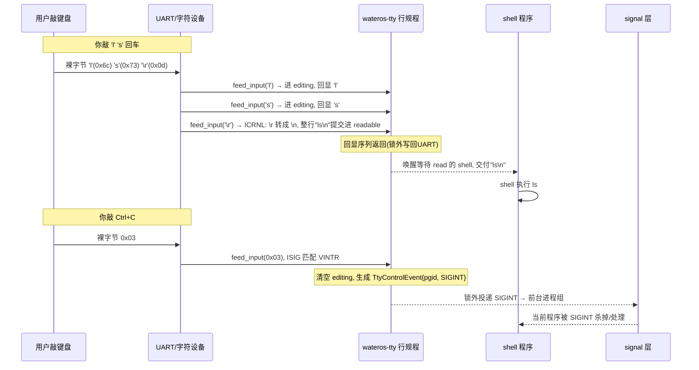

Read

Read

Read

Read , lines 1 to 120

Read

Read

Read

用同样的方法介绍 `wateros-tty`。一句话本质：

> **TTY = 终端的"行规程"（line discipline）：把键盘敲进来的原始字节流，翻译成应用程序能读的"行"和能感知的"控制事件"（如 Ctrl+C）。** 它是夹在"硬件 UART"和"你的程序"之间的一层翻译官。

和前面一样，先讲**用户怎么用**，再看**数据结构**，最后用一个**完整故事**串起来。

---

## 第一步：用户怎么用？

终端用户（或者跑在串口上的 shell）看到的其实是这套交互：

```c
// ① shell / getty 从控制台读一行命令
read(0, buf, 256);            // 0 = stdin，控制台

// ② 程序往控制台输出
write(1, "hello\n", 6);       // 1 = stdout

// ③ 用户敲 Ctrl+C —— 期望把当前程序杀掉，而不是把 ^C 当字符读进来
// ④ 用户按 Backspace —— 期望能退格改错，而不是收到一个 0x7f 字节
// ⑤ 程序可以查终端大小（比如编辑器需要）
ioctl(0, TIOCGWINSZ, &ws);
```

**关键洞察**：用户期望的是**"行"**和**"控制信号"**，但硬件只能传**裸字节**。`\r`、`\x7f`（退格）、`\x03`（Ctrl+C）这些如果原封不动地交给 `read()` 的程序，程序会疯掉。TTY 行规程就是做这个翻译的——它把一串裸字节**变成一行文字**，把 `\x03` **变成 SIGINT 信号**。

---

## 第二步：TTY 的三层模型

整个终端体系是分层的，`wateros-tty` 只负责**中间那层**：

```text
┌───────────────────────────────────────────────┐
│ 应用程序 (shell / 编辑器 / 你的程序)          │  ← 用 read/write 拿"行"
├───────────────────────────────────────────────┤
│ 行规程 (LINE DISCIPLINE)  ← wateros-tty 在这层 │  ← 行编辑/回显/信号检测/CR转换
├───────────────────────────────────────────────┤
│ 字符设备 / UART (硬件串口)                    │  ← 真正的裸字节流
└───────────────────────────────────────────────┘
```

用户敲键盘的字节**上行**经过行规程加工后给程序；程序输出的字节**下行**经过行规程转换后写给 UART。

---

## 第三步：数据结构——TTY 的核心状态

`wateros-tty` 用几个类型描述一个终端实例的全部状态（都在 `tty-api/api-v0`）：


| 类型              | 含义                                 | 关键字段                                              |
| ------------------- | -------------------------------------- | ------------------------------------------------------- |
| `TerminalId`      | 终端实例编号（`1` 固定是系统控制台） | `raw: u64`                                            |
| `ConsoleTtyMode`  | 控制台输入策略                       | `Interactive`/`Closed`/`Fixture`                      |
| `TtyTermios`      | 行规程配置（对齐 Linux`termios`）    | `iflag`/`oflag`/`cflag`/`lflag` + 控制字符表 `cc[19]` |
| `TtyWinSize`      | 窗口尺寸（`TIOCGWINSZ`）             | `row`/`col`                                           |
| `TtyControlEvent` | 敲了控制键后要发的信号               | `process_group` + `signal`                            |

其中 `TtyTermios` 是最核心的"开关面板"，四个标志位组 + 一张控制字符表：

- `iflag`（输入标志）：`ICRNL` = 把回车 `\r` 转成 `\n`
- `oflag`（输出标志）：`OPOST`/`ONLCR` = 输出时把 `\n` 转回 `\r\n`（不然终端会不走行首）
- `lflag`（本地标志）：`ICANON` = 行编辑模式；`ECHO` = 回显；`ISIG` = 检测控制键
- `cc[]`：19 个控制字符槽位——`VINTR`(Ctrl+C)、`VERASE`(退格)、`VEOF`(Ctrl+D)、`VMIN`/`VTIME`...

再加上实现层（`impl-console`）内部维护的两个缓冲队列：

```
  editing 队列  ← 正在编辑的"半行"（canonical 模式下还没回车）
  readable 队列 ← 已完成、可以交给 read(2) 的"整行/字节"
```

---

## 第四步：一个完整的故事（你在 shell 里敲命令 + Ctrl+C）



## 第五步：canonical 模式——"行编辑"的关键

`TtyTermios` 里 `ICANON` 位决定两种完全不同的行为（这就是 shell 能退格改错、普通程序收原始字节的原因）：


|                | canonical（`ICANON` 开）                          | raw（`ICANON` 关）                       |
| ---------------- | --------------------------------------------------- | ------------------------------------------ |
| 用户期望       | **按行编辑**：退格能改、Ctrl+D 是 EOF、回车才提交 | 收原始字节，按`VMIN`/`VTIME` 数量/超时读 |
| `editing` 队列 | 用：先攒半行                                      | 不用                                     |
| 提交时机       | 回车/`VEOF` 才提交进 `readable`                   | 字节直接进`readable`                     |
| 典型使用       | shell、getty 登录                                 | 编辑器（vi）、`tty` 原始输入             |

举几个行编辑动作对应 `wateros-tty` 的实现（README 里写得很细）：

- **退格**（`VERASE`，一般是 `\x7f`）：弹出 `editing` 末字节，回显 `\x08 \x08`（光标后退+清空+后退）
- **Ctrl+U**（`VKILL`）：清空整行，回显 `^U\n`
- **Ctrl+D**（`VEOF`）：空行 → 置 `eof_pending`（下次读返回 EOF）；有内容 → 立即提交
- **Ctrl+C**（`VINTR`）：`ISIG` 检测到，清空行，产生 `TtyControlEvent{SIGINT}`

---

## 第六步：两个有意思的设计细节

**① 信号不在这里发，只发"请求"**

```rust
pub struct TtyControlEvent { process_group, signal }
```

TTY 检测到 Ctrl+C 后**只生成事件**，真正的 `SIGINT` 投递交给 signal 层在**释放 TTY 锁之后**做。原因（README 明说）：避免持锁调度或信号死锁——这是嵌入式内核的锁顺序纪律。

**② "预约式读取"防止并发读互相抢字节**

```
read(2) → prepare_read(): 锁内取出字节, 分配预约id, 置 active_read
       → 用户在锁外把字节 copy 到用户缓冲
       → finish_read(预约, copied): 正式消费 copied 字节
          (失败时把未复制字节原样放回队首, 不丢数据)
```

这样即使并发多个 `read`，也只有一个"活动预约"，不会两个读都把自己读到的一半当成完整行。

---

## 对应回模块结构


| 职责                                                     | 位置                               |
| ---------------------------------------------------------- | ------------------------------------ |
| 数据契约（`Termios`/`WinSize`/`ControlEvent`/模式）      | `tty-api/api-v0/src/lib.rs`        |
| 行规程实现（feed_input、行编辑、echo、信号检测、预约读） | `tty-impl/impl-console/src/lib.rs` |
| UNIX98 伪终端（`ptmx`、`/dev/pts/N`、master/slave 队列） | `tty-impl/impl-console/src/pty.rs` |
| 聚合门面                                                 | `src/lib.rs`                       |

---

## 一句话串起来

> 用户看到的是"在终端里敲命令、能退格、Ctrl+C 能杀人"；本质是 TTY 行规程在**裸字节流**和**行/信号**之间做翻译。它用 `TtyTermios` 当开关面板（`ICANON`/`ECHO`/`ISIG`… + 19 个控制字符），用 `editing`/`readable` 两个队列完成"攒半行 → 回车提交"，检测到 Ctrl+C 就生成 `TtyControlEvent` 交给 signal 层在锁外投递。`wateros-tty` 只做机制不做策略：不碰 VFS、不碰 fd 表、不碰 errno——那些归 syscall 层。

这样 TTY 就清晰了：**一张 termios 配置 + 两个输入队列 + 一个"只产生事件不发信号"的约定**。要不要我接着讲讲 `pty.rs`（UNIX98 伪终端，即 `nxterm`/`sh` 怎么通过 master/slave 对通信）？
