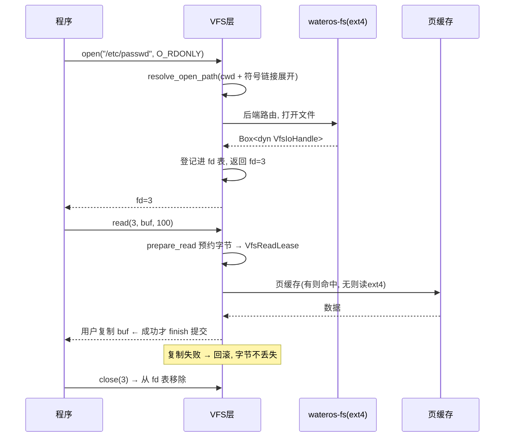

# wateros-vfs：虚拟文件系统

用"用户怎么用 + 数据结构 + 完整故事"的方式介绍 `wateros-vfs`。一句话本质：

> **VFS = 内核的"统一文件接口"：不管底层是 ext4 硬盘、proc 伪文件、tmpfs 内存盘、还是 /dev 设备，用户只要会用 `open`/`read`/`write`/`close` 一套 API 就够了。** 它是一层"翻译官"，把各种后端包装成统一的"文件句柄"。

---

## 第一步：用户到底怎么用它？

用户天天都在用，只是没意识到：

```c
// ① 打开一个真实文件
int fd = open("/etc/passwd", O_RDONLY);

// ② 打开一个"伪文件"（其实背后是内核数据）
int fd2 = open("/proc/cpuinfo", O_RDONLY);

// ③ 打开一个设备（背后是 tty / 显卡 / 随机数）
int fd3 = open("/dev/ttyS0", O_RDWR);
int fd4 = open("/dev/urandom", O_RDONLY);

// ④ 统一读写
read(fd, buf, 100);
write(fd3, "hi", 2);
close(fd);
```

用户视角：**路径 → open → 拿到 fd → read/write → close**，天下文件都长一个样。内核视角：路径解析、路由到对应后端、得到一个统一句柄、按预约模型读。

---

## 第二步：核心概念——"句柄"抽象了一切

`vfs-api` 的核心是把"一切可读写的对象"统一成 trait：

```rust
pub trait VfsIoHandle {        // 读写句柄: 读/写/seek/close/poll
    fn read(...) -> ...;
    fn write(...) -> ...;
    // ...
}

pub trait VfsFileHandle {      // 文件句柄(带 seek 等文件语义)
    // ...
}
```

于是不管后端是谁，syscall 层只需要依赖这个抽象：

```
       统一 VfsIoHandle 接口
              │
   ┌──────────┼────────────┬──────────────┐
   ▼          ▼            ▼              ▼
 真实文件    /proc 伪文件  /dev/console  匿名pipe
 (ext4)    (内核数据)    (tty桥接)      (内存对)
   │          │            │              │
   └──────────┴──── 全都实现同一个 trait ──┘
```

每个进程还有一个 **fd 表**（`impl-fd-session` 的 `PerTaskFdRegistry`）：把用户看到的整数 fd 映射到 `Box<dyn VfsIoHandle>`。固定 0/1/2 是 stdin/stdout/stderr。

---

## 第三步：一个完整故事（open → read → close）



两个值得一提的设计：

**① 预约式读取（`VfsReadLease`）**——和 futex/PTY 里见过的"预约"是同一个套路：

```
prepare_read → 锁内预约字节, 产出 lease
用户复制到自己的 buf
finish(提交/回滚): 成功才消费, 失败原样放回
```

防止"读了一半、用户缓冲复制失败"导致字节丢失或被并发读重复消费。

**② 文件内容版本化（`VfsFileContentIdentity`）**：内容一变更就递增版本号，缓存消费者把版本纳入键，跨 close/reopen 保持稳定，避免读到旧内容缓存。

---

## 第四步：多后端是怎么共存的？—— 挂载表

为什么 `/etc/passwd`、`/proc/cpuinfo`、`/dev/urandom` 能"看起来像一个文件系统"？因为 VFS 维护一张**挂载表**（`VfsMountTable`），按路径最长前缀路由：

```
路径            →  路由到
/               →  根卷(ext4)
/proc           →  procfs(伪文件)
/tmp            →  tmpfs(内存盘)
/dev            →  devfs(设备节点)
```

`resolve_route` 按**最长前缀**匹配：`/dev/pts/3` 会命中 `/dev` 而不是 `/`。挂载还有 `MountPropagation`（Private/Shared/Slave/Unbindable）语义，支持 RW/RO/伪挂载/bind 别名。

**小文件 vs 大文件**（`impl-fs-bridge`）：小文件用 `BufferedFileHandle` 全文缓冲在内存，大文件走 `PagedFileHandle` + 页缓存（`impl-page-cache`，Direct 模式 LRU）按需读页。

---

## 对应回 WaterOS 代码

| 概念 | 代码位置 |
|---|---|
| 句柄抽象 / 契约 | `vfs-api/api-v0/src/handle.rs`、`backend.rs` |
| 路径解析 / 规范化 | `vfs-api/api-v0/src/path.rs`、`resolve.rs` |
| fd 表 / cwd / 文件锁 | `vfs-impl/impl-fd-session/`（`PerTaskFdRegistry`、`Flock`） |
| FS 桥接（根卷/proc/tmpfs） | `vfs-impl/impl-fs-bridge/`（`BufferedFileHandle`/`PagedFileHandle`） |
| 页缓存 | `vfs-impl/impl-page-cache/`（Direct + LRU） |
| 挂载表 / 路由 | `vfs-api/api-v0/src/mount.rs`、`namespace.rs` |
| framebuffer 设备映射 | `vfs-api/api-v0/src/dev.rs`（`/dev/fb0` mmap） |

---

## 一句话串起来

> 用户用 `open`/`read`/`write`/`close` 一套 API 访问一切。内核用 **`VfsIoHandle` trait 统一所有后端**（ext4 文件、proc 伪文件、tmpfs、设备），用 **fd 表** 把整数 fd 映射到句柄，用 **挂载表** 按路径最长前缀把 `/etc`、`/proc`、`/dev` 路由到不同后端。读数据走**预约模型**（预约→复制→提交/回滚）保证不丢字节，小文件全文缓存、大文件走页缓存按需读页。**一套接口 + 一张路由表 + 一个预约协议**，就是 VFS 的全部。

这样 VFS 就清晰了：**句柄抽象 + fd 表 + 挂载表 + 预约读 + 页缓存**。也是理解"为什么 open 一个设备和一个文件看起来一样"的统一答案。
