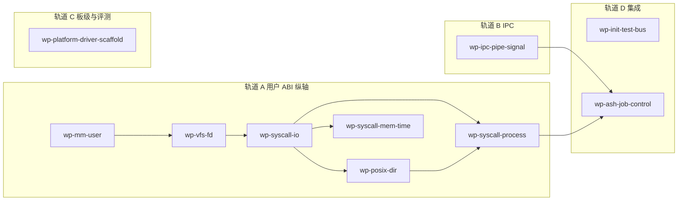

# RISC-V64-only：BusyBox  bring-up 并行计划

本目录描述在 **仅 QEMU riscv64 + OpenSBI** 目标下，为跑通 BusyBox（及赛题 busybox 组前置能力）所需的工作包。每个工作包独立成文，含**目标、范围、验收标准、验证方式**。

## 事实来源与范围

- 与 `docs/roadmap/test-case-full-pass-plan.md` 中阶段 **B0 → B1 → C** 对齐，但 **不包含 LoongArch64**。
- 与 `docs/architecture/snapshot.md`、`docs/roadmap/todolist.md` 当前缺口一致。
- **刻意不扩展** `os/src/self_tests/`：回归与阶段验收通过 **`kernel_main` 既有 init/test 总线** 接入（见 `wp-init-test-bus.md`）。

## 工作包索引（按一级模块归类）

| 文件 | 模块侧重 | 与其它包的依赖 |
|------|----------|----------------|
| [wp-init-test-bus.md](./wp-init-test-bus.md) | 根 crate 总线、`kernel_main` 顺序 | 所有包最终需挂到此总线 |
| [wp-mm-user-riscv64.md](./wp-mm-user-riscv64.md) | `wateros-mm`（用户地址空间、brk/mmap） | 阻塞：无；被 syscall/exec 依赖 |
| [wp-vfs-fd-session.md](./wp-vfs-fd-session.md) | `wateros-vfs`（per-task fd、会话） | 依赖 mm 用户映射契约稳定 |
| [wp-syscall-file-io.md](./wp-syscall-file-io.md) | `wateros-syscall` + vfs/fs（open/read/write/close/dup） | 依赖 fd 表与 VFS 桥 |
| [wp-syscall-posix-directory-mount.md](./wp-syscall-posix-directory-mount.md) | 目录项、元数据、mount/umount 子集 | 依赖文件 IO；与 exec 脚本 cwd 交叉 |
| [wp-syscall-mem-time.md](./wp-syscall-mem-time.md) | `wateros-syscall` + mm（mmap/munmap、时间类） | 依赖 mm 用户路径 |
| [wp-syscall-process-exec.md](./wp-syscall-process-exec.md) | `wateros-syscall` + `wateros-task`（fork/exec/wait） | 依赖文件 IO、目录/mount 子集（脚本 cwd）与 mm |
| [wp-ipc-pipe-signal.md](./wp-ipc-pipe-signal.md) | `wateros-ipc`（pipe、最小 signal） | 可与进程包部分并行，BusyBox ash 前需 pipe |
| [wp-ash-job-control.md](./wp-ash-job-control.md) | task + signal + fd（`&`、kill、dup2） | 依赖进程与 signal 最小集 |
| [wp-platform-driver-scaffold.md](./wp-platform-driver-scaffold.md) | `wateros-platform`、`wateros-driver`（RTC、多盘、关机） | 与纯用户路径可并行；赛题满分需要 |

## 可并行执行分组

以下分组表示 **人力上可拆给不同开发者并行**，组内仍有先后依赖。

- **轨道 A（关键路径）**：`MM → FD → IO → POSIX → PROC`；**`MEM` 与 `POSIX` 在 `IO` 稳定后可并行**。`execve` 与动态装载强依赖 **`wp-syscall-mem-time.md`** 与 **`wp-mm-user-riscv64.md`**，与 **`wp-syscall-posix-directory-mount.md`** 中的 `chdir`/路径解析联调。
- **轨道 B**：在 `open/read/write` 雏形可用后，即可开始 pipe 内核数据结构；**signal** 可与进程包后半并行。
- **轨道 C**：RTC、第二块 virtio-blk、SBI 关机与 Makefile/QEMU 对齐，**不阻塞**本地「单盘跑 BusyBox」的最小闭环，但阻塞赛题脚本环境。
- **轨道 D**：`wp-init-test-bus` 应尽早定义 **稳定日志前缀与阶段编号**，各工作包将各自的 `::test()` 或 `bringup_stageN()` 登记到总线；`wp-ash-job-control` 在 fork/pipe/signal 就绪后接棒。

## 与仓库其它文档的关系

- 全量赛题依赖表仍以 `docs/roadmap/test-case-full-pass-plan.md` 为准。
- 一级组件清单与同步文件仍以 `docs/prompts/structure.md` 为准。
- 本目录随里程碑增量修订；完成某工作包后应在 `docs/roadmap/todolist.md` 对应行补充「已验收」指向本文档路径。

## 建议的里程碑顺序（与并行不矛盾）

1. **M1**：总线骨架 + mm 用户路径第一版（可映射用户 ELF）。
2. **M2**：fd 表 + `open/read/write/close` 经 VFS 桥读写 ext4 上测试文件。
3. **M2.5**：`getdents`/`mkdir`/`unlink`/最小 `stat` 与（若需要）`mount` 子集，支撑根目录与临时路径操作。
4. **M3**：`fork` + `execve` + `wait`，跑通非 shell 的多进程用户程序。
5. **M4**：`pipe` + `dup`/`dup2`，跑通 `sh -c 'echo ok'` 类最小脚本。
6. **M5**：signal/kill 最小集 + 作业控制，BusyBox ash 脚本测例。
7. **M6**（可选并行）：赛题脚手架（多盘、RTC、关机、根目录测例调度）。

各工作包文中的验收条款应对应上述里程碑之一。
