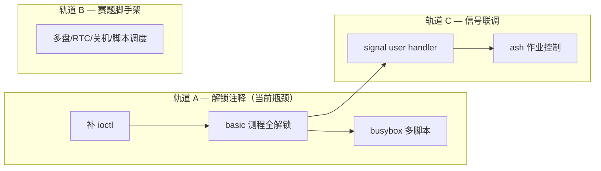

# RISC-V64-only：BusyBox bring-up 并行计划

本目录描述在 **仅 QEMU riscv64 + OpenSBI** 目标下，为跑通 BusyBox（及赛题 busybox 组前置能力）所需的工作包。

> **⚠️ 本文档在 2026-06 更新：此前版本基于旧导出文档描述的「缺口」（如 dup/fork fd 继承、信号 dispatch、进程凭证、网络 socket 族等）已在代码中实现。当前工作性质从「从零实现」变为「解锁注释 + 修复暴露的 bug」。**

## 事实来源与范围

- **分阶段总览（syscall 清单 + 并行任务）**：[busybox-phased-plan.md](./busybox-phased-plan.md)（以 `os/components/wateros-syscall/impl-kernel/src/lib.rs` dispatch 表为准）。
- 与 `docs/roadmap/test-case-full-pass-plan.md` 中阶段 **P1 → P2** 对齐；**不包含 LoongArch64**。
- 与 `docs/architecture/snapshot.md`、`docs/roadmap/todolist.md` 当前状态一致。
- **不包含 LoongArch64**（LoongArch 已具备与 RISC-V 相同的 bring-up 总线，其验证覆盖补齐工作见 `docs/roadmap/test-case-full-pass-plan.md` 阶段 P6）。

## 工作包索引（按一级模块归类）

| 文件 | 模块侧重 | 实际状态 (2026-06) |
|------|----------|-------------------|
| [wp-init-test-bus.md](./wp-init-test-bus.md) | 根 crate 总线、`kernel_main` 顺序 | 总线骨架已运行（stage-00 / stage-basic / stage-busybox）；stage-02-mm / posix-fs-meta 注释中 |
| [wp-mm-user-riscv64.md](./wp-mm-user-riscv64.md) | `wateros-mm`（用户地址空间、brk/mmap） | **已实现** — `user_aspace_ptr`、brk/mmap/munmap/mprotect 全部接线；`from_elf_path` 完整装载 ELF |
| [wp-vfs-fd-session.md](./wp-vfs-fd-session.md) | `wateros-vfs`（per-task fd、会话） | **已实现** — dup/dup3/fork 继承/CLOEXEC/refcount 全部实现并测试 |
| [wp-syscall-file-io.md](./wp-syscall-file-io.md) | `wateros-syscall` + vfs/fs（open/read/write/close/dup） | **已实现** — read/write/writev/readlinkat/openat/close/lseek/fstat/dup/dup3/pipe2 全部接线 |
| [wp-syscall-posix-directory-mount.md](./wp-syscall-posix-directory-mount.md) | 目录项、元数据、mount/umount 子集 | **已实现** — getcwd/chdir/mkdirat/getdents64/unlinkat/mount/umount2 全部接线 |
| [wp-syscall-mem-time.md](./wp-syscall-mem-time.md) | `wateros-syscall` + mm（mmap/munmap、时间类） | **已实现** — brk/mmap/munmap/mprotect/gettimeofday/clock_gettime/times/nanosleep 全部接线 |
| [wp-syscall-process-exec.md](./wp-syscall-process-exec.md) | `wateros-syscall` + `wateros-task`（fork/exec/wait） | **已实现** — clone/execve/waitpid/exit/exit_group 全部接线；fd 表继承/CLOEXEC 完整 |
| [wp-ipc-pipe-signal.md](./wp-ipc-pipe-signal.md) | `wateros-ipc`（pipe、最小 signal） | **大部分实现** — pipe+FIFO 已接入；rt_sigaction/rt_sigprocmask 已接线；用户态 handler 返回路径待联调 |
| [wp-ash-job-control.md](./wp-ash-job-control.md) | task + signal + fd（`&`、kill、dup2） | 依赖 signal 用户 handler 完成 |
| [wp-platform-driver-scaffold.md](./wp-platform-driver-scaffold.md) | `wateros-platform`、`wateros-driver`（RTC、多盘、关机） | 仍为待办 — 不影响本地单盘 BusyBox，阻塞赛题评测环境 |

## 可并行执行分组

- **轨道 A（关键路径）**：补 ioctl → basic 全解锁 → busybox 多脚本。这是当前最有价值的工作。
- **轨道 B**：赛题脚手架不影响本地单盘验证，可随时开始。
- **轨道 C**：与轨道 A 的后半并行。

## 建议的里程碑顺序

1. **M1**（`~2 周`）：ioctl 补齐 + basic 首批 12 个测程通过 + 恢复 stage-02-mm/posix-fs-meta
2. **M2**（`~2 周`）：basic 全表 24 测程通过 + busybox 多脚本 + lua 首测
3. **M3**（`~2 周`）：benchmark 组（lmbench/unixbench/libcbench/iozone）+ 网络组（iperf/netperf）
4. **M4**（`~1 周`）：赛题脚手架（多盘/RTC/关机/脚本调度/START-END）+ cyclictest
5. **M5**（`~2 周`）：LTP + libctest + LoongArch 起步

## 已在 `user_bringup_bus` 登记的阶段（`kernel_main` 顺序）

| 编号 | 阶段 id | 入口位置 | 状态 |
|------|---------|----------|------|
| 00 | `stage-00-bus` | `os/src/user_bringup_bus.rs` 内 `run()` | ✅ 激活 — RW 挂载 ext4 根卷 |
| 02 | `stage-02-mm` | `os/src/user_bringup_mm.rs` | ❌ 被注释 — 需恢复 |
| — | `stage-posix-fs-meta` | `os/src/user_bringup_posix_fs.rs` | ❌ 被注释 — 需恢复 |
| basic | `stage-basic` | `os/src/user_bringup_basic.rs` | ✅ 激活 — 仅 8/24 测程启用 |
| busybox | `stage-busybox` | `os/src/user_bringup_busybox.rs` | ✅ 激活 — 仅 1/12 脚本启用 |