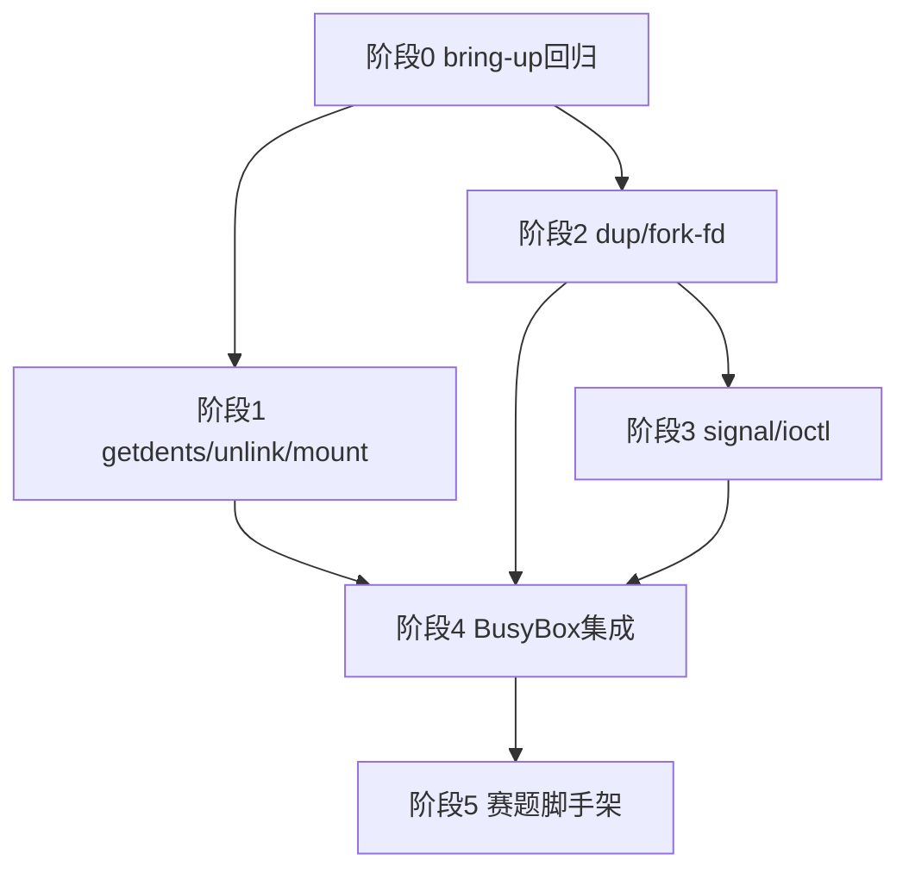

# RISC-V64 BusyBox 分阶段实施计划

**事实来源**：`os/components/wateros-syscall/`（`syscall-api/api-v0`、`syscall-impl/impl-kernel`）、`os/src/user_bringup_*.rs`、`docs/roadmap/test-case-full-pass-plan.md`（阶段 B1→C）、本目录各 `wp-*.md` 工作包。

**范围**：仅 QEMU riscv64 + OpenSBI；不含 LoongArch。用户态回归走 **`kernel_main` bring-up 总线**（见 `wp-init-test-bus.md`），不扩展 `os/src/self_tests/`。

---

## 一、功能实现阶段的 syscall 策略

在 **bring-up / 功能实现阶段**，未实现的 syscall **应主动失败、便于定位**，而不是静默返回 `ENOSYS` 让用户态继续跑偏。

当前仓库约定（以源码为准）：

| 路径 | 行为 | 位置 |
|------|------|------|
| **ABI 号表未收录的 syscall 号** | **`panic!`**，日志含 `nr` 与参数 | `impl-kernel/src/unsupported.rs`，经 `KernelSyscallDispatcher::dispatch_unknown` |
| **已解码、但 `impl-kernel` 未覆盖的 dispatch 槽位** | 走 API trait **默认 `ENOSYS`** | `syscall-api/api-v0/src/lib.rs` 中 `SyscallDispatcher` 默认实现 |
| **已接线 `sys_*`，逻辑尚未完成** | 多数返回 **`ENOSYS`**（如 `dup`）；部分路径 **`syscall_unsupported` → panic**（如 `mmap` 无 `user_aspace_ptr`） | 各 `sys/*.rs` |

**本计划约定（后续实现时遵循）**：

1. 在 `wateros-abi` 号表中 **已登记**、且决定支持的 syscall：在 `KernelSyscallDispatcher` **必须显式 `dispatch_*`**；首版未写完语义时，handler 内调用 **`unsupported::syscall_unsupported(...)`**（panic），**不要**长期留在 API 默认 `ENOSYS`。
2. **号表未收录**的探测调用：继续 **`dispatch_unknown` → panic**，用于发现需补号表或补实现的工作。
3. 子命令/变体未支持（如 `futex` 的 `REQUEUE`、`prctl` 个别 op）：可在 handler 内对**该分支**返回 `ENOSYS` 或 panic，在 PR 中注明；与「整槽未实现」区分开。

> 下文「syscall 清单」按 **2026-05 仓库树** 从 `impl-kernel` 逐文件核对；与 `os/components/wateros-syscall/TODO.md` 不一致时，**以本清单与源码为准**。

---

## 二、`wateros-syscall` 已实现能力清单

解码表：`syscall-api/api-v0::SyscallKind` + `wateros-abi::LinuxGeneric64`。  
内核分发：`syscall-impl/impl-kernel::KernelSyscallDispatcher`（`lib.rs` 是否 `override dispatch_*`）。

### 2.1 已接线且具备可用语义（BusyBox 会直接依赖）

| SyscallKind | Linux 名 | 实现文件 | 说明 |
|-------------|----------|----------|------|
| Read | `read` | `sys/read.rs` | per-task fd；pipe 可读；stdin 无真实输入 |
| Write | `write` | `sys/write.rs` | per-task fd；含控制台 1/2 |
| OpenAt | `openat` | `sys/openat.rs` | `AT_FDCWD`、目录 fd 相对路径、`O_DIRECTORY` |
| Close | `close` | `sys/close.rs` | 关闭动态 fd |
| Fstat | `fstat` | `sys/fstat.rs` | 128B `stat` 布局 |
| Lseek | `lseek` | `sys/lseek.rs` | 普通文件；pipe → `ESPIPE` |
| Pipe2 | `pipe2` | `sys/pipe2.rs` | 创建 fd 对；`O_NONBLOCK` |
| Brk | `brk` | `sys/brk.rs` | 有 `user_aspace_ptr` 走 Sv39；否则假顶桩 |
| Mmap / Munmap / Mprotect | `mmap` 族 | `sys/mmap.rs` | 匿名/文件映射骨架；无 aspace 时 **panic** |
| Clone | `clone`（含 fork） | `sys/clone.rs` | 子进程独立地址空间；**fd 表未继承动态 fd**（见 §三） |
| Execve | `execve` | `sys/execve.rs` | ELF 替换、argv/envp/auxv；**CLOEXEC 未关闭** |
| WaitPid | `wait4` | `sys/task.rs` | 最小父子等待、`WNOHANG` |
| Kill | `kill` | `sys/kill.rs` | 终止类信号强制退出；**无用户态 handler** |
| Exit | `exit` / `exit_group` | `sys/task.rs` | 同路径退出当前任务 |
| Yield | `sched_yield` | `sys/task.rs` | → `task::yield_now()` |
| GetPid / GetPPid / GetTid | `getpid` 等 | `sys/task.rs` | orphan 父进程暂返回 1 |
| GetTime / ClockGetTime | `gettimeofday` / `clock_gettime` | `sys/task.rs` | 基于调度 **tick**，非 wall-clock |
| Times / Nanosleep | `times` / `nanosleep` | `sys/task.rs` | tick 映射；非零 sleep → 1 tick |
| GetCwd / Chdir | `getcwd` / `chdir` | `sys/getcwd.rs`、`sys/chdir.rs` | per-task cwd |
| MkdirAt | `mkdirat` | `sys/mkdirat.rs` | 仅 `AT_FDCWD` |
| GetDents64 | `getdents64` | `sys/getdents64.rs` | 目录 fd；无 `.`/`..`（与 ext4 一致） |
| UnlinkAt | `unlinkat` | `sys/unlinkat.rs` | `AT_FDCWD`/目录 fd；`AT_REMOVEDIR`→`rmdir` |
| Mount | `mount` | `sys/mount.rs` | ext4 辅助卷；须空挂载点 |
| Umount2 | `umount2` | `sys/umount2.rs` | 与 mount 成对 |
| Uname | `uname` | `sys/task.rs` | 填充固定 `utsname` 字段 |
| Prctl | `prctl` | `sys/task.rs` | 常用 op 子集；未知 op → `ENOSYS` |
| Getrlimit / Setrlimit | `getrlimit` / `setrlimit` | `sys/task.rs` | 最小桩 |
| SetTidAddress | `set_tid_address` | `sys/task.rs` | 返回 tid；无 clear_child_tid 唤醒 |
| Futex | `futex` | `sys/futex.rs` | WAIT/WAKE（含 bitset）；其它 cmd → `ENOSYS` |
| Fcntl | `fcntl` | `sys/fcntl.rs` | `F_GETFD`/`SETFD`/`GETFL`/`SETFL` 等；**`F_DUPFD` → `ENOSYS`** |

### 2.2 已接线但为桩或明显不完整（实现阶段优先补齐）

| SyscallKind | Linux 名 | 实现文件 | 当前行为 |
|-------------|----------|----------|----------|
| Dup / Dup3 | `dup` / `dup3` | `sys/dup.rs` | 固定 **`ENOSYS`**（待 `VfsIoHandle::duplicate`） |

### 2.3 号表已收录，`impl-kernel` 未覆盖 dispatch（API 默认 `ENOSYS`）

下列 syscall **已被 `SyscallKind::decode` 识别**，但 `KernelSyscallDispatcher` **未**实现对应 `dispatch_*`，落入 `syscall-api` trait 默认 **`syscall_enosys_ret()`**。  
按 §一约定，BusyBox 相关项实现时应改为显式 dispatch + **`syscall_unsupported` panic**（直至语义完成）。

| SyscallKind | Linux 号（generic64） | BusyBox 相关性 |
|-------------|----------------------|----------------|
| Ioctl | 29 | TTY、`TIOCGPGRP` 等 |
| RtSigaction | 134 | 信号安装 |
| RtSigprocmask | 135 | 与 ash/pthread |
| RtSigreturn | 139 | 用户 handler 返回 |
| SetRobustList | 99 | pthread robust futex |
| GetRandom | 278 | libc 探测 |
| SetItimer | 103 | 定时器测例 |

### 2.4 未收录号表 → 用户态调用即 panic

任意不在 `SyscallKind::decode` 中的 syscall 号 → `SyscallKind::Unknown` → `dispatch_unknown` → **`panic!`**。

---

## 三、非 syscall 但阻塞 BusyBox 的内核缺口

（与 `wateros-vfs`、`wateros-task`、`bring-up` 相关，实现 syscall 时须一并考虑。）

| 缺口 | 现状 | 影响 |
|------|------|------|
| **进程凭证 / getuid 族** | 无 `wateros-cred`；get* 未登记 → panic；设计见 **`docs/guides/cred-module-design.md`** | BusyBox/musl 自检 identity |
| **fork fd 继承** | `vfs::fd::init_child_fd_table` 仅建 0/1/2，**不复制**父进程 pipe/文件 fd | `pipe` + `fork`、shell 管道 |
| **execve CLOEXEC** | `execve.rs` 中 TODO，未遍历关闭 | 脚本/exec 语义 |
| **VFS 多挂载** | 辅助卷 `mount`/`umount2` + 最长前缀路由；单盘 QEMU 下 basic `mount` 可能 `ENOENT` | 赛题多盘、`mnt` 测程 |
| **bring-up 回归** | `stage-02-mm` 在总线中被注释；`stage-03-basic` 仅 `chdir`/`clone`/`execve` | basic 全表未跑 |
| **BusyBox 镜像与总线阶段** | 仓库无 busybox 二进制；无 `stage-busybox-ash` | 无法集成验收 |
| **赛题脚手架** | 无 `*_testcode.sh` 调度、START/END、关机 | 正式 busybox 组评测 |

---

## 四、分阶段计划（同阶段任务可并行）

### 阶段 0：回归基线与 bring-up 总线

**目标**：在现有 syscall 能力下跑通 **basic 子集**，冻结「阶段日志 + warn 策略」。

| 任务 ID | 模块 | 内容 | 可并行 |
|---------|------|------|--------|
| 0-A | `os/src/user_bringup_bus.rs` | 恢复调用 `user_bringup_mm::run_stage_02` | ✓ |
| 0-B | `os/src/user_bringup_basic.rs` | 按 `basic/run-all.sh` 逐步取消注释 ELF 路径 | ✓ |
| 0-C | `wateros-mm` + `syscall` | 根据测程失败日志补强 `mmap`/`brk`/`waitpid` 边界 | ✓ |
| 0-D | `wateros-syscall/TODO.md` | 与 §二清单对齐，避免文档漂移 | ✓ |

**验收**：QEMU 日志中 `[mm-bringup]` / `[basic-bringup]` 对 glibc/musl 路径有可追溯的加载与执行记录；失败项可对应到 §二某一 syscall 行。

---

### 阶段 1：POSIX 目录与挂载 syscall

**目标**：支撑 `getdents`、`unlink`、`mount` 类 basic 测程与后续 `ls`/`rm`。

**前置**：阶段 0 中 `open`/`read`/`write`/`close` 已稳定。

| 任务 ID | 模块 | 内容 | 可并行 |
|---------|------|------|--------|
| 1-A | `syscall` + `vfs` | `getdents64`：`dispatch_getdents64` + `sys_getdents64`，接 `read_dir` + `linux_dirent64` | ✓ |
| 1-B | `syscall` + `vfs` | `unlinkat`：`dispatch_unlinkat` + `sys_unlinkat`，接 `RootRwSession::unlink` | ✓ |
| 1-C | `syscall` + `fs-rootfs` | `mount` / `umount2` 最小语义（与 `mount_default_root_rw` 文档对齐） | ✓ |
| 1-D | `syscall` | 路径 `stat`/`newfstatat`（若 `fstat` 不足以支撑 `ls -l`） | ✓ |
| 1-E | `os/src/user_bringup_*` | 总线阶段 `[bringup][posix-fs-meta]` 静态验收 ELF | ✓ |

**验收**：用户态 mkdir → write → getdents → unlink；basic 中对应测程通过。单盘 QEMU 下 `mount`/`umount`/`mnt` 若硬编码 `/dev/vblk1` 可能 `ENOENT`，不视为阶段 1 本地失败；多盘环境再验。

**参考工作包**：`wp-syscall-posix-directory-mount.md`。

---

### 阶段 2：fd 复制与 fork 继承

**目标**：`dup`/`dup2`/`dup3`、管道与重定向、fork 后共享 fd。

| 任务 ID | 模块 | 内容 | 依赖 |
|---------|------|------|------|
| 2-A | `vfs-api` + `impl-fd-session` | `VfsIoHandle::duplicate`（或等价克隆） | — |
| 2-B | `syscall` | `sys_dup` / `sys_dup3`；`fcntl(F_DUPFD)` 转调 | 2-A |
| 2-C | `vfs` + `syscall` | fork 时**复制**父进程 fd 表（首版可全量复制） | 2-A |
| 2-D | `syscall` | `execve` 关闭 `FD_CLOEXEC`；`fcntl` 跟踪 CLOEXEC | 可与 2-C 并行设计 |
| 2-E | bring-up | `pipe` → `fork` → 子 write / 父 read 验收 | 2-C |

**验收**：basic `dup`/`dup2`/`pipe`/`fork` 组合通过；最小 C 程序 `echo ok \| cat` 类场景正确。

**参考工作包**：`wp-syscall-file-io.md`、`wp-vfs-fd-session.md`。

---

### 阶段 3：信号与 ioctl 最小集

**目标**：ash、`sleep &`、`kill`、libc 信号探测。

| 任务 ID | 模块 | 内容 | 可并行 |
|---------|------|------|--------|
| 3-A | `wateros-ipc` + `trap` | `rt_sigaction` / `rt_sigprocmask` / `rt_sigreturn` 最小子集 | ✓ |
| 3-B | `syscall` + `task` | 与 `kill`、子进程退出、`waitpid` 联调 | 依赖 3-A 部分 |
| 3-C | `syscall` | 阻塞 syscall + **`EINTR`** 策略（文档化） | 3-A |
| 3-D | `syscall` | `ioctl` TTY 桩（按 strace 逐项） | ✓ |
| 3-E | `syscall` + `task` | `setpgid` / session（若 BusyBox strace 需要） | ✓ |
| 3-F | bring-up | `[bringup][ipc-pipe]` / `[bringup][ipc-signal]` | 3-B 后 |

**验收**：`kill(getpid(), SIGUSR1)` 进入用户 handler；`sleep 1 & wait` 不死锁。

**参考工作包**：`wp-ipc-pipe-signal.md`。

---

### 阶段 4：BusyBox 集成与 ash

**目标**：ext4 上运行 BusyBox 与最小脚本。

| 任务 ID | 模块 | 内容 | 可并行 |
|---------|------|------|--------|
| 4-A | 镜像 / Makefile | `/bin/busybox`（或约定路径）放入 sdcard/ext4 构建说明 | ✓ |
| 4-B | `user_bringup_bus` | `stage-busybox-ash`：`echo > /tmp/a && cat` | 1–3 完成 |
| 4-C | `task` + `syscall` | 后台 `&` 与最小作业语义 | 4-B |
| 4-D | 文档 | `busybox_cmd.txt` 支持子集 checklist | ✓ |
| 4-E | `mm` + `syscall` | 动态链接 BusyBox 时的解释器 / 可执行 `mmap` | 仅动态链接需要 |

**验收**（与 `wp-ash-job-control.md` 一致）：

- `busybox sh -c 'echo hello > /tmp/a && busybox cat /tmp/a'` → 串口 `hello`
- `busybox sh -c 'sleep 1 & wait'` 无 panic/死锁

---

### 阶段 5：赛题评测脚手架（不阻塞本地单盘 BusyBox）

| 任务 ID | 内容 |
|---------|------|
| 5-A | `kernel_main` 串行执行 `*_testcode.sh`，输出 START/END |
| 5-B | QEMU：virtio-net、RTC、第二块盘与 `test_case/README.md` 对齐 |
| 5-C | SBI 关机 / 退出 QEMU |
| 5-D | `make all` → `kernel-rv` 产物约定 |

**参考**：`wp-platform-driver-scaffold.md`、`test-case-full-pass-plan.md` 阶段 A。

---

## 五、阶段依赖（简图）

- **阶段 1 与 2** 在阶段 0 之后可**人力并行**（1 偏 VFS/fs 目录 API，2 偏 fd 表）。
- **阶段 3** 在 **2-C（fork fd 继承）** 完成后启动信号与 pipe 联调更稳。
- **阶段 5** 可与 1–4 中镜像/脚本设计并行，但不替代内核能力。

---

## 六、建议人力优先级

1. 阶段 **0**（bring-up + basic 清单）  
2. 阶段 **1-A / 1-B**（`getdents64`、`unlinkat`）  
3. 阶段 **2** 整包（dup + fork fd）  
4. 阶段 **3-A / 3-B**（信号）  
5. 阶段 **4**（BusyBox 镜像 + 总线）  
6. 阶段 **5**（正式赛题）

---

## 七、相关文档索引

| 文档 | 用途 |
|------|------|
| [README.md](./README.md) | 工作包索引与里程碑 M1–M6 |
| [wp-init-test-bus.md](./wp-init-test-bus.md) | bring-up 总线契约 |
| [wp-syscall-file-io.md](./wp-syscall-file-io.md) | open/read/write/dup |
| [wp-syscall-posix-directory-mount.md](./wp-syscall-posix-directory-mount.md) | 目录与挂载 |
| [wp-syscall-process-exec.md](./wp-syscall-process-exec.md) | fork/exec/wait |
| [wp-ipc-pipe-signal.md](./wp-ipc-pipe-signal.md) | pipe 与信号 |
| [wp-ash-job-control.md](./wp-ash-job-control.md) | BusyBox ash 验收 |
| [`cred-module-design.md`](../../guides/cred-module-design.md) | `wateros-cred` 进程凭证模块设计方案 |
| `os/components/wateros-syscall/TODO.md` | syscall 状态维护（须与 §二同步） |
| `docs/roadmap/test-case-full-pass-plan.md` | 全赛题阶段 B1→C |

---

## 八、维护说明

- 新增 `SyscallKind` 或 `dispatch_*` 时：更新 **§二** 与本文件阶段任务，并改 `wateros-syscall/TODO.md`。
- 完成某阶段验收后：在 [README.md](./README.md)「`user_bringup_bus` 登记的阶段」表追加一行，并在 `docs/roadmap/todolist.md` 标注「已验收 → 本文 §阶段 N」。
