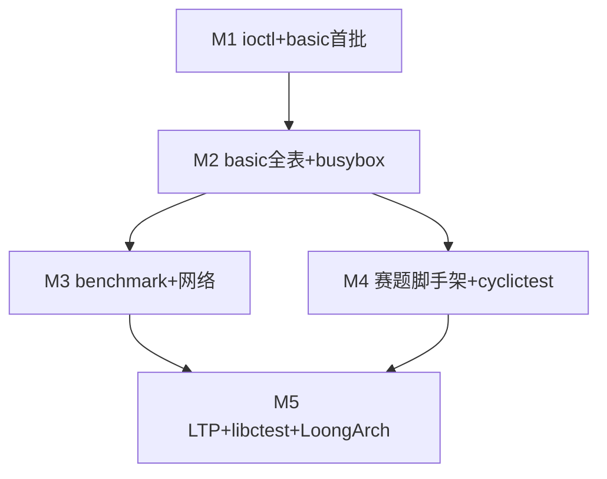

# RISC-V64 BusyBox 分阶段实施计划

**事实来源**：`os/components/wateros-syscall/syscall-impl/impl-kernel/src/lib.rs`（dispatch 表）、`os/components/wateros-syscall/syscall-impl/impl-kernel/src/sys/*.rs`（实现文件）、`os/components/wateros-vfs/vfs-impl/impl-fd-session/src/registry.rs`（fd 实现）、`os/src/user_bringup_*.rs`（bring-up 实际状态）、`docs/roadmap/test-case-full-pass-plan.md`（阶段 P1→P6）。

> **⚠️ 本文档在 2026-06 根据实际代码重写。与此前版本的差异：**
> - 删除了大量 "尚未实现" 的描述（dup/dup3、fork fd 继承、进程凭证、信号 dispatch、网络 socket 族等已在代码中实现）
> - 核心工作从「从零实现」变为「解锁注释 + 修复暴露的 bug」
> - 分阶段从 6 个阶段缩减为 5 个里程碑（M1-M5）

**范围**：仅 QEMU riscv64 + OpenSBI；不含 LoongArch。用户态回归走 **`kernel_main` bring-up 总线**（见 `wp-init-test-bus.md`）。

---

## 一、syscall 策略

**bring-up / 功能实现阶段**的行为约定（与代码一致）：

| 路径 | 行为 | 位置 |
|------|------|------|
| **号表未收录的 syscall 号** | **`panic!`**，日志含 `nr` 与参数 | `impl-kernel/src/unsupported.rs`，经 `KernelSyscallDispatcher::dispatch_unknown` |
| **已解码但未覆盖的 dispatch 槽位** | 走 API trait **默认 `ENOSYS`** | `syscall-api/api-v0/src/lib.rs` 中 `SyscallDispatcher` 默认实现 |
| **已接线 `sys_*`，逻辑尚未完成** | 部分返回 ENOSYS，部分 `syscall_unsupported` → panic | 各 `sys/*.rs` |

**当前已知未接线的关键槽位**：`ioctl`（api-v0 有 `dispatch_ioctl` 默认 ENOSYS，但 KernelSyscallDispatcher 未 override）。

---

## 二、`wateros-syscall` 已实现能力清单（2026-06 代码状态）

以下基于 `os/components/wateros-syscall/syscall-impl/impl-kernel/src/lib.rs` dispatch 表逐项核对。

### 2.1 已接线且具备可用语义的 syscall（91 个）

| SyscallKind | Linux 名 | 实现文件 | 说明 |
|-------------|----------|----------|------|
| Read | `read` | `sys/read.rs` | per-task fd；VFS handle `.read()`；用户拷贝 |
| Write | `write` | `sys/write.rs` | per-task fd；含控制台 1/2；用户拷贝 |
| Writev | `writev` | `sys/write.rs` | iovec gather-write |
| Readlinkat | `readlinkat` | `sys/readlinkat.rs` | 符号链接读取 |
| OpenAt | `openat` | `sys/openat.rs` | AT_FDCWD、目录 fd 相对路径、O_DIRECTORY |
| Close | `close` | `sys/close.rs` | 关闭动态 fd |
| Lseek | `lseek` | `sys/lseek.rs` | 普通文件；pipe → ESPIPE |
| Fstat | `fstat` | `sys/fstat.rs` | 128B stat 布局 |
| Dup | `dup` | `sys/dup.rs` | 通过 `VfsIoHandle::duplicate()` 克隆 fd |
| Dup3 | `dup3` | `sys/dup.rs` | dup 到指定 fd，支持 FD_CLOEXEC |
| Pipe2 | `pipe2` | `sys/pipe2.rs` | 创建 fd 对；O_NONBLOCK |
| Brk | `brk` | `sys/brk.rs` | 有 `user_aspace_ptr` 走 Sv39 真映射；否则假顶桩 |
| Mmap | `mmap` | `sys/mmap.rs` | 匿名/文件映射；有 aspace 时真实操作用户地址空间 |
| Munmap | `munmap` | `sys/mmap.rs` | 取消映射 |
| Mprotect | `mprotect` | `sys/mmap.rs` | 修改映射保护 |
| GetTimeOfDay | `gettimeofday` | `sys/task.rs` | 基于调度 tick |
| ClockGetTime | `clock_gettime` | `sys/task.rs` | 基于调度 tick |
| GetPid | `getpid` | `sys/task.rs` | 当前进程 ID |
| GetPPid | `getppid` | `sys/task.rs` | 父进程 ID |
| GetTid | `gettid` | `sys/task.rs` | 当前线程 ID |
| GetUid | `getuid` | `sys/cred.rs` | 进程凭证 |
| GetEuid | `geteuid` | `sys/cred.rs` | 有效用户 ID |
| GetGid | `getgid` | `sys/cred.rs` | 组 ID |
| GetEgid | `getegid` | `sys/cred.rs` | 有效组 ID |
| GetGroups | `getgroups` | `sys/cred.rs` | 补充组列表 |
| SetUid | `setuid` | `sys/cred.rs` | |
| SetGid | `setgid` | `sys/cred.rs` | |
| SetReUid | `setreuid` | `sys/cred.rs` | |
| SetReGid | `setregid` | `sys/cred.rs` | |
| SetResUid | `setresuid` | `sys/cred.rs` | |
| SetResGid | `setresgid` | `sys/cred.rs` | |
| Futex | `futex` | `sys/futex.rs` | WAIT/WAKE（含 bitset）；其它 cmd → ENOSYS |
| Fcntl | `fcntl` | `sys/fcntl.rs` | F_GETFD/SETFD/GETFL/SETFL/F_DUPFD 等 |
| Clone | `clone`（含 fork） | `sys/clone.rs` | 子进程独立地址空间；fd 表继承完整 |
| Execve | `execve` | `sys/execve.rs` | ELF 替换、argv/envp/auxv；CLOEXEC 关闭 |
| WaitPid | `wait4` | `sys/task.rs` | 最小父子等待、WNOHANG |
| Kill | `kill` | `sys/kill.rs` | 终止类信号强制退出 |
| Exit | `exit` / `exit_group` | `sys/task.rs` | 退出当前任务 |
| Yield | `sched_yield` | `sys/task.rs` | → `task::yield_now()` |
| Nanosleep | `nanosleep` | `sys/task.rs` | tick 映射 |
| Times | `times` | `sys/task.rs` | tick 映射 |
| GetCwd | `getcwd` | `sys/getcwd.rs` | per-task cwd |
| Chdir | `chdir` | `sys/chdir.rs` | per-task cwd |
| MkdirAt | `mkdirat` | `sys/mkdirat.rs` | 仅 AT_FDCWD |
| GetDents64 | `getdents64` | `sys/getdents64.rs` | 目录 fd |
| UnlinkAt | `unlinkat` | `sys/unlinkat.rs` | AT_FDCWD/目录 fd；AT_REMOVEDIR→rmdir |
| Mount | `mount` | `sys/mount.rs` | ext4 辅助卷 |
| Umount2 | `umount2` | `sys/umount2.rs` | 与 mount 成对 |
| Uname | `uname` | `sys/task.rs` | 固定 utsname |
| Prctl | `prctl` | `sys/task.rs` | 常用 op 子集 |
| Getrlimit / Setrlimit | `getrlimit` / `setrlimit` | `sys/task.rs` | 最小桩 |
| Prlimit64 | `prlimit64` | `sys/task.rs` | 进程资源限制 |
| SetTidAddress | `set_tid_address` | `sys/task.rs` | 返回 tid |
| SetRobustList | `set_robust_list` | `sys/task.rs` | robust futex 列表 |
| GetRandom | `getrandom` | `sys/task.rs` | 随机数 |
| RtSigaction | `rt_sigaction` | 已接线 dispatch | 信号安装（dispatch 已接线，用户 handler 返回路径待联调） |
| RtSigprocmask | `rt_sigprocmask` | 已接线 dispatch | 信号掩码 |
| Socket | `socket` | `sys/socket.rs` | 创建套接字 fd |
| Bind | `bind` | `sys/bind.rs` | 绑定地址 |
| Listen | `listen` | `sys/listen.rs` | 监听 |
| Accept4 | `accept4` | `sys/accept.rs` | 接受连接 |
| Connect | `connect` | `sys/connect.rs` | 连接 |
| GetSockName | `getsockname` | `sys/sockname.rs` | |
| GetPeerName | `getpeername` | `sys/sockname.rs` | |
| SendTo | `sendto` | `sys/sendto.rs` | |
| RecvFrom | `recvfrom` | `sys/recvfrom.rs` | |
| SendMsg | `sendmsg` | `sys/sendmsg.rs` | |
| RecvMsg | `recvmsg` | `sys/sendmsg.rs` | |
| SetSockOpt | `setsockopt` | `sys/sockopt.rs` | |
| GetSockOpt | `getsockopt` | `sys/sockopt.rs` | |
| Shutdown | `shutdown` | `sys/shutdown.rs` | |
| Poll | `poll` | `sys/poll.rs` | 替代 select |
| Statx | 未知号路由 291 | `dispatch_unknown` | statx 通过 `SYS_STATX` 特殊路由 |

### 2.2 号表已收录但未 override dispatch（API 默认 ENOSYS）

| SyscallKind | Linux 号（generic64） | BusyBox 相关性 | 当前行为 |
|-------------|----------------------|----------------|----------|
| Ioctl | 29 | **高** — TTY、TIOCGPGRP 等 | API 默认 ENOSYS |

**其余未显式列出的 SyscallKind** 均走 `dispatch_unsupported` → 调用 `syscall_unsupported_decoded` → panic!，日志含 `nr` 与参数。

---

## 三、非 syscall 但相关的内核缺口

| 缺口 | 现状 | 影响 |
|------|------|------|
| **ioctl** | dispatch 表未 override；API 默认 ENOSYS | BusyBox ash TTY 交互失败 |
| **signal user handler trap 返回** | `rt_sigaction`/`rt_sigprocmask` 已接线 dispatch，但用户态 handler 注册后的 trap 返回路径未完整联调 | `kill(SIGUSR1)` → 默认行为（终止）可用，用户 handler 不可用 |
| **赛题脚手架** | 多盘、RTC、关机、`*_testcode.sh` 调度、START/END 输出未对齐 | 正式赛题评测 |

---

## 四、分阶段计划（基于代码实际状态）

### M1：基础回归 & ioctl

**目标**：回归基线确认，补齐 ioctl，basic 首批 12 个测程通过。

| 任务 ID | 模块 | 内容 |
|---------|------|------|
| 1-A | `syscall` | 实现 `dispatch_ioctl`（TCGETS/TIOCGPGRP 等 TTY 子集） |
| 1-B | `os/src/user_bringup_bus.rs` | 恢复 `stage-02-mm` 和 `stage-posix-fs-meta` 注释 |
| 1-C | `os/src/user_bringup_basic.rs` | 取消 `chdir` `close` `fstat` `getcwd` `gettimeofday` `open` `openat` `read` `write` `yield` `sleep` `times` `uname` `test_echo` 注释 |
| 1-D | `wateros-mm` + `syscall` | 根据测程失败日志修复边界问题 |

**验收**：QEMU 日志中 `[basic-bringup]` 对 14 个 ELF 有完整加载→执行→退出记录。

### M2：basic 全表 & busybox

**目标**：basic 24 测程全部通过；busybox 多脚本；lua 首测。

| 任务 ID | 模块 | 内容 |
|---------|------|------|
| 2-A | `os/src/user_bringup_basic.rs` | 取消 `dup` `dup2` `getdents` `mkdir_` `pipe` `unlink` `mount` `umount` `mnt` 注释 |
| 2-B | `wateros-abi` + `syscall` | 修复 basic 剩余测程暴露的问题 |
| 2-C | `os/src/user_bringup_busybox.rs` | 解锁 `/musl/basic_testcode.sh`、`/glibc/busybox_testcode.sh` |
| 2-D | — | 解锁 `/glibc/lua_testcode.sh` |

**验收**：basic 24 测程全部通过；busybox 探针（echo、sh -c）通过；lua 解释器可执行。

### M3：benchmark & 网络

**目标**：benchmark 组和网络组通过。

| 任务 ID | 模块 | 内容 |
|---------|------|------|
| 3-A | — | 解锁 `/glibc/lmbench_testcode.sh` |
| 3-B | — | 解锁 `/glibc/unixbench_testcode.sh` |
| 3-C | — | 解锁 `/glibc/libcbench_testcode.sh` |
| 3-D | — | 解锁 `/glibc/iozone_testcode.sh` |
| 3-E | — | 解锁 `/glibc/iperf_testcode.sh` |
| 3-F | — | 解锁 `/glibc/netperf_testcode.sh` |

**验收**：各组 benchmark 脚本开始运行并通过 ≥ 50% 测项。

### M4：赛题脚手架 + cyclictest

**目标**：赛题环境对齐。

| 任务 ID | 模块 | 内容 |
|---------|------|------|
| 4-A | `os/scripts/` + `Makefile` | QEMU 启动脚本与赛题命令对齐（virtio-net/RTC/多盘） |
| 4-B | bring-up 总线 | `*_testcode.sh` 串行调度 + `#### OS COMP TEST GROUP START/END ####` 输出 |
| 4-C | `wateros-platform` | SBI 关机/退出 QEMU |
| 4-D | — | 解锁 `/glibc/cyclictest_testcode.sh` |

### M5：LTP + libctest + LoongArch 起步

**目标**：最大覆盖面和跨架构。

| 任务 ID | 模块 | 内容 |
|---------|------|------|
| 5-A | — | 解锁 `/glibc/libctest_testcode.sh` |
| 5-B | — | 解锁 `/glibc/ltp_testcode.sh` |
| 5-C | `/musl/` | 解锁全部 musl 路径脚本 |
| 5-D | LoongArch | 分页真实化 + 块设备/fs + 用户 ELF 加载 |
| 5-E | CI | riscv/loongarch × glibc/musl 四套抽样验证 |

---

## 五、阶段依赖

---

## 六、建议人力分配

1. **M1**（`~2 周`）→ 1 人集中攻坚
2. **M2**（`~2 周`）→ 1-2 人并行
3. **M3**（`~2 周`）→ 1-2 人并行
4. **M4**（`~1 周`）→ 1 人
5. **M5**（`~2-3 周`）→ 1-2 人（LoongArch 需独立人力）

---

## 七、与现有工作包的关系

| 工作包 | 状态更新 |
|--------|----------|
| `wp-mm-user-riscv64.md` | **已实现**。内容可用于验收基准，无需代码修改 |
| `wp-vfs-fd-session.md` | **已实现**。`PerTaskFdRegistry` 完整；可用于回归测试 |
| `wp-syscall-file-io.md` | **已实现**。read/write/writev/readlinkat/openat/close/lseek/fstat/dup/dup3/pipe2 全部接线 |
| `wp-syscall-posix-directory-mount.md` | **已实现**。getcwd/chdir/mkdirat/getdents64/unlinkat/mount/umount2 全部接线 |
| `wp-syscall-mem-time.md` | **已实现**。brk/mmap/munmap/mprotect/gettimeofday/clock_gettime/times/nanosleep 全部接线 |
| `wp-syscall-process-exec.md` | **已实现**。clone/execve/waitpid/exit/exit_group + fd 继承/CLOEXEC 全部实现 |
| `wp-ipc-pipe-signal.md` | **大部分实现**。pipe 已接入；rt_sigaction/rt_sigprocmask 已接线 dispatch；用户 handler 返回路径待联调 |
| `wp-ash-job-control.md` | 依赖 signal 用户 handler 完成 |
| `wp-platform-driver-scaffold.md` | 仍为待办（多盘/RTC/关机） |
| `wp-init-test-bus.md` | 总线骨架已运行；stage-02-mm/posix-fs-meta 注释中 |

---

## 八、维护说明

- 新增 `dispatch_*` 实现时：更新 **§二** 本节，并同步 `docs/roadmap/todolist.md` 的 syscall 清单。
- 完成某里程碑后：在 `docs/roadmap/test-case-full-pass-plan.md` 勾选清单对应项。