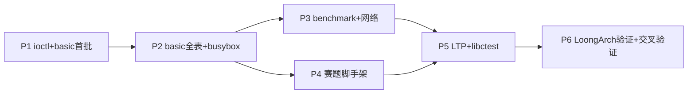

# test_case 全通过路线图

**事实来源**：`testsuits-for-oskernel/README.md`、`os/components/wateros-syscall/syscall-impl/impl-kernel/src/lib.rs`（dispatch 表）、`os/components/wateros-vfs/vfs-impl/impl-fd-session/src/registry.rs`（fd 实现）、`os/src/main.rs`、`os/src/user_bringup_*.rs`（bring-up 实际状态）、`docs/roadmap/todolist.md`。

**⚠️ 本文档在 2026-06 已根据实际代码状态重写。此前版本（基于旧导出文档的"缺口"描述）已落后。**

**范围说明**：「全通过」指赛题磁盘镜像中的各组 `*_testcode.sh` 在 **RISC-V 与 LoongArch**、**glibc 与 musl** 变体下均能按评测要求跑完并得到预期输出。

---

## 零、实际代码进度（2026-06）

以下基于 `os/components/` 下实际代码，而非旧导出文档。

### 已实现且稳定的底座（RISC-V 主线）

| 子系统 | 实际状态 |
|--------|----------|
| **启动与平台** | QEMU riscv64 + OpenSBI 下 `kernel_main` 流程完整；控制台、日志、堆、panic；定时器与中断已接入调度主线 |
| **驱动** | DTB 扫描、**virtio-mmio 块设备**注册、与 **devfs** 刷新协作；**virtio-net + smoltcp 已集成**（`driver::network::stack::init` + 轮询任务 + 同步烟测） |
| **文件系统** | **ext4** RO + **RW（beta）**；devfs **`/dev/vblkN`**；根卷挂载与启动期 `fs::test` 树遍历/自检 |
| **VFS** | **`impl-fs-bridge`** 稳定；**`impl-fd-session`** 完整支持 per-task fd 表——dup/dup3/fork 继承/CLOEXEC/refcount 全部实现并自测；VFS 自检通过 |
| **内存管理** | **Sv39**、内核 ELF 装载、全局内核页表、栈式物理帧分配器；**用户态 `brk`/`mmap`/`munmap`/`mprotect`** 全部接线到 syscall 并有真实语义；`from_elf_path` 可完整装载 ELF |
| **任务与调度** | 轮转、阻塞/睡眠队列、zombie 回收、WaitQueue、trap 帧协作；`spawn_user_task_from_loaded_elf` 完整；条件等待与 child-exit 等待服务 |
| **系统调用** | **~80 个 syscall 已接线**（见 todolist.md），包括：文件 IO（read/write/writev/readlinkat/openat/close/lseek/fstat/dup/dup3/pipe2）、内存（brk/mmap/munmap/mprotect）、进程（clone/execve/waitpid/exit/exit_group/yield/kill/getpid/getppid/gettid）、凭证（get*id/set*id 全族）、时间（gettimeofday/clock_gettime/times/nanosleep）、目录（getcwd/chdir/mkdirat/getdents64/unlinkat/mount/umount2）、信号（rt_sigaction/rt_sigprocmask）、同步（futex/fcntl/poll）、网络（socket/bind/listen/accept4/connect/sendto/recvfrom/sendmsg/recvmsg/setsockopt/getsockopt/shutdown）、通用（uname/prctl/getrlimit/setrlimit/prlimit64/set_tid_address/set_robust_list/getrandom/statx）。**ioctl 仍未接线。** |
| **IPC** | 聚合层默认含 **waitqueue**、**pipe**（内核 ring-buffer + fd endpoint）；**futex** 已接线（WAIT/WAKE）；signal dispatch 函数已实现但用户态 handler trap 返回路径待联调 |
| **凭证** | **代码已实现**——`cred-api` + `impl-root`；dispatch 表含完整的 get/set*id 族；fork/exec 生命周期已接入 |
| **网络栈** | **socket/bind/listen/accept4/connect/getsockname/getpeername/sendto/recvfrom/sendmsg/recvmsg/setsockopt/getsockopt/shutdown/poll 全部接线**；smoltcp 协议栈已集成；`network_poller_task` 周期性收发包 |

### LoongArch64

- QEMU loongarch64 virt 板级可完整启动并运行与 RISC-V **相同**的 bring-up 总线：`mm::kernel_mm::init`（三级页表）、`driver::active_impl::init_after_boot`（virtio 块设备）、`fs::init`（ext4 挂载）、`crate::user_bringup_bus::run()`（用户 ELF 加载）、`fs::test`、`vfs::test`。
- 内核轮转烟测任务 `kernel_task_a/b` 作为演示性负载。
- 当前与 RISC-V 的差距主要在：**可用物理内存上限较低**（0x1_0000_0000），**syscall dispatch 表中 loongarch 特定实现路径的验证覆盖**未齐全，以及**赛题评测环境的多盘/RTC/关机路径**未对齐。
- LoongArch 侧的工作是「补齐验证覆盖」而非「从零实现」。

### Bring-up 总线当前激活阶段（`os/src/user_bringup_bus.rs`）

| 阶段 | 状态 | 说明 |
|------|------|------|
| `stage-00-bus` (挂载根卷) | ✅ 激活 | RW 挂载 ext4 根卷 |
| `stage-02-mm` | ❌ 注释 | 加载 `/glibc/basic/brk`/`mmap`/`munmap` |
| `stage-posix-fs-meta` | ❌ 注释 | POSIX 文件系统元数据阶段 |
| `stage-basic` | ✅ 激活 | 8 个 ELF 测程（clone/fork/wait/waitpid/getpid/getppid/exit/execve）启用，其余 20+ 个注释 |
| `stage-busybox` | ✅ 激活 | 仅 `/glibc/basic_testcode.sh` 启用，其余 12 组脚本注释 |

---

## 一、赛题侧硬性要求（基础设施）

来自 `testsuits-for-oskernel/README.md` 的评测约定，与具体测例脚本无关但必须先满足：

1. **产物**：项目根 `Makefile` 的 `all` 能构建 **`kernel-rv`**、**`kernel-la`**（ELF）；可选 **`disk.img`**。
2. **QEMU 环境**：`virtio-blk` 挂载含测试点的 **EXT4 无分区表** 磁盘；评测命令还包含 **`virtio-net`** 与 **RTC**；可选第二块盘 `disk.img`。
3. **自举测例**：内核启动后需能发现并**串行**执行各 `*_testcode.sh`，输出形如 `#### OS COMP TEST GROUP START … ####` / `END` 的标记。
4. **收尾**：全部测试点后主动**关机/退出 QEMU**。

**对应内核工作**：多 `virtio-blk` 实例、块设备与 EXT4 用户态可见路径、virtio-net 已集成但需 QEMU 参数对齐、时钟源与 wall-clock、进程内执行脚本（已通过 BusyBox sh 实现）、**poweroff/reboot** 路径。QEMU 启动脚本 `os/scripts/test_in_qemu_riscv.sh` 需要与赛题命令对齐。

---

## 二、测例分组与能力依赖（12 组）

| 组别 | 典型入口脚本 | 内核覆盖情况 | 剩余风险 |
|------|----------------|----------|----------|
| **basic** | `basic_testcode.sh` → `basic/run-all.sh` | 所有 ~24 个 syscall 已接线；basic 测程注释中 | 需逐项取消注释并修复边界 |
| **busybox** | `busybox_testcode.sh` + `busybox_cmd.txt` | 依赖 syscall 均已接线；`ioctl` 缺失可能阻塞部分命令 | ioctl TTY 子集 |
| **lua** | `lua_testcode.sh` | 依赖 busybox + 动态链接 + 文件 IO | 动态链接器路径验证 |
| **libctest** | `libctest_testcode.sh` | 静态/动态链接 | TLS、dlopen、`sdcard/.../lib/` 协同 |
| **iozone** | `iozone_testcode.sh` | 多线程/多进程 IO | preadv/pwritev、fsync |
| **unixbench** | `unixbench_testcode.sh` | 多进程/管道/算术 | 综合调度稳定 |
| **lmbench** | `lmbench_testcode.sh` | signal/select/pipe/ctx switch | 信号用户 handler 路径 |
| **iperf** | `iperf_testcode.sh` | **socket 族已全线接线** | loopback + 后台 server 模型 |
| **netperf** | `netperf_testcode.sh` | **socket 族已全线接线** | netserver 后台进程 |
| **libcbench** | `libcbench_testcode.sh` | libc 密集场景 | 实际按需验证 |
| **cyclictest** | `cyclictest_testcode.sh` | 高精度定时器、SCHED_FIFO | SIGINT（kill -2） |
| **LTP** | `ltp_testcode.sh` | 遍历范围最广 | 置最后，分桶收敛 |

`sdcard` 下同时存在 **riscv/loongarch × glibc/musl** 四套用户态二进制，内核需在两条架构上达到相近的 Linux 兼容度。

---

## 三、实际剩余工作量（而非"差距"）

**不再是从零实现内核功能，而是「现有功能已相当全面，需要集成和验证」**。剩余工作以解锁注释和修复边界问题为主：

| 序号 | 工作项 | 类型 | 预计时间 |
|------|--------|------|----------|
| 1 | **补 `dispatch_ioctl`** | 新增代码 | 1-2 天 |
| 2 | **basic 测例全解锁** | 取消注释 + 修复 | 1-2 周 |
| 3 | **busybox 多脚本解锁** | 取消注释 + 修复 | 1-2 周 |
| 4 | **重激活 stage-02-mm / stage-posix-fs-meta** | 取消注释 | 0.5 天 |
| 5 | **赛题脚手架**（多盘/RTC/关机/START-END/脚本调度） | 新增代码 | 1 周 |
| 6 | **benchmark 组**（lmbench/unixbench/libcbench/iozone） | 解锁脚本 + 修复 | 1-2 周 |
| 7 | **网络组**（iperf/netperf） | 解锁脚本 + QEMU 参数对齐 | 1 周 |
| 8 | **lua/libctest** | 解锁脚本 + 修复 | 1 周 |
| 9 | **cyclictest** | 解锁脚本 + 信号修复 | 0.5 周 |
| 10 | **LTP** | 分桶收敛 | 1-2 周 |
| 11 | **LoongArch 用户路径** | 分页/驱动/fs/ELF/syscall | 2-3 周 |
| 12 | **四套交叉验证 + CI** | 验证与自动化 | 1 周 |

---

## 四、推荐实施顺序（分阶段，基于实际代码状态）

阶段划分原则：**先解锁 basic → 再解锁 busybox/脚本 → 再 benchmark/网络 → 最后 LTP 和 LoongArch**。每个阶段的核心工作是"取消 script/elf 路径的注释 + 修复暴露的 bug"，而非从零实现。

| 阶段 | 聚焦 | 包含的剩余工作量 | 预计时间 |
|------|------|-----------------|----------|
| **P1** | 基础回归 & ioctl | 补 ioctl；basic 首批 12 个测程解锁；恢复 stage-02-mm/posix-fs-meta | 2 周 |
| **P2** | basic 全表 & busybox | basic 剩余测程；busybox 多脚本；lua 首测 | 2 周 |
| **P3** | benchmark & 网络 | lmbench/unixbench/libcbench/iozone/iperf/netperf | 2 周 |
| **P4** | 赛题脚手架 + cyclictest | 多盘/RTC/关机/脚本调度/START-END；cyclictest | 1 周 |
| **P5** | LTP + libctest | LTP 分桶收敛；libctest 动态/静态 | 2 周 |
| **P6** | LoongArch 验证 + 交叉验证 | LoongArch 验证覆盖补齐；四套 sdcard CI | 2 周 |

### 阶段依赖简图

P1-P4 可集中 RISC-V 人力；P5 可与 P6 部分并行；P6 建议独立人力。

---

## 五、Markdown 勾选清单（维护用）

### P1：基础回归 & ioctl

- [ ] 回归基线确认：`make all` + QEMU riscv64 内核启动、自检、8 个 basic 测程通过
- [ ] `dispatch_ioctl` 实现（TCGETS/TIOCGPGRP 等 TTY 子集）
- [ ] `user_bringup_bus.rs` 恢复 `stage-02-mm` 注释
- [ ] `user_bringup_bus.rs` 恢复 `stage-posix-fs-meta` 注释
- [ ] basic 测程首批解锁：`chdir` `close` `fstat` `getcwd` `gettimeofday` `open` `openat` `read` `write` `yield` `sleep` `times` `uname` `test_echo`

### P2：basic 全表 & busybox

- [ ] basic 测程二批解锁：`dup` `dup2` `getdents` `mkdir_` `pipe` `unlink` `mount` `umount` `mnt`
- [ ] basic 24 测程全部通过验收
- [ ] `/musl/basic_testcode.sh` 解锁
- [ ] `/glibc/busybox_testcode.sh` 解锁
- [ ] busybox 探针（echo、sh -c）通过
- [ ] `/glibc/lua_testcode.sh` 解锁

### P3：benchmark & 网络

- [ ] `/glibc/lmbench_testcode.sh` 解锁
- [ ] `/glibc/unixbench_testcode.sh` 解锁
- [ ] `/glibc/libcbench_testcode.sh` 解锁
- [ ] `/glibc/iozone_testcode.sh` 解锁
- [ ] `/glibc/iperf_testcode.sh` 解锁
- [ ] `/glibc/netperf_testcode.sh` 解锁

### P4：赛题脚手架 + cyclictest

- [ ] QEMU 启动脚本与赛题命令对齐（virtio-net/RTC/多盘）
- [ ] `*_testcode.sh` 串行调度 + `#### OS COMP TEST GROUP START/END ####` 输出
- [ ] SBI 关机/退出 QEMU
- [ ] `make all` → `kernel-rv`/`kernel-la` 产物确认
- [ ] `/glibc/cyclictest_testcode.sh` 解锁

### P5：LTP + libctest

- [ ] `/glibc/libctest_testcode.sh` 解锁
- [ ] `/glibc/ltp_testcode.sh` 解锁
- [ ] `/musl/` 下全部脚本对应解锁

### P6：LoongArch + 交叉验证

- [ ] LoongArch 验证覆盖补齐（分页/驱动/fs/VFS/syscall 在两条架构上一致）
- [ ] riscv/loongarch × glibc/musl 四套交叉验证
- [ ] CI 策略落地

---

## 六、与 `docs/prompts` 的协作方式

- 编码与 feature 切换：遵循 `structure.md` 的同步文件列表与 `architecture.md` 的 API/impl 分层。
- 扩展 syscall 与 ABI：对齐 `wateros-abi` 与 `docs/exports/`，并回写 `docs/roadmap/todolist.md`。
- 本文档应随内核能力变更**增量修订**，避免与 `todolist.md` 长期矛盾。