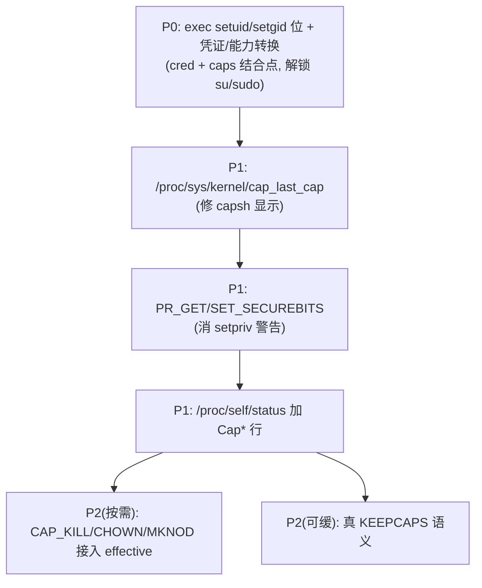

# cred/caps 完善与待测试

## 第二轮（真 KEEPCAPS，2026-08-15）

✅ 已实现真 KEEPCAPS 语义（替代"永不清"）：
- `ProcessControlBlock.keep_caps`（fork 继承、exec 清）；`PR_SET/GET_KEEPCAPS` 真实存取。
- setuid 0→非0：清 effective；无 KEEPCAPS 连 permitted 一起清；非0→0：effective=permitted。
- setpriv 兼容性已推演（KEEPCAPS=1 保留 permitted → reactivate 恢复 effective → setresgid 用 CAP_SETGID）。

待回归：`setpriv --reuid=man --regid=man --clear-groups true`（rc=0）、`su nobody -s /bin/sh -c id`（uid=65534）、`runuser -u man -- id`。

## 第一轮测试结果（2026-08-15）

✅ 通过：setpriv rc=0；`mount` 提权（setuid 位生效）；`runuser -u man` 切到 uid=6；
`/proc/sys/kernel/cap_last_cap`=31；`/proc/self/status` Cap* 行正确（CapPrm/Eff=01c1、CapBnd=ffffffff）；
`setpriv -dd` 四 cap；`setpriv --bounding-set -kill` rc=0；`setpriv --dump` 无 securebits 警告；
netcat `ii`、`dpkg --audit` 空。

❌ 修复中（已改，待重测）：
1. **su → "failed to execute /bin/sh: Not a directory"**：`preflight_executable_path` 把
   `check_parent_search` 放在 `resolve_symlinks` 之前，非 root 进程 exec `/bin/sh`（/bin 是
   symlink）时对 `/bin` 做父目录检查失败 → ENOTDIR（root 因短路一直未暴露）。已把
   check_parent_search 移到 symlink 展开之后。
2. **capsh `Securebits: 0xffffffff`**：capsh 调 `prctl(PR_GET_SECUREBITS)` 只传 option
   （glibc 可变参，arg2 是寄存器垃圾），我们校验 arg2..arg5 → EINVAL。Linux 对 PR_GET_*
   不校验额外参数。已改为不校验直接返回 0。

❓ 待观察：capsh `Current: =` 空（libcap 显示层；libcap-ng/setpriv 读同一 capget 正常）。
重测时加 `getpcaps $$` 交叉验证；若仍空，下轮在 sys_capget 加临时日志定位。

## 第二轮测试（重测）

```sh
# su（execve 修复）
su nobody -s /bin/sh -c id 2>&1; echo "su rc=$?"   # 期望 uid=65534(nobody)
# capsh（securebits 修复 + Current 观察）
/usr/sbin/capsh --print 2>&1 | head -6              # Securebits 应为 0，Current 应非空
getpcaps $$                                          # libcap 另一读法，期望 cap_chown,...
# setpriv 回归
setpriv --reuid=man --regid=man --clear-groups true; echo "rc=$?"   # 期望 0
setpriv --securebits +noroot -- true 2>&1; echo "rc=$?"             # 期望 0（+keep-caps 被 setpriv 自身拒绝）
```

## 实施状态（2026-08-15，rv_check 全部通过，待 guest 统一验证）

已完成：

- [x] **capget/capset per-process 状态** + uid/gid/setgroups 特权判定接入 caps（setpriv 已实测 rc=0）
- [x] **bounding set**：`ProcessCaps.bounding` + `cap_bset_read` 读实际位、`cap_bset_drop` 支持 CAP_SETPCAP 收窄并 prune E/P/I、capset 加 bounding 上限（root 同样受限）
- [x] capset **word1（cap 32–63）**非零明确 EPERM；**inheritable 只减不增**（对齐 Linux）
- [x] **`PR_GET_SECUREBITS`→0 / `PR_SET_SECUREBITS`** root 接受（消 setpriv `--dump` 警告）
- [x] **`/proc/sys/kernel/cap_last_cap` → 31**（libcap 探测用，修 capsh WARNING）
- [x] **`/proc/<pid>/status` 加 `CapInh/CapPrm/CapEff/CapBnd/CapAmb`** 行
- [x] **exec `S_ISUID/S_ISGID` 位**：euid/egid → 文件属主（saved 同步），提权到 root 时 caps → ROOT（解锁 su/sudo 提权路径）

改动文件：`task-api/api-v0/process.rs`、`sys/cred/{cap,mod}.rs`、`sys/task/{task,execve}.rs`、`fs-procfs/.../{path,view,render}.rs`

## 待测试（guest 一次性验证清单）

```sh
# 1. setpriv 回归（bounding/word1/inheritable 改动后必须仍通）
setpriv --reuid=man --regid=man --clear-groups true; echo "rc=$?"   # 期望 0
id man

# 2. setuid 位提权（su/sudo/mount）
ls -l /usr/bin/su /usr/bin/passwd /usr/bin/sudo 2>&1     # 确认 setuid 位（-rwsr-xr-x）
mount 2>&1 | head -2                                      # 提权后读 mount 表
runuser -u man -- id 2>&1                                 # 期望 uid=6(man)
su nobody -c id 2>&1; echo "rc=$?"                        # 期望切 nobody（若 shadow 读取 OK）

# 3. cap 探测与显示
apt-get install -y libcap2-bin                            # 快照重启需重装
/usr/sbin/capsh --print 2>&1 | head -8                    # WARNING 应消失；Current 应非空
grep -E 'Cap(Eff|Prm|Inh|Bnd)' /proc/self/status          # 应显示 00000000000001c1 等
cat /proc/sys/kernel/cap_last_cap                         # 应输出 31
setpriv -dd --dump 2>&1 | grep -E 'Effective|Permitted'   # 应显示 chown,setgid,setuid,setpcap

# 4. securebits
setpriv --dump 2>&1 | head -3                             # 不应再报 "secure bits failed"
setpriv --securebits +keep-caps -- true 2>&1; echo "rc=$?" # 应 0
```

## 规划与判断标准（原始内容）

好——基于"真实软件工作流 + oscomp 比赛"这个目标，完善的标准应该是：**每项都有真实触发场景，不过度设计安全模型**。分两块列，标注"触发场景 / 风险 / 优先级"。

## 判断标准（先定尺子）

1. 有真实程序会触发它（apt/dpkg/setpriv/su/sudo/mount/ps/capsh…）
2. 低–中风险，不破坏已验证的 setpriv 流程
3. 比赛 oscomp 可能测到（`proc`、基本 setuid/setgid、cap 相关 syscall）
4. 纯安全增强（file caps、ambient、per-thread）→ 一律不做

## A. cred（uid/gid 凭证）要完善的


| 项                                  | 触发场景                                                              | 风险                                        | 优先级             |
| ------------------------------------- | ----------------------------------------------------------------------- | --------------------------------------------- | -------------------- |
| **exec 的 `S_ISUID/S_ISGID` 位**    | `su`/`sudo`/`passwd`/`mount`/`chsh` 等 setuid-root 程序（当前全卡死） | 中（动 exec + 凭证转换，需回归 setpriv）    | **P0**             |
| 随 setuid 更新`saved_uid`（= euid） | setuid 程序内部再 setuid 的逻辑正确性                                 | 中（并入 P0 一起做）                        | P0                 |
| `passwd`/`group`/`shadow` 读取      | `getpwnam`/`getgrnam`/NSS（su 查用户、`ls -l` 显示属主）              | 低（纯 fs 读，已基本可用）                  | 已 OK，验证即可    |
| `initgroups`（用户态）+ `setgroups` | `runuser --init-groups`、su/sudo 补组                                 | 低（setgroups 已实现，initgroups 是用户态） | 低                 |
| `setfsuid/setfsgid`                 | NFS 类程序                                                            | 低                                          | **不做**（无场景） |

## B. caps（能力）要完善的


| 项                                                                             | 触发场景                                                       | 风险                                          | 优先级               |
| -------------------------------------------------------------------------------- | ---------------------------------------------------------------- | ----------------------------------------------- | ---------------------- |
| **exec 凭证转换时同步能力**（setuid 提权 → permitted/effective 变 root 全量） | 与 A 的 P0 是同一件事的两面，su/sudo 需要"euid=0 且有能力"     | 中（并入 P0）                                 | **P0**               |
| `PR_GET/SET_SECUREBITS`                                                        | `setpriv` 每次 `--dump` 都警告；`--securebits` 流程            | 低（GET→0，SET→no-op 校验）                 | P1                   |
| `cap_last_cap`                                                                 | **修 capsh 的 WARNING + `Current:` 空显示**（libcap 探测依赖） | 低（加个文件/节点）                           | **P1**（性价比最高） |
| `status` 加 `CapEff/Prm/Inh/Bnd`                                               | `ps`/`procps`/用户排查显示                                     | 低（procfs 加字段）                           | P1                   |
| `kill` 权限接 `CAP_KILL`                                                       | 非 root 持 CAP_KILL 杀他人进程（场景少）                       | 中（动 signal 判定）                          | P2（按需）           |
| `chown` 接 `CAP_CHOWN`                                                         | 非 root 持 CAP_CHOWN 改属主                                    | 中（动 attr）                                 | P2（按需）           |
| `mknod` 接 `CAP_MKNOD`                                                         | 非 root 持 CAP_MKNOD 建设备节点                                | 中（动 dir）                                  | P2（按需）           |
| 真`KEEPCAPS`（setuid 0→非0 清 E 留 P）                                        | 对齐 Linux 降权语义（当前"永不清"）                            | **中高**（动 setresuid 流程，需重验 setpriv） | P2（可缓）           |
| file caps xattr / ambient / per-thread caps                                    | 几乎无真实触发                                                 | 高                                            | **不做**             |

## 建议落地顺序



## 我的推荐（最小有效集）

1. **P0（核心）**：实现 exec 的 setuid/setgid 位 + 同步能力 → `su`/`sudo`/`mount`/`passwd` 全部解锁。这是 cred 和 caps 的**交汇点**，一次做两个子系统。
2. **P1（性价比）**：`cap_last_cap` + `PR_GET_SECUREBITS` + `proc` Cap* 行——都是低风险、消噪音、提升工具兼容。
3. **P2 全看压测**：如果 `kill`/`chown`/`mknod` 相关程序或比赛用例暴露问题再逐项接。

要不要我从 **P0** 开始？在 `cred::on_exec` 里补 setuid/setgid 位处理（读文件 mode/owner → 更新 euid/egid/saved + caps），这是当前唯一真正"卡住真实软件"的缺口（su/sudo）。
