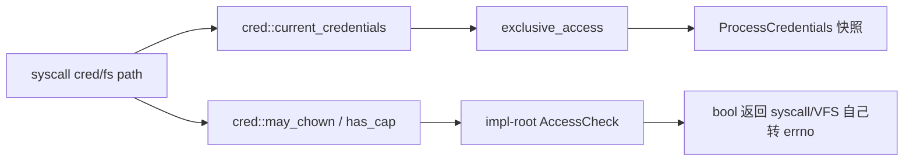

# wateros-cred

[项目首页](../../../README.md) · [内核工程](../../README.md) · [系统架构](../../../README.md#系统架构)

### 简介

`wateros-cred` 为 WaterOS 保存任务级身份与授权上下文，是连接任务生命周期、凭证系统和文件权限检查的轻量侧表组件。它以 `TaskId` 建立凭证记录，保存 real、effective、saved、filesystem UID/GID 及 supplementary groups，并通过 owner 映射和引用计数支持 `fork` 复制与 `CLONE_THREAD` 共享。用户任务创建、exec、退出和 reap 均由 syscall 或启动路径显式触发对应 hook，组件本身不拥有任务实体、地址空间或 inode。当前 `impl-root` 提供初始 root 与 bring-up 阶段的 `set*id` 更新策略，capability 和 inode 访问检查仍是受限占位实现；因此本文同时说明锁、发布、回收时序及尚未实现的 Linux 语义，避免将接口预留误读为完整权限模型。

## 定位和边界

`wateros-cred` 是按 `TaskId` 索引的进程凭证侧表。它保存用户任务的 UID/GID 快照、
supplementary groups，以及线程 clone 时共享凭证所需的 owner/refcount bookkeeping；它不拥有
任务实体、PID/线程组关系、地址空间或文件描述符。`wateros-task` 不依赖本组件，任务创建、
fork/clone、exec 和 reap 路径通过 `wateros-cred` 顶层 hook 显式同步状态（`src/lib.rs`）。

当前默认 feature 为 `api-v0 + impl-root`（`Cargo.toml`），实现与 ISA 无关，RISC-V 和
LoongArch 使用同一侧表；未选择 `impl-root` 时仅保留版本化 API，顶层生命周期入口不导出。
syscall 层读取/修改凭证，VFS/文件 syscall 自己完成大部分元数据权限判断；`AccessCheck` 只
是凭证侧预留的窄边界。

## 代码地图

| 语义 | 路径 | 真实职责 |
| --- | --- | --- |
| 聚合门面 | `src/lib.rs` | 选择 `active_impl`，转发生命周期、查询、ID/组修改和权限查询；对当前任务的清理做延迟保护。 |
| 稳定数据契约 | `cred-api/api-v0/src/types.rs` | `Uid`、`Gid`、`ProcessCredentials` 和固定组容量 32。 |
| 后端契约 | `cred-api/api-v0/src/traits.rs` | `CredentialBackend`、`CredentialMutation` 生命周期/修改接口，以及 `AccessCheck`/`Capability`。 |
| 侧表状态 | `cred-impl/impl-root/src/registry.rs` | `PerTaskCredRegistry` 三张 `BTreeMap`、owner 解析、引用计数、权限占位和全局发布。 |
| hook 转发 | `cred-impl/impl-root/src/hooks.rs` | 在 `MultiprocessorSafeCell::exclusive_access()` 内调用 registry；包含可选 `self_test`。 |

## 核心状态与数据结构

### 凭证快照

`ProcessCredentials`（`cred-api/api-v0/src/types.rs`）包含 real/effective/saved/fs 四组
UID/GID（八个 ID）、`[Gid; 32]` 固定数组和有效长度 `supplementary_group_len`。`ROOT` 将
所有 ID 置 0，并把有效 supplementary 组设为 `[0]`（长度 1）。修改方法是就地更新快照：
`set_uid`/`set_gid` 更新同类四个 ID，`setreuid`/`setregid` 用 `None` 表示 Linux `-1`，
`setres*` 分别更新三元组并令 fs ID 跟随 effective ID。

### `PerTaskCredRegistry`

| 状态 | 存储与所有权 | 不变量/转移 |
| --- | --- | --- |
| `creds: BTreeMap<TaskId, ProcessCredentials>` | 堆上的有序 map；只保存每个 owner 一份快照 | `owners[tid]` 的有效 owner 必须有对应条目；`current` 找不到条目会 panic，`try_cred` 返回 `None`。 |
| `owners: BTreeMap<TaskId, TaskId>` | 每个任务一个 owner 映射；独立任务映射到自身，线程共享映射到共同 owner | `effective_owner(tid)` 是所有读写的归一化入口；`share_cred` 若 child 已存在先释放旧归属。 |
| `ref_counts: BTreeMap<TaskId, usize>` | 以 owner 为 key 的共享引用数 | 初建为 1；共享递增；`drop_task_cred` 删除映射并递减，归零时同时删除 `creds[owner]`。 |

三张表整体由 `MultiprocessorSafeCell<PerTaskCredRegistry>` 保护；`hooks.rs` 的每次查询或修改
都在一次 `exclusive_access()` 中完成，返回的是 `Copy` 快照，不把 map 内引用带出锁。全局
`CRED_REGISTRY` 用 `MaybeUninit` 延迟构造，`CRED_REGISTRY_READY` 以 Acquire/Release 发布。
这个发布检查没有 CAS/once 锁，源码没有证明并发首次初始化安全，调用方应在并发访问前完成
单线程预热。

## 关键链路

### 创建、fork 与 `CLONE_THREAD`

```mermaid
sequenceDiagram
    participant B as user_bringup_common / clone
    participant C as wateros-cred::src/lib.rs
    participant H as impl-root::hooks
    participant R as PerTaskCredRegistry
    B->>C: on_user_task_spawned(tid)（首个用户任务）
    C->>H: active_impl hook
    H->>R: ensure_owner(tid); creds[tid] = ROOT
    B->>C: fork_cred(parent, child)（clone.rs）
    C->>R: 复制 parent 快照到 child owner
    B->>C: share_cred(parent, child)（CLONE_THREAD）
    C->>R: child -> effective_owner(parent); ref_counts++
```

`os/src/user_bringup_common.rs:104` 负责初始用户任务注册；`sys/task/clone.rs` 在 fork
分支调用 `fork_cred`，在线程 clone 分支调用 `share_cred`。fork 得到独立快照，之后的 ID
修改不会影响父任务；线程共享同一个 owner，因此任一线程的修改对共享组可见。若 clone 失败，
`clone.rs:432` 调用 `drop_task_cred(child_id)` 回滚新建条目。

### exec、退出与 reap

```mermaid
flowchart TD
    A[execve::exec] --> B[清理被移除线程]
    B --> C[drop_task_cred(exited.id)]
    C --> D[处理文件 S_ISUID/S_ISGID 的 set_resuid/set_resgid]
    D --> E[cred::on_exec(current_tid)]
    E --> F[impl-root on_exec: no-op]
    G[任务退出进入 zombie] --> H[wait.rs reap]
    H --> I[cred::drop_task_cred(exited.id)]
    I --> J[release_owner; refcount=0 时删除 creds]
```

`sys/task/execve.rs` 负责被移除线程的清理，并在当前任务上按文件元数据调用顶层
`set_resuid`/`set_resgid`，最后调用 `on_exec`；后端的 `on_exec` 当前没有再解析 setuid
位（`registry.rs:135-137`）。退出时不能立即删除当前任务凭证：`src/lib.rs::drop_task_cred`
检测 `task::current_task_id()` 并直接返回，以保留 zombie/退出收尾期间的查询；父任务在
`sys/task/wait.rs:154,202` reap 后再次调用，非当前任务才真正减少引用并回收 owner 条目。

### syscall/VFS 查询边界



例如 `sys/fs/attr.rs` 读取当前快照并调用 `may_chown`；`sys/cred/mod.rs` 将用户 ABI
参数转换为 `Uid/Gid` 后调用 `set_res*`/`set_supplementary_groups`。凭证组件不持有 inode、
路径或 errno，也不替代 `attr.rs`、`cwd.rs` 等文件 syscall 的 owner/group/mode 检查。

## 机制与正确性

- 所有 registry 访问都经过同一独占锁；锁内只做 `BTreeMap` 操作和快照更新，不执行用户拷贝、
  调度或文件 I/O。快照按值返回，避免悬空引用。
- owner/refcount 是线程共享安全的核心：共享 child 不复制 `ProcessCredentials`，退出任意
  一个线程只释放自己的 owner 映射，最后一个引用才删除快照。重复注册同一 tid 会先释放旧
  归属再建立新 root/副本。
- `current_credentials`/`credentials_for` 对缺失条目 panic；需要处理任务尚未发布或已回收
  的竞争时使用 `try_credentials_for`，例如信号身份检查。
- `has_cap` 仅对 effective UID 0 返回 true；非 root 一律 false。`may_access_inode` 当前
  无条件 true；`may_chown` 对 root 或 `CAP_CHOWN` 放行，非 root 仅允许 fs UID 匹配 inode、
  不改变 inode UID，并把新 GID 限制为 effective GID 或有效 supplementary 组。
- `set_supplementary_groups` 直接以输入长度写入固定数组；上游 syscall 目前限制为
  `SUPPLEMENTARY_GROUP_COUNT`，后端本身没有独立边界检查，直接调用者必须遵守该前提。

## 初始化、配置与可观测性

`registry()` 首次访问时构造全局侧表；建议在用户任务并发启动前由启动路径完成一次初始化。
`self_test` feature（`wateros-cred/Cargo.toml`）调用 `impl-root::hooks::self_test`，用
局部 registry 验证 root 初始化、fork 隔离、组更新和两次回收，并输出 `[cred]` 日志；顶层
`src/main.rs` 在启用该 feature 时触发它。凭证没有 RISC-V/LoongArch 分支，也没有持久化或
独立容量配置；唯一固定容量是 API 的 32 个 supplementary groups。

## 限制与后续边界

- `on_exec` 尚未实现从 ELF 权限位解析并应用 S_ISUID/S_ISGID；当前 exec 路径的 setuid/setgid
  处理在 syscall 层显式完成，不能据此宣称完整 Linux exec 凭证语义。
- capability 集合只有 `Chown`、`SysAdmin` 两个枚举值，permitted/inheritable/bounding
  集合和 `prctl(PR_CAPBSET_*)` 的持久状态尚未由本组件保存；`has_cap` 只是 root/非 root 占位。
- inode access 检查仍无条件放行，真实 mode/ACL/namespace 策略由 syscall/VFS 现有代码承担，
  `AccessCheck` 尚未成为统一授权入口。
- 侧表没有独立的任务退出通知订阅；正确回收依赖 syscall 的 rollback/reap hook。全局 lazy
  发布采用非原子“检查后写入”，源码未提供并发首次初始化的完整保证。
