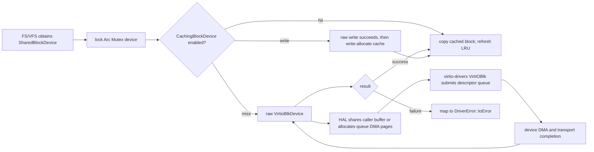

# wateros-driver

## 组件简介

`wateros-driver` 是 WaterOS 内核把启动期硬件发现转换为可供其他子系统使用的设备对象的聚合组件。它以通用驱动 API 统一表达设备类型、MMIO 区间、中断描述和错误，再按构建 feature 选入 QEMU RISC-V 或 LoongArch64 的机器实现。RISC-V 路径从 DTB 发现 UART 与 VirtIO-MMIO 设备，LoongArch 路径从 PCIe ECAM 枚举并配置 VirtIO-PCI；成功构造的块、字符、网络、显示和输入设备会进入各自的共享注册表。组件负责 transport 初始化、DMA 资源接线和 devfs 刷新触发，但不接管 VFS 文件语义、文件系统、网络协议、GUI 绘制或用户态设备策略。块设备还可选择性包裹写穿 LRU 缓存，以降低重复读取的底层 I/O。内核消费者取得注册表中的共享句柄后，才在其所属层执行实际操作。

## 定位和边界

`wateros-driver` 是 WaterOS 的设备发现和设备 I/O 聚合层。它把通用的
[`driver-api/api-v0`](driver-api/api-v0/src/lib.rs) 数据模型、块/字符/网络/显示/输入子系统，
以及由 feature 选择的 QEMU 机器实现组合起来；顶层
[`src/lib.rs`](src/lib.rs) 通过 `machine()` 只暴露 `MachineDriver`，使内核启动代码不直接依赖
具体板级 crate。

它拥有 DTB 或 PCI 枚举后的设备绑定、各类设备的内核注册表、VirtIO transport 的构造和
devfs 刷新触发；不拥有 VFS 的文件描述符与路径语义、文件系统块格式、网络协议栈、GUI
合成或用户态设备映射。这些消费者从本组件取得共享设备句柄后，在各自层处理策略。

顶层默认 feature 仅为 `api-v0`。`impl-qemu-riscv64-virt` 选择 RISC-V/OpenSBI QEMU virt 的
DTB + VirtIO-MMIO 路径；`impl-qemu-loongarch64-virt` 选择 LoongArch64 QEMU virt 的 PCIe ECAM
+ VirtIO-PCI 路径（见 [`Cargo.toml`](Cargo.toml)）。显示与输入还需要相应的 `display`、`input`
feature；`impl-block-cache` 是可选的块设备装饰器。

## 代码地图

|职责|源码位置|当前职责边界|
|---|---|---|
|聚合 facade 和 feature 选择|[`src/lib.rs`](src/lib.rs)|再导出子系统 API，选择当前 `MachineDriver`，汇总可声明绑定的设备表。|
|跨子系统契约|[`driver-api/api-v0/src/lib.rs`](driver-api/api-v0/src/lib.rs)|`DeviceInfo`、MMIO/IRQ 描述、`DriverError` 与 `MachineDriver`；不包含具体 I/O trait。|
|QEMU RISC-V 机器组装|[`driver-impl/impl-qemu-riscv64-virt/src`](driver-impl/impl-qemu-riscv64-virt/src)|扫描 DTB、探测 MMIO VirtIO/UART、注册设备并刷新 devfs。|
|QEMU LoongArch 机器组装|[`driver-impl/impl-qemu-loongarch64-virt/src`](driver-impl/impl-qemu-loongarch64-virt/src)|扫描 PCIe ECAM、为 BAR 分配窗口、构造 VirtIO-PCI 设备并刷新 devfs。|
|块设备与缓存|[`driver-block`](driver-block)|块注册表、`BlockDevice`、VirtIO-MMIO/PCI 后端与可选写穿 LRU 缓存。|
|字符设备|[`driver-character`](driver-character)|UART、RTC/null stub 与可回滚的串口读取保留；devfs/VFS 是其消费者。|
|网络、显示、输入|[`driver-network`](driver-network)、[`driver-display`](driver-display)、[`driver-input`](driver-input)|分别注册以太网帧设备、线性 framebuffer 和非阻塞原始输入事件；协议、绘制和事件解释在组件外。|

## 核心状态与数据结构

|状态|所有者和存储|并发/生命周期不变量|
|---|---|---|
|`DeviceInfo` 与 RISC-V `DEVICE_INFOS`|`enumerate.rs` 中 `Mutex<Vec<DeviceInfo>>`；每次 `scan_device_info()` 清空后重建|保存节点名、compatible 列表、`DeviceType`、首个 MMIO 区间和可选 IRQ。注册阶段先克隆快照再做 I/O，避免持有该锁进行构造。|
|块注册表 `BLOCK_DEVICES`|`block-api/api-v0` 中 `Mutex<Vec<SharedBlockDevice>>`，元素为 `Arc<Mutex<Box<dyn BlockDevice>>>`|注册顺序就是稳定索引；取用函数克隆 `Arc` 后释放表锁。设备 mutex 串行化同一设备的读、写和 `flush`；当前没有注销路径，注册设备存活至内核结束。|
|字符、网络、显示、输入注册表|各自 `*-api/api-v0/src/lib.rs` 中同形的 `Mutex<Vec<Arc<Mutex<Box<dyn ...>>>>>`|表锁只保护表本身；消费者取得克隆句柄后才锁设备。输入的 `input_devices()` 返回句柄快照。|
|RISC-V 已成功 transport 的诊断表|`VIRTIO_BLK_MMIO`、`VIRTIO_NET_MMIO`、可选 `VIRTIO_GPU_MMIO`|均为 `Mutex<Vec<...>>`，每轮 probe 清空，只有成功注册后写入；用于自检/诊断，非 I/O 数据面。LoongArch 对应 PCI BDF/ID 表在 `register.rs`。|
|`INIT_AFTER_BOOT_DONE`|两套机器 crate 的 `AtomicBool`|以 `swap(AcqRel)` 拒绝重复初始化；内部失败后以 `store(Release)` 清除，允许重试。成功后设备表允许为空。|
|`CachingBlockDevice`|注册表中的一个 `BlockDevice` 装饰器；持有 raw 后端、预分配数据区、LBA 索引、空闲槽、LRU 双链及 `RecentIndex`|读取第一次未命中只记 recent，第二次才准入；写入先向 raw 后端写成功，再 write-allocate/更新缓存。外层设备 mutex 覆盖其全部可变状态。默认容量为 `BLOCK_CACHE_CAPACITY_BLOCKS = 16384` 块。|
|VirtIO DMA 资源|各 MMIO/PCI 后端的 `Hal::dma_alloc` 向 frame allocator 申请连续页|当前假定内核恒等映射，`paddr == vaddr`；分配失败或页不连续时回收已取页并返回空对，由 `virtio-drivers` 初始化失败映射为 `DriverError`。|

`DeviceInfo` 的 `SupportedDeviceEntry` 匹配是非排他的目录：`compatible = "virtio,mmio"`
可被多个子系统声明，但 RISC-V probe 随硬件读出的 `DeviceType` 选择 block、network、display 或 input
构造器。它不是设备运行时注册表。

## 关键链路

### RISC-V 启动发现到消费者

顶层 [`os/src/main.rs`](../../src/main.rs) 的 `init_services_after_boot()` 直接调用
`driver::machine().init_after_boot()`，并在失败时记录警告、返回 `false`。RISC-V 实现按下列顺序扫描、
注册和刷新 devfs；消费者通过 `first_block_device()` 等函数取得共享句柄，而不是访问 DTB 快照。

```mermaid
sequenceDiagram
    participant Boot as main::init_services_after_boot
    participant Machine as riscv MachineDriver
    participant Scan as enumerate::scan_device_info
    participant Reg as register::probe_virtio_devices
    participant Table as BLOCK_DEVICES
    participant Devfs as devfs::sync
    participant User as FS/VFS consumer

    Boot->>Machine: init_after_boot()
    Machine->>Scan: read_fdt(platform::dtb_pa())
    Scan->>Scan: MMIO magic + device id -> DeviceInfo
    Machine->>Reg: probe_character_devices(); probe_virtio_devices()
    Reg->>Reg: VirtioBlkDevice::from_mmio(mmio)
    Reg->>Table: register_block_device(shared device handle)
    Machine->>Devfs: set_dt_unsupported_paths(); refresh()
    User->>Table: first_block_device() clones Arc
    User->>User: lock device, issue BlockDevice I/O
```

`scan_device_info()` 先解析 DTB，再对 `virtio,mmio` 节点以易失读检查 magic 和 device ID；缺少 MMIO
或构造失败的节点会进入 unsupported 列表，最终由 `devfs::sync()` 交给 fs-devfs。UART 从 DTB 匹配
`ns16550a`/`ns8250`，没有命中时回退 QEMU UART0，并随后注册 RTC/null 内建设备。

### 块请求、缓存、VirtIO 队列和完成

块消费者锁住已取得的 `SharedBlockDevice` 后调用 `read_blocks`/`write_blocks`。raw 后端将范围或
transport 错误折叠为 `DriverError::{InvalidParam,Unsupported,IoError}`；当前组件源码没有独立的
WaterOS IRQ waiter/wakeup 状态机，队列提交及完成等待由 vendor `virtio-drivers` 的 `VirtIOBlk` 调用完成。



[`impl-virtio-mmio/src/lib.rs`](driver-block/block-impl/impl-virtio-mmio/src/lib.rs) 使用
`MmioTransport`，PCI 版本以 `PciTransport` 解析 capability；两者的 `Hal` 均从物理帧分配器取得
连续页并坚持恒等映射。`share()` 仅把现有缓冲区地址作为物理地址，因此调用路径也依赖该映射假设。
缓存只合并连续读未命中区间；它是 write-through，`flush()` 仍转发 raw 设备，不实现 write-back。

## 机制与正确性

- 注册表锁与设备锁分离：先在表锁内 clone `Arc`，再锁具体设备；平台注册函数也在构造完成后才追加，避免把未初始化对象暴露给消费者。设备 mutex 是 spin lock，因此调用者不应在已持有其它可阻塞或会递归进入驱动的锁时进行 I/O。
- `BlockDevice::check_request_range()` 拒绝零块大小、非整块缓冲、LBA 加法溢出及已知容量越界。字节读取会分配整块 scratch buffer，因而不适合假定为无分配热路径。
- 缓存的 LRU 头是最久未使用项、尾是最近项；索引冲突或容量满时淘汰头部并把 LBA 放回 recent 集。若内部不变量损坏，`alloc_slot()` 会记录警告并重置缓存元数据，数据可重新从 raw 设备读取。
- 字符设备的 `SerialPortCharacterDevice` 用 `CharacterReadReservation` 保留最多 256 字节；用户拷贝未提交的后缀按原顺序放回 `pending`，因此一次取消不应丢失串口输入。它是轮询式读取，没有本组件提供的阻塞等待队列。
- 显示设备 mutex 同时保护驱动状态和 framebuffer 借用；输入 `pop_event()` 明确要求非阻塞。网络设备只提供以太网帧收发，VirtIO 网络接收空队列返回 `Ok(0)`，协议轮询由上层拥有。

## 初始化、配置与可观测性

驱动初始化必须发生在帧分配器可用之后：VirtIO 构造会为 descriptor/缓冲区调用
`frame_alloc_result()`。RISC-V 在 DTB 中取得 VirtIO-MMIO 窗口；LoongArch 从 DTB 找 PCI 配置空间
（默认 `0x2000_0000`），枚举 bus 0，并在 `0x4000_0000..0x8000_0000` 的 PCI MMIO 窗口内为 BAR
单调分配地址。后者只探测其实现所请求的 VirtIO PCI 设备，缺失设备通常记录 warning 后继续。

日志前缀包括 `[driver]`、`[driver-la]`、`[virtio-pci-blk]` 与 `[block-cache]`；RISC-V 的
`dump_device_and_devfs_info()` 和两平台 `self_test` feature 提供只读诊断。顶层 `test()` 测 API
样例和机器 `test()`；它不是带真实设备的端到端 I/O 验证。`block-cache-diagnostics` feature 另会
周期性输出缓存命中、后端调用和淘汰计数。

## 限制与后续边界

- 顶层 `supported_device_entries()` 是静态声明合并，不表示硬件已发现、已构造或可用。
- 设备注册表只追加、不支持运行时删除或热插拔；成功的机器初始化也不保证至少有一个块、网卡或图形设备。
- RISC-V 路径只从 DTB 识别 MMIO VirtIO；LoongArch 路径为 PCIe ECAM，并非两种 transport 的通用自动探测器。
- 当前源码将 VirtIO I/O 完成细节委托 `vendor/virtio-drivers`，在本组件内没有可描述的独立 IRQ-to-wakeup 队列或中断亲和策略。
- `MachineDriver::realtime_ns()` 是可选能力；不支持时返回 `Ok(None)`，不能据此假定 RTC 总存在。顶层 facade 的 `init_after_boot()` 会吞掉错误，仅适合不需向上报告启动失败的调用方；内核启动主路径使用 `machine()` 的结果。
