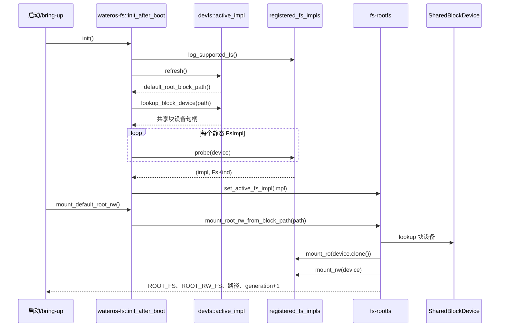
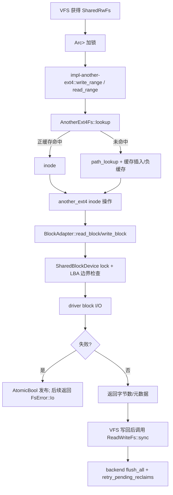

# wateros-fs

[项目首页](../../../README.md) · [内核工程](../../README.md) · [系统架构](../../../README.md#系统架构)

`wateros-fs` 是 WaterOS 内核中文件系统实现的统一聚合层，负责把稳定的 FS API、设备文件系统、
进程信息文件系统、根卷状态和可选后端连接起来。系统启动后，它先刷新 devfs、发现默认块设备，
再依据文件系统签名从静态注册表选择实现；真正的根卷挂载延后到 bring-up 阶段，并同时建立只读与
读写共享句柄。默认后端是面向 ext4 的 `another-ext4` 适配器，也可按 feature 选择其他 ext4 或
ramfs 实现。该组件提供挂载、设备和后端 I/O 的生命周期与错误转换，但不负责 VFS 的路径解析、
文件描述符、页缓存、命名空间或 syscall 语义，这些职责由上层组件承担。

## 定位和边界

`wateros-fs` 是文件系统实现的聚合门面：维护静态 `FsImpl` 注册表，启动后从 devfs 找到根块设备，
探测并注入活动实现，再把根卷句柄交给调用方。`src/lib.rs::init_after_boot` 明确只做探测和注入，
`mount_default_root_rw` 才执行默认根卷挂载。路径解析、FD/cwd、mount namespace、页缓存和 syscall
语义属于 `wateros-vfs`/`wateros-syscall`，本组件不重复实现这些策略。

上游是 driver-block 的共享块设备和 devfs 的设备表；下游是 VFS、ELF/内核读者以及挂载调用方。
稳定类型和 trait 来自 `fs-api/api-v0`，具体机制位于 `fs-impl/*`、`fs-rootfs`、`fs-devfs` 和
`fs-procfs`。架构差异由驱动/平台提供的 `SharedBlockDevice` 吸收，FS 聚合代码本身没有 RISC-V
或 LoongArch 分支。

## 代码地图

| 语义 | 主要源码 | 作用 |
| --- | --- | --- |
| 聚合门面 | `src/lib.rs` | `registered_fs_impls`、`pick_fs_impl`、`init_after_boot`、根卷转发与自检调度。 |
| 稳定契约 | `fs-api/api-v0/src/{types,traits,handles}.rs` | `FsError`、`FsKind`/`FsAccessMode`、RO/RW trait、`SharedFs`/`SharedRwFs`。 |
| 设备文件系统 | `fs-devfs/devfs-impl/impl-kernel/{manager,fs_impl}.rs` | 从驱动注册表刷新 `/dev` 节点并解析块/字符设备。 |
| 根卷状态 | `fs-rootfs/rootfs-impl/impl-kernel/{registry,mount,state}.rs` | 活动 impl、RO/RW 句柄、设备路径和 mount generation。 |
| 伪文件系统 | `fs-procfs/procfs-impl/impl-kernel/` | `/proc` 视图和渲染；作为 `FsImpl` 注册，但不是块卷根 FS。 |
| 默认 ext4 适配 | `fs-impl/impl-another-ext4/{backend,block_io,filesystem,path_lookup,dentry_cache}.rs` | vendored `another_ext4` 的 WaterOS API、块 I/O、查找缓存和生命周期适配。 |
| 其他后端 | `fs-impl/impl-ext4/`、`impl-ext4-rs/`、`impl-ramfs/`、`impl-devfs/` | 由 feature 选择的替代 ext4、页 payload ramfs、devfs 适配。 |

`FsImpl` 是每个实现暴露的 `'static` 实例（如 `impl_another_ext4::IMPL`），注册表按 feature 静态
拼接。`pick_fs_impl(kind, mode)` 只按能力表匹配；实际块卷仍须先经过 `probe`，因此“已注册”不等于
“已经挂载”。

## 核心状态与数据结构

| 状态/结构 | 存储与并发 | 生命周期和不变量 |
| --- | --- | --- |
| `registered_fs_impls()` | 编译期静态切片，元素为 `'static FsImpl` | 由 feature 决定；ext4 三选一，重复选择由 `compile_error!` 拒绝。devfs/procfs 也在表中用于能力展示。 |
| `ACTIVE_FS_IMPL` | `spin::Mutex<Option<&'static dyn FsImpl>>` | `init_after_boot` probe 成功后写入；未注入时挂载返回 `Unsupported`。引用指向静态注册项，不在运行期释放。 |
| `ROOT_FS` / `ROOT_RW_FS` | 两个 `spin::Mutex<Option<Arc<Mutex<...>>>>` | 一次成功 RW 根挂载同时建立 RO 和 RW 句柄；克隆 `Arc` 后共享同一挂载实例。`clear_root_fs` 同时清理两者和设备路径。 |
| `ROOT_DEV_PATH` | `Mutex<Option<String>>` | 记录最近一次成功挂载的设备路径；辅助挂载可据此判断是否为同一块设备。 |
| `MOUNT_GENERATION` | `AtomicU64`，读取 `Acquire`、递增 `Release` | 每次根/辅助挂载成功递增，供依赖方（如页缓存）识别挂载实例变化；`FsNodeId` 不得跨代复用。 |
| `DevFsImpl` | 静态 `DEVFS: Mutex<DevFsImpl>`；节点和路径绑定为 `Vec` | `refresh` 先以驱动快照重建块/字符绑定，再合并 DTB 未支持路径占位；查找只返回当前快照中的共享句柄。 |
| `AnotherExt4Fs` | 单个后端对象由 `SharedFs`/`SharedRwFs` 的 `Mutex` 串行访问；缓存分别加锁 | 保存 vendored `Ext4`、设备、I/O 错误标志、4096 容量正查找缓存、4096 槽四路负缓存、open/orphan 表。卸载/句柄销毁由持有的 `Arc` 生命周期决定。 |

`AnotherExt4Fs::io_error_state` 用 `AtomicBool` 的 `Release` 发布块读写失败，后续 `check_backend`
以 `Acquire` 转换为 `FsError::Io`。正缓存达到 `LOOKUP_CACHE_CAPACITY=4096` 时清空；负缓存按路径
哈希分桶并在创建、删除、重命名时失效。用户可见 unlink 成功而隐藏 orphan 删除失败时，条目进入
`pending_reclaims`，由 `sync`/最终 close 重试，不把已提交的命名空间操作回滚。

## 关键链路

### 启动探测到默认根挂载

`init_after_boot` 在无设备、lookup 失败或 probe 无匹配时只记录日志并返回，不伪造根卷。默认
挂载阶段再次解析设备，并要求已注入 impl；RO 句柄供内核读者使用，RW 句柄供 VFS 变更使用，任一步
失败都向上返回 `FsError`，不会发布不完整的全局状态。

### 一次读写请求到持久化

WaterOS 适配层把驱动设备的实际 block size 转换成 vendored `another_ext4` 固定的 4096 字节块，
检查乘法溢出和设备容量后才读写 LBA。`FsError` 映射集中在 `block_io::map_error`（例如 ENOENT→
`NotFound`、EROFS/ENOTSUP→`Unsupported`、EIO→`Io`）。文件页缓存先由 VFS 负责写回；这里的
`sync` 负责 ext4 元数据/块缓存及延迟 orphan 回收，不能替代 VFS 的 open-file offset 或 mount 语义。

## 机制与正确性

- **选择与挂载分离**：能力表只描述 `(FsKind, FsAccessMode)`；`probe` 读取设备签名后才选择 impl，
  `mount_*` 成功后才写入全局句柄和设备路径。默认 `another-ext4` 检查 ext4 magic `0xEF53`。
- **锁边界**：根状态、devfs 表和共享 FS 实例分别由 `spin::Mutex` 保护；调用者不得在持有 FS 锁时
  再进入可能阻塞的用户拷贝、调度或 VFS 递归路径。块适配器只在一次底层读写期间持有设备锁。
- **一致性与身份**：`SharedFs`/`SharedRwFs` 是 `Arc<Mutex<...>>`，多个读者看到同一挂载状态；
  mount generation 与节点身份配套，缓存不能跨代使用。创建/删除/重命名会清理对应正负 dentry 缓存。
- **错误处理**：设备查找、probe、mount 和后端操作逐层返回 `FsResult`；底层格式/驱动错误转换为
  稳定 `FsError`，I/O 原子标志避免继续把已知坏后端当作成功。
- **边界**：procfs/devfs/ramfs 的实现能力由各自 impl 声明；tmpfs 是 VFS 基于 ramfs 句柄的策略，
  不是本聚合层另建的挂载管理器。VFS namespace、权限检查和 syscall errno 转换不在此处完成。

## 初始化、配置与可观测性

`Cargo.toml` 默认 feature 为 `api-v0`、`impl-devfs`、`impl-another-ext4`、`impl-ramfs`；
`impl-ext4`、`impl-ext4-rs` 是互斥替代后端，`ext4-lookup-diagnostics` 为 another-ext4 查找
计数诊断，`self_test` 会传播到各实现。`init_when_boot` 只宣布门面就绪；真正设备访问必须在
驱动初始化完成后调用 `init_after_boot`/`init`。

初始化和运行期日志使用 `[fs]`、`[fs::rootfs]`、`[fs::another-ext4]` 前缀，包括能力列表、devfs
节点数、probe/mount 结果和块 I/O 失败。验证入口是聚合 `test`/feature-gated `self_test`，其中
`impl-another-ext4::self_test` 检查 4096 块和 magic，`rootfs::self_test` 检查根状态自洽；完整读写
验证还应在镜像副本上执行并用宿主 `e2fsck -fn` 做只读检查。

## 限制与后续边界

- 根卷自动流程只选择一个默认块设备；没有设备或 probe 不匹配时不会挂载。多卷、namespace 和
  VFS mount 生命周期由上层处理。
- 默认 `another-ext4` 依赖 vendor `another_ext4` 的同步、固定 4096 字节块接口；WaterOS 适配层
  不提供 journal/崩溃恢复保证，写入持久性取决于后端 `flush_all` 和设备实现。
- `FsAccessMode::Async` 在 API 中仅是枚举（v1 未实现）；部分 API 操作仍按具体后端返回
  `Unsupported`。负缓存、orphan 重试和查找诊断不是 Linux VFS 语义的承诺。
- `impl-ext4`、`impl-ext4-rs` 等替代后端只有启用对应 feature 才参与注册；本 README 不把未启用
  或未运行验证的组合描述为已支持。
