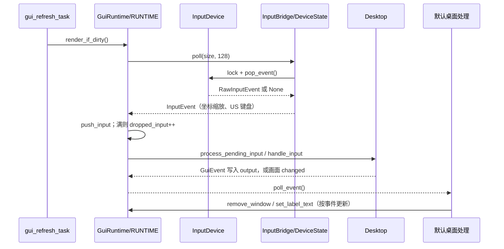

# wateros-gui

[项目首页](../../../README.md) · [内核工程](../../README.md) · [系统架构](../../../README.md#系统架构)

## 简介

`wateros-gui` 是 WaterOS 的内核态图形界面运行时，为 QEMU 图形 bring-up 提供窗口、控件、输入处理和软件合成能力。它以稳定的 GUI 数据模型隔离上层场景与具体硬件，将键盘、鼠标或平板的原始 evdev 事件转换为指针、按键和文本事件，并在单个桌面中维护窗口层级、焦点、拖动与控件交互。所有图元先绘制到普通内存中的 BGRA8888 shadow surface，再按脏区复制到显示驱动管理的 framebuffer 并请求刷新，从而避免窗口逻辑直接操作 VirtIO、MMIO 或 PCI 细节。该组件服务于内核默认桌面和诊断演示；它不是用户态图形 ABI，也不提供进程隔离、窗口协议或硬件加速。

## 定位和边界

`wateros-gui` 是 `no_std + alloc` 的内核态软件合成器：它把窗口、控件和输入状态绘制到 CPU 持有的 shadow surface，再复制到由 `wateros-driver-display` 提供的线性 framebuffer。聚合门面 `src/lib.rs` 默认选择版本化模型 `gui-api/api-v0` 和软件实现 `gui-impl/impl-software`；上层不需依赖 VirtIO、MMIO 或 PCI。

它拥有桌面场景、事件转换、软件绘制、脏区和提交策略；display 驱动拥有 DMA framebuffer、设备注册及 `flush_region`，input 驱动拥有原始 evdev 三元组和设备注册。内核启动代码 `os/src/main.rs:bringup_user_and_optional_services` 只在顶层 `gui` feature 开启后初始化默认桌面并创建刷新任务。`gui` 与 `user-graphics` 互斥，因为后者通过 VFS 将同一 framebuffer/input ABI 交给用户态，不能同时作为最终所有者。

当前没有用户态窗口协议、`/dev/fb0` 所有权或硬件加速 renderer；`gui-api/api-v0` 的 `InputEvent::Text(char)` 是模型能力，不代表当前内嵌字体能够显示全部 Unicode。

## 代码地图

| 位置 | 实际职责 |
| --- | --- |
| `src/lib.rs` | 聚合和再导出：`api-v0` 提供公共模型，`impl-software` 提供默认运行时；`self_test` 仅在两个 feature 都启用时转发。 |
| `gui-api/api-v0/src/{geometry,color,text,event,widget}.rs` | 无硬件依赖的半开 `Rect`、RGBA 颜色/文本、输入与语义事件、拥有型 `Window`/`Widget` 模型和 `GuiError`。 |
| `gui-impl/impl-software/src/runtime.rs` | `GuiRuntime`：显示设备、shadow surface、桌面、队列、脏区与帧提交的唯一状态所有者。 |
| `gui-impl/impl-software/src/{global,scene,input}.rs` | 进程内单例和锁边界、窗口 z 序/焦点/命中状态机、原始输入到 GUI 事件的桥接。 |
| `gui-impl/impl-software/src/{surface,canvas,font,theme}.rs` | BGRA8888 像素存储、有界脏区、带裁剪的软件图元和 ASCII 字体、主题。 |
| `gui-impl/impl-software/src/demo.rs` | 仅用公共窗口/控件 API 构建及更新默认演示桌面；不属于合成机制。 |

## 核心状态与数据结构

| 状态 | 存储与所有者 | 规则、创建和释放 |
| --- | --- | --- |
| `global::RUNTIME` | `spin::Mutex<Option<GuiRuntime>>`；`global.rs` | 唯一全局 GUI 实例。`initialize_on` 从 display 注册表取得共享句柄并构造，重复初始化返回 `AlreadyInitialized`；`shutdown` 取走实例，随之释放 surface、桌面和设备 `Arc`。所有全局入口经 `with_runtime` 持有此锁。 |
| `GuiRuntime` | 由 `RUNTIME` 中的 `Option` 拥有；字段见 `runtime.rs` | 持有一个 `SharedDisplayDevice`、`ShadowSurface`、`Desktop`、`Theme`、`DirtyRegions`、输入桥、两个队列和计数器。单实例但可选第 N 个已注册显示设备；构造时整屏标脏。 |
| `ShadowSurface` | `Vec<u8>`，由 runtime 独占，`surface.rs` | CPU 绘制缓冲，`stride = width * 4`，长度为 `stride * height`，两次乘法均 checked。像素内存序为 BGRA8888；它不是 display 的 DMA framebuffer。 |
| `DirtyRegions` | 固定 `[Rect; 16]` 加 `len`，由 runtime 独占 | `add` 先裁剪至 surface；接触或重叠的区域取并集。满 16 个时退化为一个总包围矩形，因此增加传输范围但不丢更新；`take` 交出 `Vec<Rect>` 并清空。 |
| `Desktop` | `Vec<Window>`、指针、`focused`、`captured`、`drag` 和光标闪烁状态，`scene.rs` | `windows` 顺序即由底到顶的 z 序；新窗口置顶并取消其他窗口 active。`focused`/`captured` 以 `(WindowId, WidgetId)` 定位，拖动保存窗口和指针相对偏移。删除窗口会清焦点，剩余最顶窗口设 active。 |
| 输入/输出队列 | runtime 内两个 `VecDeque`，各预留并限制为 256 项 | `push_input` 满时递增 `dropped_input` 并返回 `QueueFull`；硬件轮询忽略该错误，因此溢出的语义输入被丢弃但可由快照计数观察。输出由场景 append，处理后若超过 256 项便从队首丢弃最旧事件。 |
| `InputBridge` | `Vec<DeviceState>`，由 runtime 独占，`input.rs` | 按 input 全局注册表长度增量发现设备。每项保存共享设备句柄、绝对轴范围、指针、修饰键；设备锁只覆盖一次非阻塞 `pop_event`。 |

`Rect` 是 `[x, right) x [y, bottom)`（`geometry.rs:Rect`）；裁剪、命中、copy 边界因此使用同一几何语义。`Color` 保持 RGBA 语义，Canvas 写入前以 `Color::to_bgra8888` 编码；半透明图元先与现有 BGRA 像素整数混合。

## 关键链路

### 原始输入到语义事件

`InputBridge::poll` 每次最多消费 128 个原始事件，避免长输入流一直占用 GUI 全局锁。它会先发现新增设备，再逐个在短暂设备锁内取 `InputDevice::pop_event`；输入驱动契约保证该调用非阻塞。



`DeviceState::consume` 将绝对轴映射到 `0..extent-1`，相对轴做饱和裁剪；移动在 `SYN_REPORT` 合并为一次 `PointerEvent::Move`。按键更新 Shift/Ctrl/Alt/Super/Caps 状态，并对未按 Ctrl/Alt 的可打印 US 键产生 `InputEvent::Text`。`Desktop::handle_input` 由顶层窗口反向命中测试，按下时置顶、更新焦点并捕获控件；标题栏建立拖动，释放左键后只有仍在同一按钮内才产生 `Clicked`。Tab、光标移动、编辑及 Enter 则驱动焦点控件并产生 `Focus*`、`TextChanged` 或 `Submitted`。

### 状态变化到合成与提交

`set_label_text` 与 `set_progress` 从桌面取回精确控件屏幕矩形而非盲目全屏标脏；指针、拖动和任意场景输入变化则刻意 `mark_all`，优先保证旧位置也被重绘。整个场景重画进 shadow surface，真正 framebuffer 的写入只发生在提交阶段。

```mermaid
sequenceDiagram
    participant Caller as GUI API/刷新任务
    participant RT as GuiRuntime
    participant Dirty as DirtyRegions
    participant Canvas as Canvas + Desktop
    participant Display as SharedDisplayDevice
    Caller->>RT: set_progress / process_pending_input
    RT->>Dirty: add(rect) 或 mark_all()
    Caller->>RT: render()
    RT->>Dirty: take()
    RT->>Canvas: Desktop::render(surface, theme)
    Canvas-->>RT: 完整 shadow surface 已更新
    RT->>Display: lock（runtime -> display）
    RT->>Display: framebuffer(); copy_region(region)*
    RT->>Display: flush_region(所有 region 的 union)
    alt 复制或刷新失败
        Display-->>RT: DriverError
        RT->>Dirty: 逐项重新 add(region)
        RT-->>Caller: DisplayFailure / InvalidSurface
    else 成功
        RT-->>Caller: frames_presented++
    end
```

`GuiRuntime::new` 只接受非零尺寸、`stride >= width * 4` 且 `PixelFormat::Bgra8888` 的设备，否则返回 `InvalidSurface`。`copy_region` 再以 slice `get`/`get_mut` 验证每一行的 source 和目标范围；驱动 framebuffer 短于元数据时同样不会越界。所有脏区复制完成后，`present_regions` 把它们合成一个 `FramebufferRegion` 调 `flush_region`；该 API 的默认实现可以退化为全屏 `flush`，不能假定所有后端都有局部硬件传输。

## 机制与正确性

全局 API 的 `with_runtime` 持有 GUI mutex，因此回调必须短小，不能等待、调度或先取 display 锁。唯一允许的嵌套顺序是 **GUI runtime 锁 -> display device 锁**：`render` 在已持有 runtime 时才进入 `present_regions`，而 `InputBridge` 每次只短暂持有 input device 锁，随后再修改场景。代码没有跨锁的等待队列或原子发布协议；并发安全依赖 `spin::Mutex` 互斥和上述非阻塞调用约束。

桌面没有独立的窗口锁。`Desktop::bring_to_front`、`change_focus`、capture/drag 与控件可变访问都在同一 runtime 可变借用中完成，保持 z 序、active 标志和焦点指向一致。关闭点击只报告 `CloseRequested`，由默认刷新任务决定调用 `remove_window`；组件不会隐式销毁窗口。TextInput 保存 UTF-8 `String` 和字节 cursor，但编辑路径使用字符边界寻找，最大字符数默认 256。

渲染不是保留式 GPU 命令流：每个 dirty 帧仍调用 `Desktop::render` 重画完整 shadow surface，脏区只缩小 CPU-to-framebuffer 拷贝和请求的 flush 区域。`render` 在失败时恢复已取出的脏区，下一帧可重试；它不会阻塞等待设备恢复，也不会对 display/input 驱动错误做 errno 转换。

Canvas 在每个 primitive 前依据 clip 和 slice 范围裁剪；实现包含填充/描边矩形、Bresenham 线、圆、多边形、BGRA blit 和文本。窗口内容区域在 `Desktop::render_window` 临时设置 clip，随后恢复旧 clip，避免控件越出内容区改写其他窗口。

## 初始化、配置与可观测性

顶层 `wateros-gui/Cargo.toml` 的默认 feature 为 `api-v0, impl-software`；软件实现仅依赖 display/input 的 `api-v0` feature，故没有 RISC-V 或 LoongArch 专属代码。内核 `os/Cargo.toml` 的 `gui` feature 同时选择 `driver/display` 和 `driver/input`，`display-demo` 只是兼容别名。启动顺序是驱动初始化完成后，`main.rs` 调 `gui::initialize`、`install_default_desktop` 和首次 `render`，成功才 spawn `gui_refresh_task`；没有显示设备时 `initialize` 返回 `NoDisplay`，启动记录 warning 并继续其他 bring-up。

常驻任务每轮注入 `Tick`、更新 demo、执行 `render_if_dirty`、消费默认桌面事件，然后 `sleep_for_ticks(2)`。`GuiRuntimeSnapshot` 暴露尺寸、窗口数、输入/输出积压、render/present 计数、丢弃输入计数和脏标志；目前没有独立 GUI 日志环或 trace feature。`self_test` 仅验证 8x8 shadow surface 分配和基本脏区裁剪/提取，不能代替真实 VirtIO 显示和输入验证。

开发启动入口为：

```bash
make run ARCH=rv PROFILE=pre EXTRA_FEATURES=gui
make run ARCH=la PROFILE=pre EXTRA_FEATURES=gui
```

`GRAPHICS_BACKEND=none` 可用于不打开图形窗口的驱动启动回归，但无法验证 framebuffer 可见输出或指针交互。

## 限制与后续边界

- 这是内核内单例和内核协议；没有用户态 compositor/client 协议、窗口权限隔离或 `/dev/fb0` GUI 所有权。
- `font.rs` 只含可打印 ASCII `0x20..=0x7e`；尽管文本模型和 `TextInput` 能保存 UTF-8，非 ASCII 字符当前不能由内嵌字体正确渲染。
- `InputBridge` 的扫描码映射为 US 布局，只处理当前实现列出的常见键和修饰键；没有键盘布局、IME 或组合文本输入。
- 输入轮询每帧上限 128，输入队列满时丢弃新事件；输出队列溢出时丢弃最旧语义事件。两者均不阻塞生产者。
- 仅接受 BGRA8888 的单线性 framebuffer。区域 flush 是驱动可选能力，未覆盖 `flush_region` 的后端会全屏 flush；即使有局部 flush，当前 renderer 仍全量重画 shadow surface。
- 当前单例可按注册索引初始化一个显示器，但没有多显示器桌面、显示热插拔/重配置处理，也没有硬件加速或垂直同步策略。
