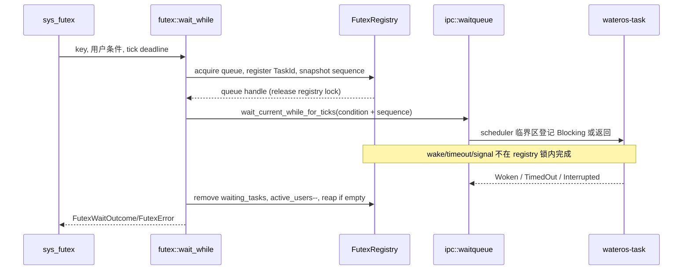
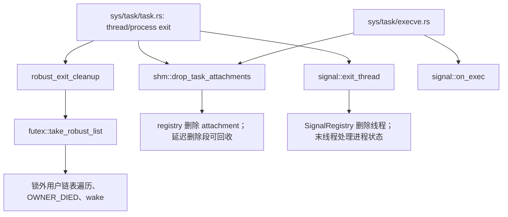

# wateros-ipc

[项目首页](../../../README.md) · [内核工程](../../README.md) · [小写历史说明](readme.md)

`wateros-ipc` 是 IPC 对象状态与任务等待之间的聚合边界。顶层
[`src/lib.rs`](src/lib.rs) 只按 feature 重导出版本化 API、`waitqueue` 和各对象子系统；它不
保存 pipe、futex、共享内存或 signal 的全局状态，也不解析 Linux syscall ABI、复制用户内存、
修改页表或决定被唤醒任务运行在哪个 CPU。这些分别属于 syscall、MM 和 task。

它面向的不是一套统一的消息总线，而是一组语义不同、却都需要与任务生命周期协作的内核对象。
pipe 以有界环形缓冲区传递字节并靠端点引用决定 EOF 或断管；futex 将用户地址对应的同步字映射
到内核等待队列；SysV SHM 持有可跨地址空间映射的物理帧；signal 则维护进程与线程各自的待处理、
屏蔽和处置状态。对象在自己的短临界区内更新状态，随后经 waitqueue 让 task 层完成阻塞、超时和
唤醒，从而避免把调度器锁、用户访问和页表操作带入 IPC 锁内。syscall 层负责 Linux ABI、errno 与
用户拷贝，IPC 层只返回领域结果和锁外执行的调度意图；这种分工也是处理 fork、exec、线程退出及
资源回收时保持状态一致的前提。

## 定位和边界

IPC 对象的可变状态由各实现 crate 持有：pipe 是字节流和端点生命期，futex 是 key 到等待队列
的登记，SysV SHM 是段、物理帧和映射登记，signal 是进程/线程信号状态。所有睡眠、超时、
唤醒和跨 CPU 重调度都经 `ipc-waitqueue` 委托 `wateros-task`；
[`ipc-waitqueue/waitqueue-impl/impl-task/src/lib.rs`](ipc-waitqueue/waitqueue-impl/impl-task/src/lib.rs)
没有第二份 waiter 容器。

`eventfd` 是例外：仓库当前实现的 `EventFdState` 位于
[`wateros-syscall/.../sys/ipc/eventfd.rs`](../wateros-syscall/syscall-impl/impl-kernel/src/sys/ipc/eventfd.rs)，
作为 VFS I/O handle 管理，并不由 `wateros-ipc` 的 facade 重导出。`ipc-event/` 只有独立
`Cargo.toml`，未列入本组件 workspace 或顶层 feature，因此不能把它视为已接入的 IPC 子系统。

## 代码地图

| 层/机制 | 位置 | 当前职责 |
| --- | --- | --- |
| 聚合与选择 | `src/lib.rs`、`Cargo.toml` | 默认导出 `api` 与 task waitqueue；`all` 才组合 futex、pipe、shm、signal。 |
| 等待适配 | `ipc-waitqueue/*` | `WaitQueue` 对 task wait queue 的零额外状态包装。 |
| 管道 | `ipc-pipe/pipe-api/api-v0`、`pipe-impl/impl-ringbuf` | 固定容量环形流、读 lease、匿名/命名端点。 |
| Futex | `ipc-futex/futex-api/api-v0`、`futex-impl/impl-task` | private/shared key、等待者反查、requeue、robust 登记。 |
| SysV SHM | `ipc-shm/shm-api/api-v0`、`shm-impl/impl-frame` | 段号/key、frame 分配、两阶段 attach 与延迟删除。 |
| Signal | `ipc-signal/signal-api/api-v0`、`signal-impl/impl-core` | disposition、pending/mask、备用栈、interval/POSIX/CPU timer。 |
| ABI 与生命周期接线 | `wateros-syscall/.../sys/ipc/`、`sys/task/{clone,execve,task}.rs` | 用户复制、errno、MM 映射，以及 fork/clone/exec/exit 回调。 |

各 API crate 定义跨层类型，`impl-*` 保存机制；子模块 `src/lib.rs` 仅再导出当前实现。调用方应依赖
`ipc::{pipe,futex,shm,signal}`，而非直接依赖实现 crate。

## 核心状态与数据结构

| 状态 | 所有者与存储 | 并发/生命周期不变量 |
| --- | --- | --- |
| `PipeState` | `Pipe::state: spin::Mutex`，含固定 `Vec<u8>`、`head`、`len`、segment 队列、读 reservation、两端 refcount；见 `ipc-pipe/.../kernel_pipe.rs` | `0 <= len <= capacity`；仅 state 锁访问。最后一端 close 将 open 位清除；每次状态改变后释放锁再唤醒。 |
| `PipeEndpoint` | fd/VFS 持有的 `Arc<Pipe>`，每个 wrapper 有 `Cell<bool>`，OFD 状态为 `Arc<AtomicBool>`；见 `endpoint.rs` | `close` 与 `Drop` 通过 `closed` 至多递减一次端点引用；clone 取得底层读/写引用。 |
| `FutexRegistry` | `global.rs` 的模块级锁保护；`registry.rs` 的 `queues`、`waiting_tasks`、`robust` | 一个 task 至多登记一个 futex wait；queue 的 `active_users` 覆盖锁外 waitqueue 操作，空队列只能在其为零且底层队列为空时回收。 |
| `FutexQueue` | registry 条目中的 `WaitQueue`、`wake_sequence` 与使用计数 | 等待者在用户条件二次检查后，以 sequence 检查封住最终 lost wake 窗口；wake 在 registry 锁外推进 sequence 并唤醒。 |
| `ShmRegistry` | `ipc-shm/.../registry.rs` 的全局 registry：段主表、SysV key 索引、task attachment 表 | frame 由段持有；`IPC_RMID` 先隐去 key、保留已有映射，只有 marked-for-delete 且 `nattch == 0` 才释放。attach reservation 防止持锁进入 MM。 |
| `SignalRegistry` | `signal-impl/impl-core/src/global.rs` 的全局锁与 `registry.rs` | 进程保存 disposition/process pending/timer；线程保存 mask/thread pending/等待掩码/alt stack。普通信号是位集，同一信号不累计。 |
| `EventFdState` | syscall `eventfd.rs` 的 `Arc`，内部 `Mutex<EventFdInner>` 和 `WaitQueue` | `counter <= u64::MAX - 1`；读先 reservation 后按用户复制结果提交或取消，避免用户 copy fault 偷消费计数。 |

## 关键链路

### Futex 等待、超时和唤醒

`sys_futex` 在 syscall 层校验操作、从用户地址读取 futex 字并构造 `FutexKey`；IPC 实现不在
registry 锁内访问用户内存。`wait_while` 取得 queue 和 `wake_sequence`、写入 task 反查表后释放
registry 锁；随后 waitqueue 在 task 调度临界区再次判定条件。由 `wake`、超时或信号打断返回后，
实现删除登记、减少 active user，并在满足条件时回收队列。



`wake` 与 `requeue` 均先在 registry 锁内固定队列与记账，锁外调用 `WaitQueue::{wake_*,requeue_*}`。
这既避免 scheduler 锁与 registry 锁嵌套，也保证 wake/requeue 不会因 queue ID 过早复用而指向
错误对象。errno 翻译仍在 `sys/ipc/futex.rs`。

### 线程退出：robust futex、SHM 与 signal

任务退出的编排在 syscall/task 层，IPC registry 只提供幂等的状态转移。`take_robust_list` 将
登记一次性取走，随后 syscall 在 IPC 锁外遍历用户 robust list、写 `FUTEX_OWNER_DIED` 并 wake；
`drop_task_attachments` 以旧地址空间取消 SHM 映射登记；`on_thread_exit` 更新 signal registry。
`execve.rs` 还会处理被替换线程并撤销旧地址空间的 SHM attachment。



fork/clone 的信号状态通过 `on_fork` 或 `on_clone_thread` 建立，SHM attachment 由
`fork_task_attachments` 复制登记；页表复制、失败回滚及 TLB shootdown 属于 MM/调用方。

### Pipe 阻塞读写

`Pipe::read`/`write` 在 `PipeState` 锁内尝试操作 ring。空且仍有 writer 的读者在锁外等待
`read_wait`；满且仍有 reader 的 writer 等待 `write_wait`。条件闭包会在 task scheduler 临界区
重新取得短暂 state 锁检查，封住检查与登记之间的 lost wake。写入、消费数据和最后端点关闭都在
释放 state 锁后唤醒另一侧。无 writer 的空读返回 EOF；无 reader 的写返回 `BrokenPipe`。

## 机制与正确性

- 锁顺序的基本规则是：对象/registry 锁只保护本对象数据；不得持有它进入 `WaitQueue`、scheduler、
  用户访问、MM 映射、VFS 或 IPI。`SignalDispatch` 也是锁内计算的意图，真正 wake/stop/continue/
  terminate 由 syscall/task 在锁外执行。
- pipe 的读 lease 在 `finish` 前不消费字节；stream copy fault 的未提交前缀保留，packet 模式依
  `PipeSegment` 决定提交时消费整包。eventfd 采用相同 reservation/finish/cancel 结构。
- waitqueue 的 `wait_current_while`/带 tick deadline 变体将条件复查和 task 阻塞置于 task
  scheduler 临界区；IPC 对象只提供短小、不可阻塞的条件闭包。超时结果和目标 CPU 由 task 层决定。
- signal 的 `SIGKILL`/`SIGSTOP` 不可屏蔽且不可安装 action；signal frame、用户 PC/SP 和
  `rt_sigreturn` 恢复不属于 signal registry，见 syscall `sys/ipc/signal.rs` 与架构 trap 路径。
- SHM 的 `begin_attach`、`finish_attach`、`cancel_attach_reservation` 是跨 registry/MM 的两阶段
  所有权协议：先固定段和 frame 快照，释放 registry 锁后映射，最后提交或回滚。

## 初始化、配置与可观测性

`wateros-ipc` 没有统一 boot 初始化函数；其全局 registry 按实现 crate 的静态状态首次使用，前提是
task waitqueue/scheduler 已可用。默认 feature 仅启用 `api-v0`，但 `waitqueue` 依赖是固定的；顶层
`all` 组合 `futex`、`pipe`、`shm`、`signal`。`self_test` 只在同时启用相应对象 feature 时转发对象级
自检。这里没有 RISC-V/LoongArch 专属实现，架构差异留给 task/MM/trap。

排障入口包括各实现的 `self_test`，futex 的 `log_debug_snapshot`，以及对象/子系统前缀日志
（例如 `[ipc/pipe/impl-ringbuf]`）。最窄构建检查应从 `os/` 运行：

```bash
cargo check --manifest-path components/wateros-ipc/Cargo.toml --features all
git diff --check -- components/wateros-ipc/README.md
```

## 限制与后续边界

- `ipc-event/` 未接入 facade；eventfd 的现状是 syscall/VFS 实现，不是 `wateros-ipc` 公共模块。
- futex 不支持 PI；bitset wait/wake 仅支持 `FUTEX_BITSET_MATCH_ALL`，见
  [`ipc-futex/readme.md`](ipc-futex/readme.md)。robust list 的用户内存遍历和 owner-died 写回也由
  syscall/MM 承担。
- SHM 实现不替代 MM：它不拥有页表复制、TLB shootdown 或映射失败后的底层地址空间恢复。
- signal registry 不构造用户 signal frame，也不自行调度任务；能否完成 handler 交付还取决于
  syscall 与架构 trap 层。
