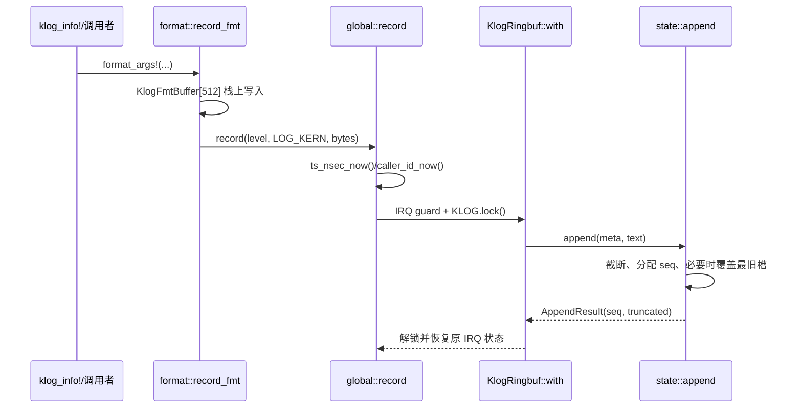

# wateros-klog

`wateros-klog` 是内核侧的**保留式观测缓冲**：把带元数据的消息写入固定容量环，供
`sys_syslog`/`dmesg` 风格读取和内核排障使用。它不拥有用户指针验证、用户内存拷贝，也不
负责把 `log` 记录即时打印到控制台；这些边界分别属于 `wateros-syscall` 和
`wateros-runtime/runtime-logging`。

简而言之，klog 把内核消息组织为带单调序号、时间戳、级别和调用任务 ID 的固定槽记录。
格式化入口使用 512 字节栈缓冲，不依赖堆分配；正文超过单条上限时截断并记录标志。全局
环由 IRQ 屏蔽与 `TrackedMutex` 共同保护，既支持多核访问，也避免同一 CPU 的中断日志重入
锁。环满后覆盖最旧槽，并通过统计值暴露丢失情况。`sys_syslog` 在内核缓冲与用户空间之间
负责拷贝，klog 则在锁内完成读取、traditional 行格式化和全局游标推进。它保存诊断记录，
而 runtime logger 仍直接写控制台，两条路径彼此独立。

## 定位和边界

- 聚合门面 `src/lib.rs` 只再导出 `api-v0`、`impl-kernel`、`syscall::dispatch_kernel` 和
  `klog_{trace,debug,info,warn,error}!` 宏，不保存状态。
- `klog-api/api-v0` 定义记录头、flags、Linux syslog action 和 `KlogStore` 契约；
  `klog-impl/impl-kernel` 持有实现状态、锁、中断边界、格式化和 syslog 缓冲语义。
- `wateros-syscall/.../sys/misc/syslog.rs` 将用户地址复制到最多 2048 字节的内核栈缓冲，
  调用 `klog::syscall::dispatch_kernel`，再按 READ 类 action 复制回用户空间并转换 syscall
  返回值。
- klog 的记录是留存路径；runtime logger (`runtime-logging/src/logger.rs`) 通过
  `console::println!` 立即输出 `[WaterOS][cpu=...]`，两者没有共享的输出队列或过滤器。
- 当前实现由 `impl-kernel` 直接连接 `platform` 的单调时钟、`task` 的当前任务 ID、
  `platform-arch` 的中断控制和 `wateros-debug::TrackedMutex`。没有按架构分裂的 ring 算法；
  RISC-V/LoongArch 差异只在这些平台/arch API 的具体实现。

## 代码地图

| 语义 | 源码 | 所有者/边界 |
| --- | --- | --- |
| 聚合与宏 | `src/lib.rs` | 版本化 API、当前实现和稳定入口的门面 |
| 公共数据契约 | `klog-api/api-v0/src/{meta,flags,action,store,error}.rs` | `KlogRecordMeta`、`KlogFlags`、action、`KlogStore`、结果/错误 |
| 环状态 | `klog-impl/impl-kernel/src/state.rs` | `KlogRingbufInner`、`Slot`、sequence/cursor/覆盖策略 |
| 全局并发入口 | `klog-impl/impl-kernel/src/global.rs` | `KLOG`、IRQ guard、时间/task 上下文、`record`/`stats` |
| 无分配格式化 | `klog-impl/impl-kernel/src/format.rs` | 512 字节栈缓冲和 traditional syslog 行 |
| syslog 语义 | `klog-impl/impl-kernel/src/syslog.rs` | READ/WRITE/SIZE/CLEAR action 与内核缓冲拷贝 |
| 容量配置 | `wateros-base/base-config/src/klog.rs` | 编译期槽数、单条上限和容量常量 |
| 用户 ABI 接线 | `wateros-syscall/syscall-impl/impl-kernel/src/sys/misc/syslog.rs` | 用户 copy、空指针检查和 syscall 返回值 |

## 核心状态与数据结构

| 状态 | 关键字段/存储 | 共享与生命周期 | 不变量和失败语义 |
| --- | --- | --- | --- |
| `KlogRingbufInner` | `slots[256]`、`head`、`count`、`next_seq`、`oldest_seq`、`read_cursor_seq`、`records_committed/dropped` | `KLOG` 中的 `Option` 惰性创建；`init()` 在同一临界区重置，进程不拥有副本 | 有效槽按 sequence 单调递增；满环覆盖最旧槽并推进游标，避免游标永久指向已丢记录 |
| `Slot` | `valid`、`KlogRecordMeta`、`bytes: [u8; 1024]` | 内嵌于 `KlogRingbufInner`，无堆分配；写入时整体替换槽内容 | 正文最多 `KLOG_MAX_RECORD_BYTES`；超长只保留前缀并置 `TRUNC` |
| `KlogRecordMeta` | `seq:u64`、`ts_nsec:u64`、`text_len:u16`、facility/level/flags、`caller_id:u32` | 追加前由调用者构造，`append` 在锁内覆盖 `seq/text_len/flags`；视图只借用锁内槽 | `seq` 从 1 单调递增；时间/任务上下文不可用时分别为 0；不是用户态裸 ABI |
| `read_cursor_seq` | 全局 READ 游标 | 所有消费者共享；`READ_CLEAR`/`READ_ALL` 推进，`CLEAR` 跳到 `next_seq` | 读取已被覆盖的序号时夹到 `oldest_seq`；没有未读记录时 READ 返回 0 |
| `KlogRecordView` | 复制的 `meta` + 借用的 `text` | 仅在产生它的 `KlogRingbuf::with` 闭包和锁内有效 | 不得跨越解锁、下一次 append、调度或保存引用 |
| `KLOG` | `debug::TrackedMutex<Option<KlogRingbufInner>>` | 每次 `with` 先保存/关闭本 CPU 中断，再加锁；退出时解锁并恢复原中断状态 | 闭包内禁止再次记录、调度、用户 copy、阻塞或取得可能回入 klog 的锁 |

容量常量来自 `wateros-base/base-config/src/klog.rs`：`KLOG_DESC_SLOTS=256`，
`KLOG_MAX_RECORD_BYTES=1024`，`KLOG_TEXT_RING_BYTES=32*1024`。后者目前只作为
`buffer_bytes()`/`SIZE_BUFFER` 报告值；实际实现是每个槽内联 1024 字节数组，并不是独立的
可变 byte-ring，源码明确保留该常量供后续扩展。

实现没有原子发布协议：SMP 可见性由 `TrackedMutex` 提供，当前 CPU 的 IRQ 屏蔽防止中断重入
同一自旋锁。记录路径因此不分配、不会等待调度，但会短暂自旋等待全局锁；“中断安全”仅指
该 IRQ+锁边界，不能据此推断任意外部回调都可在锁内执行。

## 关键链路

### 内核记录到环



`record_fmt` 不调用 console；消息只在 `KlogRingbufInner` 中留存。满环时
`records_dropped` 饱和递增，`refresh_oldest_seq` 后再夹紧 `read_cursor_seq`，因此写入成功
不等于消息永久可读。

### `sys_syslog` 读取到用户空间

```mermaid
flowchart LR
    A[syscall_nr_dispatch::SYSLOG] --> B[sys_syslog]
    B --> C{WRITE priority?}
    C -->|是| D[copy_from_user 到 kbuf[2048]]
    D --> E[dispatch_kernel: record_with_meta USER]
    C -->|否| F[dispatch_kernel]
    F --> G[KlogRingbuf::with 锁内 peek]
    G --> H[format_traditional: <level>text\n]
    H --> I{READ_CLEAR/READ_ALL?}
    I -->|是| J[锁内推进 read_cursor]
    I -->|否| K[保持游标]
    J --> L[copy_to_user]
    K --> L
    E --> M[返回写入字节数]
```

`READ`/`READ_CLEAR`/`READ_ALL` 的单条格式化和游标变更在同一次 ring 锁闭包中完成，避免
`KlogRecordView.text` 在覆盖后仍被使用。syscall 层只复制用户内存；klog 收到的
`kernel_buf` 已经是内核地址。`READ_ALL` 在每条记录后推进游标，直到用户长度耗尽、没有
未读记录或最后一行被截断。

## 机制与正确性

1. **追加状态机**：空槽增加 `count`，满槽覆盖 `head`；`head` 环回，`next_seq` 饱和递增。
   `text_len` 是实际保留字节数而不是输入长度，`AppendResult.truncated` 与 `TRUNC` 标志同时
   反映截断。
2. **读取一致性**：`peek_next_unread` 扫描有效槽并选择不小于游标的最小 sequence；
   `advance_read_cursor` 只接受已消费序号，随后按 `oldest_seq` 夹紧。游标是全局的，多个
   进程/线程会互相消费，而不是每个 fd 独立读取。
3. **锁顺序**：`KlogInterruptGuard::new` 保存状态并关闭本 CPU IRQ，再获取 `KLOG`；闭包
   返回后按反向顺序释放。锁内不能执行用户 copy、调度、等待、外部回调或日志递归。
4. **错误/未实现 action**：无未读记录在 READ 路径转为 0；`CONSOLE_ON/OFF/LEVEL`、
   `OPEN`、`CLOSE` 只返回 0，不改变 runtime console；未知 action 当前直接 panic，代码没有
   将其转为 `EINVAL` 的路径。
5. **WRITE priority**：action 非 0..=10 时由高 3 位解析 level、低 3 位解析 facility，
   并置 `KlogFlags::USER`；syscall 层在 `len>0` 时先检查空指针并 `copy_from_user`。

## 初始化、配置与可观测性

- 根内核在 `os/src/main.rs` 的启动服务阶段调用 `klog::init()`；实现也支持首次访问时由
  `ensure_inner` 惰性构造。`init()` 会清空全局记录，因此只适合启动或显式重置阶段。
- 顶层 `wateros-klog/Cargo.toml` 默认启用 `api-v0` 与 `impl-kernel`；`self_test` 只传播到
  实现。`impl-kernel::self_test` 写入 `klog-self-test` 并断言 `records_committed >= 1`。
- `stats()` 返回锁内复制的 `KlogStats`；重点观测 `records_dropped`（覆盖丢失）、
  `oldest_seq/newest_seq`（当前可见范围）和 `read_cursor_seq`（消费者位置）。实现当前没有
  独立的 klog 输出设备或后台 flush 线程。
- 运行时即时日志由 `wateros-runtime/runtime-logging/src/logger.rs::WaterOSLogger::log`
  完成：按级别着色并一次 `println!` 写入 console；它不写入本环。klog 宏与 runtime
  `log::*` 宏是两条独立路径。
- 最窄验证入口是 `cargo test --manifest-path os/components/wateros-klog/klog-impl/impl-kernel/Cargo.toml`
  （含环的 append/read 单测），以及目标架构的 `make -C os rv_check`、`make -C os la_check`。

## 限制与后续边界

- 正文实际按槽内联存储；`KLOG_TEXT_RING_BYTES` 目前是容量报告/兼容常量，不代表已经存在
  独立 byte-ring，因此有效容量受 256 个槽和每槽 1024 字节共同约束。
- 环满会静默覆盖最旧记录（只增加统计），没有阻塞写入、持久化后端、每消费者游标或丢失
  通知机制。
- `CONSOLE_*` action 是兼容占位；klog 不提供运行时级别过滤，也不改变 runtime console。
- `syslog.rs` 对未知 action 和内部读取异常使用 `panic!`；这不是完整 Linux errno 兼容实现。
- 代码没有为 klog 记录提供 procfs 专用 reader；当前可见读取入口是 `sys_syslog`/兼容转发，
  其它消费者必须遵守锁内借用视图约束。
