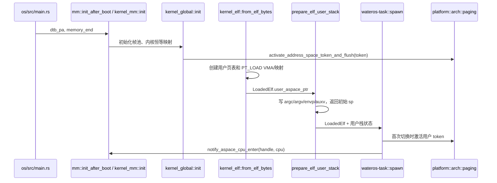
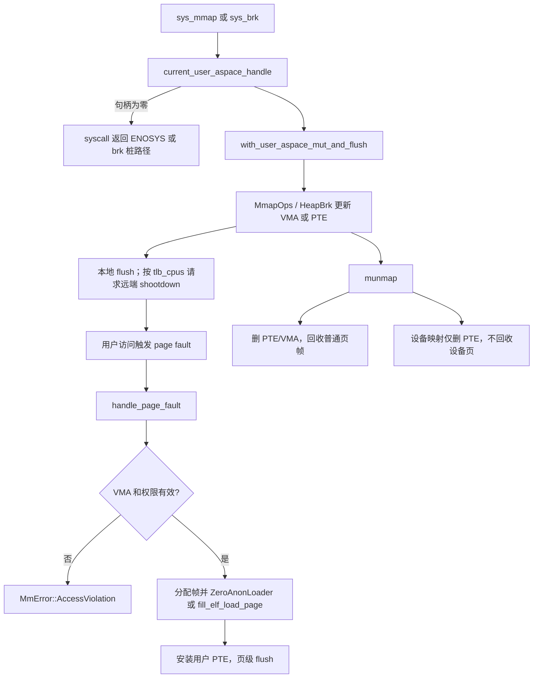

# wateros-mm

[项目首页](../../../README.md) · [内核工程](../../README.md) · [系统架构](../../../README.md#系统架构)

## 简介

`wateros-mm` 为 WaterOS 内核提供从物理页到进程虚拟地址空间的基础支撑。启动阶段，它依据平台给出的 RAM 范围建立帧池和内核页表，使内核代码、RAM 与必要 MMIO 在分页启用后仍可访问；运行阶段，它为 ELF 程序创建独立用户页表，维护堆、匿名映射、文件映射和设备映射所需的虚拟地址区间，并在访问发生时按需分配或填充页面。组件同时负责页权限、写时复制、用户缓冲区跨页访问、ASID 分配及多核 TLB 失效协调。它通过稳定的 `mm-api` 向 task、syscall 和其它子系统提供能力，而把 Sv39 与 LoongArch64 的页表格式和硬件细节限制在架构实现内部；调度、ABI 错误编码、文件生命周期和设备发现则分别由相邻组件负责。

`wateros-mm` 是 WaterOS 的物理帧和虚拟地址空间聚合层。它拥有 4 KiB 页粒度的地址/权限契约、全局物理帧池、内核恒等映射、用户页表及其 VMA 和 TLB 一致性机制；它不拥有任务调度、陷入分发、用户 ABI 的 `-errno` 转换、文件描述符或设备发现。任务组件保存每个任务的用户地址空间句柄并在切换时通知 CPU 使用状态；syscall 组件把 `mmap`、`brk` 与用户拷贝请求转换为本组件 API；平台组件负责实际的地址空间激活、TLB 刷新和 IPI 投递。

当前聚合 crate 的稳定边界是 `mm-api/api-v0` 及 `src/lib.rs` 的再导出。Sv39 和 LoongArch64 的 PTE 格式、页表 walk 与地址空间存储都保持在各 `impl-*` crate 内，不能通过 `mm_impl` 整包访问（`src/lib.rs`）。

## 定位和配置边界

- 页大小固定为 `api::addr::PAGE_SIZE`，即 4 KiB；所有页号区间和映射区间使用半开形式 `[start, end)`。`VirtAddr::floor_page` / `ceil_page` 负责端点圆整，调用方仍须在字节地址计算时避免溢出（`mm-api/api-v0/src/addr.rs`）。大页不在当前 API 中表达。
- `wateros-mm/Cargo.toml` 默认选择 `impl-sv39`；`impl-loongarch64` 由顶层 feature 链选择。两个实现定义同名内部模块，`src/lib.rs` 只用 `cfg` 选择一个 `active_mm_impl`，因此一次内核构建不应同时激活它们。
- 两种实现的内核页表均假定可分配 RAM 有恒等映射或等价的物理线性访问，因而可将 `PPN * PAGE_SIZE` 作为页表和 `OwnedPhysPage` 的可访问地址（`mm-frame-alloctor/src/lib.rs::OwnedPhysPage`）。改变内核映射模型必须同步修改所有页表/帧访问点。
- RISC-V Sv39 内核从 `0x8000_0000` 映射 RAM、常规 QEMU virt MMIO 和 RTC MMIO；LoongArch64 从 `0x9000_0000` 映射 RAM，并映射低地址和 PCI MMIO 窗口（两个 `mm-impl/impl-*/src/kernel_global.rs::init`）。两者都以 S/PLV0 权限建内核映射，不授予 `U`。

## 代码地图

| 职责 | 位置 | 当前代码中的边界 |
| --- | --- | --- |
| 聚合、实现选择和统一初始化 | `src/lib.rs`、`src/kernel_mm.rs` | 再导出 `api`、帧分配器、活动 `user_aspace`；`init_after_boot` 转入活动架构的 `kernel_mm::init`。 |
| 地址、权限和生命周期契约 | `mm-api/api-v0/src/{addr,perm,address_space,mmap,brk,user_access,user_aspace_lifecycle}.rs` | 定义 newtype、页权限、地址空间/mmap/brk/用户拷贝语义和 task 回调钩子，不编码 PTE。 |
| 帧分配 | `mm-frame-alloctor/frame-alloctor-impl/impl-stack/src/lib.rs` | 全局栈式帧池、引用计数和保留区；聚合 crate 中的 `OwnedPhysPage` 管一页 RAII。 |
| 共享按需映射机制 | `mm-impl/common/src/{vma,mapping,fault,cache,elf}.rs` | VMA、匿名零页、ELF 页填充和只读映射页缓存辅助；不是稳定对外 API。 |
| RISC-V 地址空间 | `mm-impl/impl-sv39/src/{pagetable,asid,kernel_global,kernel_elf,user_aspace,user_heap_mmap,user_access}.rs` | Sv39 三级页表、运行时 ASID 位宽、DTB 保留区和 `satp` 路径。 |
| LoongArch 地址空间 | `mm-impl/impl-loongarch64/src/{pagetable,asid,kernel_global,kernel_elf,user_aspace,user_heap_mmap,user_access}.rs` | LoongArch64 三级页表、固定 10 位 ASID 和 `PGDL` token 路径。 |

## 核心状态和所有权

| 状态/结构 | 所有者与存储 | 并发/生命周期规则 | 不变量 |
| --- | --- | --- | --- |
| `PhysAddr`、`VirtAddr`、`PhysPageNum`、`VirtPageNum` | `mm-api` 的零成本地址 newtype | 值不携带映射或分配所有权 | 页粒度操作必须先 floor/ceil；区间上界不包含。 |
| `StackFrameAllocator` | `impl-stack` 的 `FRAME_ALLOCATOR: MaybeUninit<MultiprocessorSafeCell<_>>` | BSP 先构造，`FRAME_ALLOCATOR_READY` 以 Release/Acquire 发布；运行期经中断保护和单元锁访问 | 帧池为 `[start_ppn,end_ppn)`，保留区永不分配；`recycled` 与尚未使用的连续区共同构成空闲帧。 |
| `allocated` 与 `ref_counts` | `StackFrameAllocator` 内的 `Vec<bool>` / `Vec<u32>` | 与分配器同锁 | 重复回收、未分配帧或保留帧被拒绝；引用减至零才进入 `recycled`。该早期栈式实现不提供完备的重复释放诊断保证。 |
| `OwnedPhysPage` | 调用者栈上持有一个不可复制的 `PhysPageNum` | `alloc_zeroed` 分配且清零；`Drop` 调 `frame_dealloc_result` | 只能借出与 `self` 同寿命的一页切片，正常路径恰好归还一次（`mm-frame-alloctor/src/lib.rs`）。 |
| 内核地址空间 | `KERNEL_ASPACE: BootOnceCell<KernelAddressSpaceCell>`，内部为 `MultiprocessorSafeCell` | `kernel_global::init` 只允许一次；RAM 上界用 `PHYS_RAM_END_EXCL` Release/Acquire 发布 | 页表根和中间页来自帧池；全局页表在运行期不销毁，LoongArch 路径明确以 `Box::leak` 保证 PGDL 不悬空。 |
| 用户地址空间 | 各架构 `user_aspace` 将泄漏的地址空间对象登记为 `usize` 句柄 | `with_user_aspace_mut` 先验证句柄和 dropped 状态，再独占访问；task exit 通过 API 注册的释放钩子销毁 | 句柄为零或已销毁均为 `MmError::InvalidAddress`；销毁须递归回收用户映射、页表帧和 ASID。 |
| 页表、VMA 与 resident PTE | `Sv39AddressSpace` / `LoongArch64AddressSpace` 内部 | 由用户地址空间锁串行；映射变更经带 flush 的包装器完成 | VMA 权限可先于驻留 PTE 改变；访问时才按 VMA 填页。设备映射解除时删除 PTE，不把设备页归入普通帧池。 |
| ASID 与 TLB 使用者位图 | 每架构 `USER_ASIDS` 互斥分配器；地址空间记录 `tlb_cpus` | ASID 只能在可能缓存其翻译的 CPU 完成失效后释放；远端事务由 shootdown 锁串行 | ASID 0 保留给内核。Sv39 依据硬件 `ASIDLEN` 缩小可用空间，零位时退化为 ASID 0 和全量 fence；LoongArch 固定 10 位。 |

## 关键链路

### ELF、用户栈到首次激活

`kernel_mm` 的 ELF 入口构造 `LoadedElf`，其中的 `user_aspace_ptr` 是后续 task 保存的地址空间句柄；用户栈准备把参数、环境和 auxv 写入该地址空间。task 负责把 token 带入首个用户上下文，平台实际写入 `satp`/PGDL，故本组件不直接调度或返回用户态。

内核初始化先以 `kernel_end` 和 RAM 上界建立帧池，再建内核页表、映射 RAM/MMIO，激活后用一页探针验证 VA 到 PA 的翻译和写入一致性（`kernel_global.rs::init`）。Sv39 还从 DTB 计算并排除 DTB 保留页区；随后两个实现注册 `drop_user_aspace` 和地址空间 CPU enter/leave 钩子（`mm-api/api-v0/src/user_aspace_lifecycle.rs`）。若帧耗尽、建表或探针失败，bring-up 路径以 panic 终止，而非生成不完整页表。

### `mmap` / `brk`、缺页与解除映射

syscall 层先取得当前 task 的 `user_aspace_ptr`，并将 Linux 标志和权限转换为 MM 类型；地址空间层决定 VMA 和 PTE 的变更，只有需要时才同步本地和远端 TLB。匿名映射和 ELF 文件段可保持未驻留，首次读写才分配并填充页。

`sys_brk_mm` 通过 `HeapBrk::brk` 修改真实地址空间；扩展失败时遵循原始 `brk(2)` 的返回约定，返回旧 break，由 libc 判断失败（`wateros-syscall/.../sys/mem/brk.rs`）。没有用户地址空间的遗留/bring-up 路径则使用 syscall 层的单调 `USER_BRK_FAKE`，这不是 MM 的真实堆。`MmapOps::mprotect` 若只改变尚未驻留的 VMA，不要求 flush；若改动 PTE 则返回变更标志，由 `with_user_aspace_mut_and_flush_if_changed` 处理（`user_aspace.rs`）。

### 用户拷贝与写时复制

`ActiveUserMemoryOps` 绑定当前用户地址空间句柄。读写可以跨页；写接口保留错误前的精确前缀，空输入不触碰用户地址。每页在写入前都会走缺页/COW 处理、权限检查和翻译，未映射或越权转为 `MmError`，syscall 再映射为 `EFAULT` 等 ABI 错误（`mm-api/api-v0/src/user_access.rs`、`wateros-syscall/.../user_copy.rs`）。

fork 使用 `fork_user_aspace` 复制页表树并把可 COW 的用户页共享为只读；写 fault 经 `handle_cow_fault` 取得页级本地 flush，PTE 实际改变时再通知远端 CPU。设备页不进入 COW，fork 后共享映射（`impl-*/src/lib.rs::kernel_mm_impl::fork_user_aspace`、`user_heap_mmap.rs`）。

## 机制与正确性

### 帧、页表和映射回收

帧分配器从 `next_novel` 向下取得从未使用帧，优先重放 `recycled`，初始化时不把整个 RAM 区间压入 `Vec`（`impl-stack/src/lib.rs::StackFrameAllocator`）。内核全局映射使用 PPN 等于 VPN 的恒等映射；用户匿名页、页表节点和普通 file/COW 私有页从该帧池获得并在 unmap/destroy 时回收。`OwnedPhysPage` 的数据切片依赖这一恒等映射前提，不能在 MM 初始化前使用。

映射操作以页覆盖的半开区间处理。`map_identity_range_user` 和 `map_anon_range_user` 均拒绝空区间，并以 `floor_page` 到 `ceil_page` 逐页工作（`kernel_global.rs`）。`MmapKind::Device` 携带 `DeviceMapping` lease：其物理页由设备/DMA 所有，解除映射或地址空间销毁不可调用普通帧回收。只读共享文件页缓存由 `impl-common` 提供；文档不把它描述为通用写回缓存。

### 权限、fault 和错误边界

`PagePerm` 约束用户/读/写/执行权限。syscall 将 `PROT_WRITE` 规范化为 `R|W`，避免 Sv39 的 `W=1,R=0` 保留 PTE 组合（`wateros-syscall/.../mm_util.rs::linux_mmap_prot_to_perm`）。`handle_page_fault` 必须先确认 VMA 和访问类型；合法的匿名页由 `ZeroAnonLoader` 清零，ELF `PT_LOAD` 页由 `fill_elf_load_page` 填充。无 VMA、权限不足、不可分配帧或无效句柄分别沿 `MmError` 返回，MM 不直接决定 Linux errno。

用户原子 `u32` 操作要求四字节对齐，先验证用户读写权限与翻译，再在物理映射上执行原子操作。共享 futex 映射返回稳定物理身份；私有或 COW 映射返回 `Private`，以免首次写入改变物理页后丢失既有等待队列（`mm-api/api-v0/src/user_access.rs::UserMemoryOps`）。

### SMP、ASID 与 TLB

地址空间的可变操作不能绕开 `with_user_aspace_mut_and_flush*` 包装器。它们在锁保护下修改 PTE/VMA，随后做本地 TLB invalidation，并从该地址空间的 `tlb_cpus` 交集在线 CPU 集合选择目标。远端支持硬件 flush 时优先使用；否则发布序号到每 CPU `TLB_PENDING`（Release）、发送 TLB shootdown IPI，并等待 `TLB_COMPLETED`（Acquire）（`impl-loongarch64/src/user_aspace.rs::request_tlb_shootdown_targets`；Sv39 有等价路径）。

shootdown 事务由 `TLB_SHOOTDOWN_LOCK` 串行，避免单个 pending slot 被并发事务覆盖。等待该锁时会处理本 CPU 已到达的 IPI，防止“持锁 CPU 等确认、目标 CPU 等锁”的环形死锁。超时或 IPI 失败记录 warning 并使请求失败；这意味着映射修改路径仍需将该运行时故障视为一致性风险，而不是把日志当作成功确认。

## 初始化、配置与可观测性

1. 顶层启动在堆和架构基础初始化后调用 `mm::init_after_boot(dtb_pa, memory_end)`（`os/src/main.rs`）。
2. `kernel_mm::init` 初始化帧池、建立并激活内核页表，发布内核 token，并注册 task 生命周期和 CPU 使用钩子。
3. 之后才可创建用户地址空间、装载 ELF、使用 `OwnedPhysPage` 或执行用户拷贝。AP 通过 `mm::kernel_mm::kernel_satp()` 激活已发布的内核地址空间（RISC-V `os/src/main.rs::ap_main`）。

聚合 crate 提供 `test_with_range` 和 feature 条件下的 `self_test`；后者不猜测物理内存范围，要求帧池已经初始化。`test_user_copy_progress` 覆盖用户写入进度契约和两套实现的定向自检（`src/lib.rs`）。运行期日志使用 `[mm]`、`[kernel-mm]`、`[tlb]` 和 `[frame-allocator]` 前缀；RISC-V 的 `user-copy-diagnostics` 在 debug 构建可输出用户 VA 探针，LoongArch 路径只输出句柄/token 诊断（`wateros-syscall/.../user_copy.rs`）。

## 限制与后续边界

- 当前帧分配器是栈式早期实现；源码明确说明其重复释放/未分配检测并不完备，不能据此承诺生产级分配器诊断能力。
- API 只表达 4 KiB 页，不支持大页；实现依赖 RAM 恒等映射，不能独立适配任意高半内核布局。
- 用户地址空间与 TLB 一致性依赖 task 在切换时正确调用 enter/leave 钩子及平台成功投递/处理 IPI。硬件/软件 shootdown 超时只记录警告并报告失败，没有独立的全局恢复协议。
- `brk` 在没有真实用户地址空间的路径是 syscall 层兼容桩，不具备映射、回收或内存隔离语义。
- 本组件提供 ELF 懒装载、匿名零页、COW 和设备映射的基础机制，但不拥有 VFS 的文件生命周期、设备发现或 Linux ABI 全覆盖；这些语义分别属于 VFS/FS、driver/platform 和 syscall。
