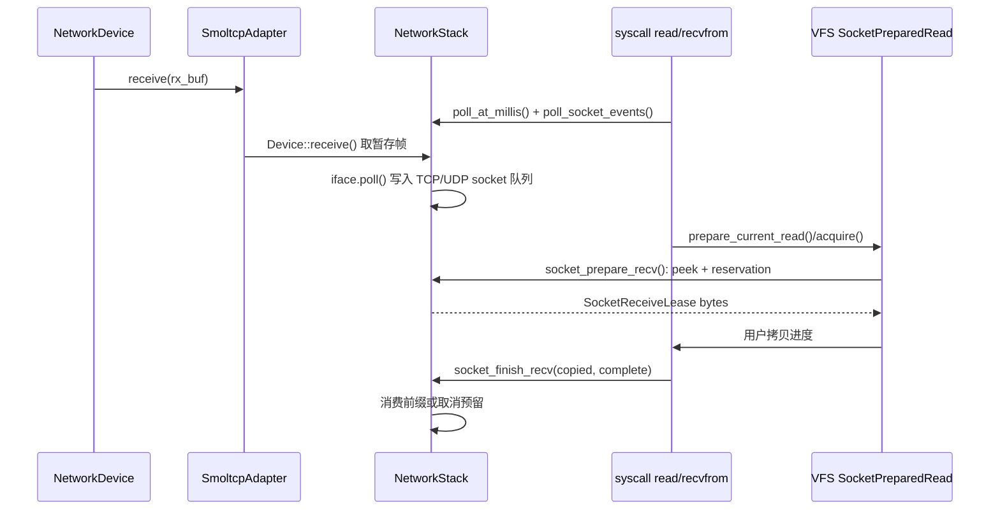
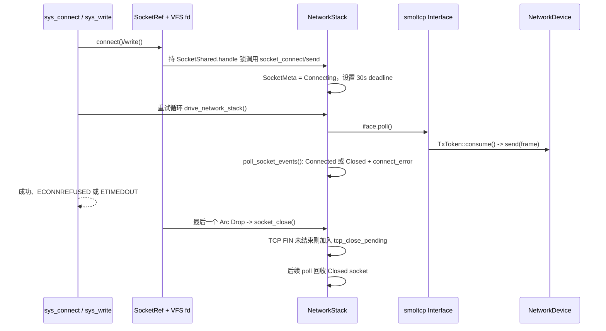

# wateros-network

[项目首页](../../../README.md) · [内核工程](../../README.md) · [系统架构](../../../README.md#系统架构)

## 简介

`wateros-network` 为 WaterOS 提供面向 IPv4 的 TCP/UDP 网络运行时。组件以无后端依赖的
`network-api` 描述端点、状态和错误，以 smoltcp 实现接口、路由及传输协议，并通过适配器把驱动层
的 Ethernet 帧收发接入协议栈。网络 socket 被包装为可由 VFS fd 表持有的内核对象，因而 read、write、
poll 和网络 syscall 能在不直接依赖 smoltcp 类型的前提下工作。启动完成后，顶层周期 poller 推进帧
处理、连接状态和延迟关闭回收；syscall 等待路径也会主动轮询以取得进展。接收采用先预留、完成用户
复制后再消费的租约模型，避免复制 fault 丢失数据。本组件不实现 AF_UNIX、用户 ABI 或设备发现，
这些职责分别留在 syscall、VFS 与 driver 层。

## 定位和边界

`wateros-network` 是 WaterOS 的 IPv4 TCP/UDP 协议栈运行时及其 socket-fd 桥接层。默认特性选择
`network-impl/impl-smoltcp`，将 `wateros-driver-network` 注册的 `NetworkDevice` 接入 smoltcp，并在
同一全局协议栈中保存接口、路由、传输 socket 和 WaterOS 补充的 socket 元数据。

组件边界如下：

- `network-api/api-v0` 只定义后端无关的 IPv4、socket 状态和错误类型，不依赖驱动、VFS、syscall
  或 smoltcp（`network-api/api-v0/src/lib.rs`）。
- `impl-smoltcp` 拥有 Ethernet/IPv4/TCP/UDP 帧处理、接口与路由、socket 池、轮询和关闭回收
  （`network-impl/impl-smoltcp/src/stack/`）。它不拥有设备发现或 VirtIO 传输；底层帧 I/O 属于
  `wateros-driver-network` 的 `NetworkDevice`。
- `src/socket/` 将协议栈句柄包装成可复制的内核对象和 `VfsIoHandle`，使 VFS fd 表能够引用网络
  socket；fd 表、用户指针复制、阻塞策略和 Linux errno 转换仍由 VFS/syscall 层拥有。
- AF_UNIX 不进入本组件。syscall 实现以 `unix_sock.rs` 中的独立注册表和队列处理它，并在各网络
  syscall 入口先分流（`wateros-syscall/.../unix_sock.rs`、`sys/net/socket.rs`）。

`impl-smoltcp` 与 `vfs-handles` 是可选特性；默认同时启用。后者依赖前者、`spin` 和 VFS API，
因此没有活动协议栈时不能单独得到网络 fd 桥接（`Cargo.toml`）。组件本身没有 RISC-V/LoongArch
专有实现；唯一的架构接口是调试锁记录使用 `arch::cpu::current_cpu_id()`
（`stack/global.rs`）。

## 代码地图

| 语义职责 | 位置 | 当前实现 |
| --- | --- | --- |
| 聚合门面与特性选择 | `Cargo.toml`、`src/lib.rs` | 再导出 API；`stack` 仅公开初始化和轮询，socket 内部操作保持 `pub(crate)`；启用 `vfs-handles` 后公开 `SocketRef` 与 `SocketReceiveLease`。 |
| 通用语义 | `network-api/api-v0/src/lib.rs` | `NetworkConfig`、端点、内核侧 `SocketState`、就绪快照及后端错误。 |
| 全局运行时 | `network-impl/impl-smoltcp/src/stack/{global,state,init}.rs` | 唯一 `NetworkStack`、锁入口、IPv4 地址和路由、socket 元数据与容量常量。 |
| 帧适配与轮询 | `network-impl/impl-smoltcp/src/{adapter.rs,stack/poll.rs}` | 从驱动批量取帧、向驱动发帧或回灌本机帧，并用单调毫秒驱动 smoltcp。 |
| TCP/UDP 机制 | `stack/{socket,tcp,udp,receive,sockopt}.rs` | bind/connect/listen/accept、TCP 监听槽池、UDP loopback 队列、接收预留和 sockopt 元数据。 |
| socket 到 fd | `src/socket/{object,lease,fd}.rs` | `Arc` 生命周期、每 socket 句柄锁、接收租约，以及 TCP/UDP 的 `VfsIoHandle` 适配。 |

## 核心状态与数据结构

| 状态 | 所有者与存储 | 并发/生命周期规则 | 关键不变量 |
| --- | --- | --- | --- |
| `NETWORK_STACK: TrackedMutex<Option<NetworkStack>>` | `stack/global.rs` 的静态单例 | 只能由 `install_stack` 安装一次；所有访问经 `with_stack*` 在同一把锁内完成 | 未初始化的普通操作返回各自的 `StackUnavailable`/I/O 错误；早期或周期 poll 用 `with_stack_if_ready` 无声跳过。 |
| `NetworkStack` | 单例内的堆分配 `SocketSet`、`BTreeMap`/`BTreeSet` | 协议处理、socket 增删和元数据读取都持有全局栈锁 | `iface` 持有地址、路由与邻居状态；`metas` 必须与活动 socket 对应；`last_poll_millis` 只递增，避免 smoltcp 时间倒退（`state.rs`、`poll.rs`）。 |
| `SocketMeta` | `metas[SocketHandle]` | 由栈锁保护；创建 socket 时插入，关闭时删除 | `SocketState` 是 WaterOS 的可见状态，不等同 smoltcp 内部状态；`connect_error` 仅保存异步 TCP connect 的结果；`recv_reservation` 同时至多一个。 |
| TCP listener group | `tcp_listener_groups: BTreeMap<u64, TcpListenerGroup>` | 与元数据同锁；listen 建立多个 smoltcp socket，accept 后补回一个槽 | 槽数为 `max(backlog, 1)+1` 且不超过 16；一个用户监听 fd 映射为一组监听槽，而快照只报告一次。 |
| 延迟关闭与 UDP 回环 | `tcp_close_pending`、`udp_loopback` | 同属 `NetworkStack`；轮询回收关闭 TCP，接收完成时弹出 UDP 报文 | TCP fd 关闭后保留底层 socket 到 FIN 状态机结束；当前 `UDP_USE_SMOLTCP_LOOPBACK=false`，本机 UDP 走每 socket FIFO，最多 256 包且总字节不超过 64 KiB。 |
| `SmoltcpAdapter` | `NetworkStack.adapter`，RX/TX 堆上 `Vec` 与两个 `VecDeque` | 仅在栈锁内由 smoltcp 调用；驱动对象为共享句柄，实际 `receive/send` 时临时锁设备 | RX/TX 工作缓冲各 4096 字节；单次最多从驱动暂存 32 帧；本地 Ethernet/ARP/IPv4 帧可回灌，回灌队列上限 4096 帧（`adapter.rs`）。 |
| `SocketRef` / `SocketShared` | `Arc<SocketShared>`，fd 与在途 syscall 共享 | `handle: Mutex<StackSocketHandle>` 串行化同一 socket 的句柄操作；`status_flags` 用 Acquire/Release 读取/写入 | 最后一个 `Arc` 释放才调用 `socket_close` 一次；`accept` 持句柄锁完成取出连接和监听句柄替换（`src/socket/object.rs`）。 |
| `SocketReceiveLease` | 堆上暂存 `Vec<u8>`、`SocketRecvReservation` 和 `SocketRef` | 直到 `finish` 或 `Drop` 保持 socket 引用；预留由全局栈锁登记 | 用户复制前只 peek 不消费；`finish(copied, complete)` 仅消费已复制前缀，丢弃租约会以 `(0,false)` 取消预留、保留数据。 |

固定容量在 `stack/state.rs`：每个 TCP socket 的收发缓冲各为 65535 字节；UDP 每方向数据区为
64 KiB、报文元数据为 64 项，单报文最大 payload 为 65507 字节。TCP 临时端口从 49152 开始递增。

## 关键链路

### 收包、轮询与阻塞读取



驱动帧不会由中断直接交给 socket。`SmoltcpAdapter::drain_rx_staging` 在 smoltcp 请求接收 token 时，
从驱动读取至多 32 帧并复制进暂存队列；`NetworkStack::poll_at_millis` 再调用 `Interface::poll`
（`adapter.rs`、`stack/poll.rs`）。启动后 `network_poller_task` 每 tick 驱动这两个步骤；syscall 的
`acquire_read_lease` 和 `recvfrom::receive_blocking` 也在各自重试循环中主动调用
`drive_network_stack`，随后尝试租约；数据为空或已有租约时走 `socket_blocking_tick`，非阻塞 fd 则
返回 `EAGAIN`（`os/src/main.rs`、`sys/fs/io.rs`、`sys/net/recvfrom.rs`）。

`prepare_recv` 设置递增 reservation id 后，以 `peek_slice`/`peek` 复制到租约缓冲，并不消费协议栈
队列。完成的用户复制才让 `finish_recv` 消费准确字节数；用户内存 fault 或租约析构会清除预留而不
消费。这既避免用户复制失败丢数据，也阻止两个 read/recv 同时读取同一前缀（`stack/receive.rs`）。

### TCP connect、发送与关闭回收



`SocketRef::connect` 和写入经 handle mutex 串行化，随后由栈锁执行具体操作。TCP connect 将状态置为
`Connecting`，设置 30 秒握手 deadline；轮询观察 smoltcp 状态，成功转为 `Connected` 并取消 socket
timeout，失败转为 `Closed` 并保留 `ConnectionRefused` 或 `TimedOut` 供 syscall/`SO_ERROR` 使用
（`stack/socket.rs`、`stack/poll.rs`）。TX token 在回调返回后立即把帧交给驱动；发送错误只记录日志，
不会回传给已经完成的 smoltcp token 消费（`adapter.rs`）。

`VfsIoHandle::close` 不直接销毁协议 socket，因为 fd 的 duplicate、fork 或租约仍可能持有 `SocketRef`。
最终 `SocketShared::drop` 关闭它；UDP 立刻移除，TCP 则在尚未 `Closed` 时移至 `tcp_close_pending`，由后续
`poll_socket_events` 真正从 `SocketSet` 移除（`src/socket/{fd,object}.rs`、`stack/{socket,poll}.rs`）。

## 机制与正确性

- **锁与上下文。** 全局栈锁包住 smoltcp、元数据和适配器，因此不得在该临界区阻塞或进行用户复制。
  `SocketRef` 先短暂取得自己的 handle mutex，再进入栈操作；源码没有反向“持栈锁再取 handle mutex”
  的路径。驱动锁只在 adapter 的 `receive`、MAC/MTU 查询或 TX send 中短暂取得。
- **状态与快照。** `SocketPollSnapshot` 在一次栈锁临界区内同时读取元数据和 smoltcp 就绪位；TCP 的
  `can_recv` 在有接收预留时被压低，监听 socket 的可读性来自 listener group 中已完成握手的槽。`/proc`
  用的 `NetworkSocketSnapshot` 同样来自 `metas`，并折叠同一 listener group；它是管理快照，不是
  smoltcp 状态的逐字段镜像（`stack/socket.rs`）。
- **缓冲与失败。** TCP 预留复制失败返回 `Fault`，UDP 在提交时整包出队，即使用户缓冲较短也会报告
  实际拷贝长度并消费该报文。UDP 无匹配本机接收者时丢弃且发送者仍成功；回环队列满也丢新包。
  `SocketSendError`、`SocketRecvError` 先映射到 VFS 错误，再由 syscall 映射 Linux errno，组件不直接
  返回用户 ABI 值（`src/socket/fd.rs`）。
- **轮询与等待。** 启动成功后顶层创建 `network_poller_task`：它暂时关闭全局中断，驱动一次
  `poll_at_millis` 与 `poll_socket_events`，恢复中断后休眠一个 tick（`os/src/main.rs`）。同时，网络
  syscall/poll 路径会显式调用 `drive_network_stack` 再以 scheduler tick 重试。当前仍没有从网卡事件到
  socket wait queue 的专属唤醒链；读者依靠这两类轮询和调度重试，而不是本组件直接唤醒。

## 初始化、配置与可观测性

内核启动在网卡注册后从 `os/src/main.rs` 调用 `network::stack::init(NetworkConfig { ... })`；成功后以
`task::spawn_kernel_task(network_poller_task, 0)` 创建周期 poller。`init` 验证 prefix 长度不大于 32，
选择第一个已注册网卡；没有网卡时创建 loopback-only adapter，并配置给定 IPv4 CIDR、默认网关、本地
子网和 `127.0.0.0/8` 路由（`stack/init.rs`）。第二次初始化返回 `NetworkError::AlreadyInitialized`。

轮询优先使用 `platform::timer::now_duration()` 的单调毫秒；时钟读取失败时 `poll()` 传入 0，但实现会
取 `max(0, last_poll_millis)`，不会倒退协议栈时间（`stack/poll.rs`、`syscall-impl/.../poll_engine.rs`）。
日志前缀包括 `[network-stack]`、`[smoltcp-adapter]` 和 `[socket-ref]`；`gdb-debug` 构建会使
`NETWORK_STACK` 的 `TrackedMutex` 发布锁 owner/contention。`self_test` 只检查门面和 impl 自检入口，
不创建真实连接（`src/lib.rs`）。

文档改动的最小静态验证入口是：

```bash
cd os
cargo check -p wateros-network
git diff --check -- components/wateros-network/README.md
```

运行时链路还需要已注册 QEMU 网卡和相应用户 workload；仅 `cargo check` 不能验证真实帧收发、TCP
重传或驱动错误路径。

## 限制与后续边界

- 当前实现只启用了 smoltcp 的 Ethernet、IPv4、TCP 和 UDP 特性（`impl-smoltcp/Cargo.toml`）；本组件
  没有 AF_UNIX、IPv6 或其它协议族实现。
- UDP 本机回环的 `UDP_USE_SMOLTCP_LOOPBACK` 当前为 `false`，故其收发走 WaterOS 的有限队列，而非
  smoltcp 回灌路径；队列溢出明确丢包。
- `setsockopt` 中的 send/receive buffer 值保存在 `SocketMeta` 供查询，但实际 TCP/UDP 缓冲区在创建时
  固定分配；配置记录不意味着运行时重分配（`stack/state.rs`、`stack/sockopt.rs`）。
- 后台 poller 由顶层启动代码拥有，syscall 重试由 syscall 层拥有；本组件没有从网卡事件到 socket
  wait queue 的直接唤醒机制，因此不能声称 socket 读由网卡事件直接唤醒。
