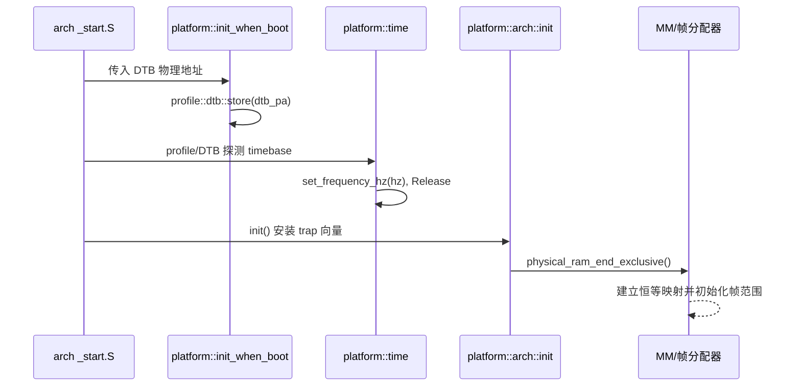
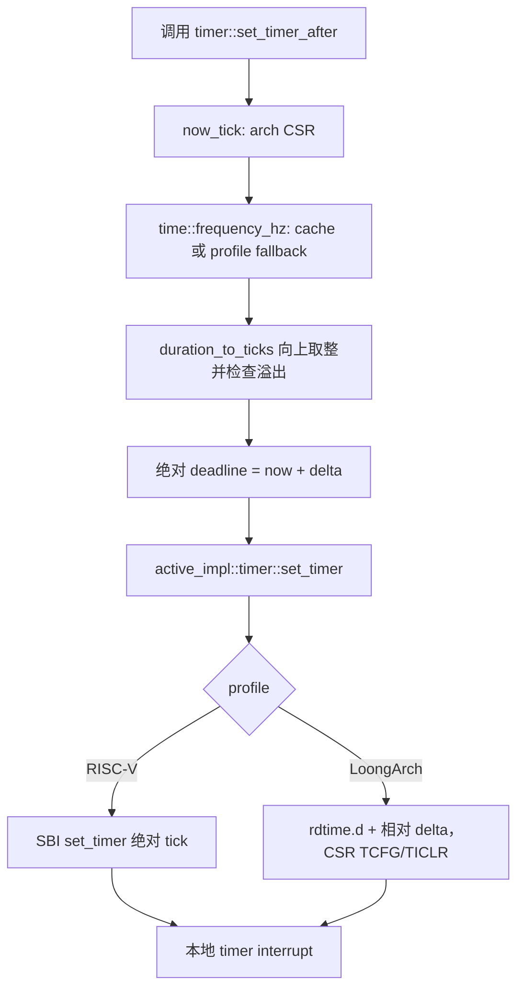
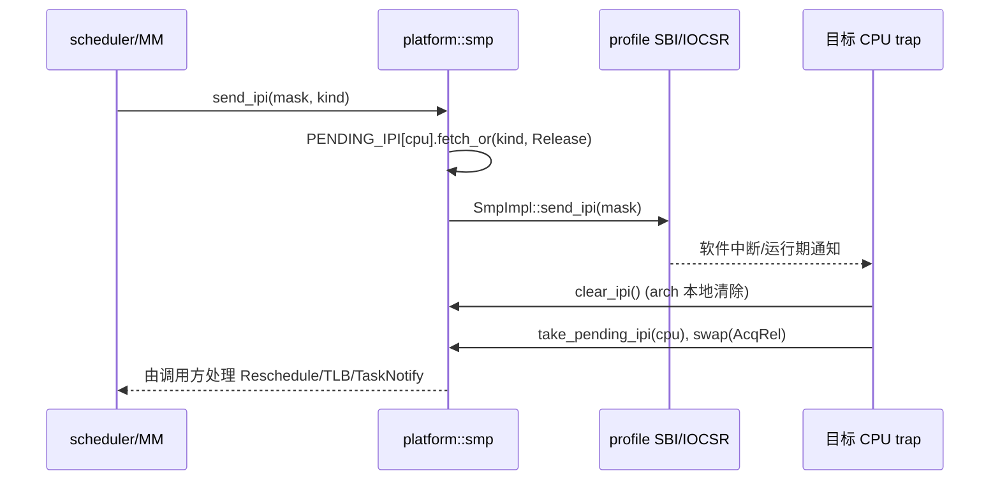

# wateros-platform

[项目首页](../../../README.md) · [内核工程](../../README.md) · [系统架构](../../../README.md#系统架构)

## 简介

`wateros-platform` 是 WaterOS 面向硬件与固件的边界层，将 RISC-V 或 LoongArch 原语与
QEMU、OpenSBI 等服务组合成稳定入口。它承接启动参数、DTB、内存边界、计时器、控制台、
复位和跨 CPU IPI，并统一错误与时间单位。`platform-arch` 负责 CSR、trap、分页和本地中断，
`platform-impl` 负责 SBI、IOCSR、mailbox；调度、页表策略和设备驱动归其它组件。当前覆盖
QEMU RISC-V + OpenSBI、QEMU LoongArch `virt`、VisionFive 2/JH7110 与 Loongson 2K1000LA；
远端 TLB shootdown 尚未实现。

## 定位和边界

`wateros-platform` 是内核与“当前 ISA + 当前机器/固件”之间的组合层。它向启动、调度、MM、
trap 和 syscall 提供统一入口，但不拥有调度策略、进程状态、页表内容、设备驱动策略或全局
时间推进。`platform-arch` 只操作 ISA 原语（CSR、trap、上下文、分页和本地中断）；
`platform-impl` 解释 QEMU/固件约定并实现 SBI、IOCSR、DTB、console、timer、reset 和 SMP
运输；`wateros-platform/src` 保存跨架构组合语义（例如 IPI reason 和 tick 换算）。

`Cargo.toml` 的默认组合是 `api-v0 + impl-qemu-riscv64-opensbi`；其它构建分别选择
`impl-qemu-loongarch64-virt`、`impl-jh7110-visionfive2` 或 `impl-loongson2k1000la`。platform
profile 与 arch profile 均为互斥选择；`self_test` 只在显式启用时导出。

## 代码地图

| 语义 | 当前源码 | 所有权与边界 |
| --- | --- | --- |
| 聚合门面 | `src/lib.rs`、`src/{boot,time,timer,smp,console,wall_clock}.rs` | 选择 `active_impl`，保存 DTB 入口、时间频率缓存和软件 IPI reason；不直接写硬件寄存器 |
| 平台契约 | `platform-api/api-v0/src/{boot,time,timer,smp,console,reset}.rs` | 最小稳定类型/错误；不绑定某个 ISA 或 QEMU 实现 |
| 架构契约与实现 | `platform-arch/arch-api/api-v0/`、`platform-arch/arch-impl/impl-{riscv64,loongarch64}/` | trap、任务切换、分页、CSR、中断和本地计时；RISC-V 另有 `ipi.rs` |
| 机器实现 | `platform-impl/impl-{qemu-riscv64-opensbi,qemu-loongarch64-virt,jh7110-visionfive2,loongson2k1000la}/` | 入口参数、DTB/RAM 解析、SBI 或板级中断/SMP 运输、deadline timer、console、reset |
| 链接与入口 | `linker/kernel-sections.ld`、各 profile `src/asm/_start.S` 与 `linker/link.ld` | 固定内核段布局和最早期栈/入口；不承载运行期策略 |

## 核心状态与数据结构

| 状态 | 字段/存储 | 发布、生命周期与不变量 |
| --- | --- | --- |
| `TIMEBASE_HZ_CACHE` (`src/time.rs`) | `AtomicU64`，0 表示未由 DTB 覆盖 | boot 阶段 `set_frequency_hz` 以 `Release` 写入且拒绝 0；读侧 `Acquire`，timer 开始换算后不得再改。未覆盖时调用 profile `PlatformTimeImpl::get_time_frequency_hz` |
| `PENDING_IPI` (`src/smp.rs`) | `AtomicU8[MAX_CPUS]`，每 CPU 的 `IpiKind` 位图 | 发送方 `fetch_or(..., Release)` 后才调用 profile 运输；目标 trap 用 `swap(0, AcqRel)` 一次取走并合并原因。它不表示 CPU online，也不替代 scheduler 的 need-resched |
| LoongArch `CPU_STATES` / `CONFIGURED_CPU_MASK` | profile 内 `AtomicU8[MAX_CPUS]` / `AtomicU64` | DTB `/cpus` 解析后 `Release` 发布可用 CPU；`start_cpu` 用 `compare_exchange` 从 stopped 抢占启动所有权。状态镜像不是 scheduler online mask |
| `PlatformTimerDeadline` | API 中的 `u64` 绝对 tick | 必须与 `arch::time::read_time_tick` 同源；RISC-V 直接交 SBI，LoongArch 在本 CPU 读取 `rdtime.d` 后转换为相对、至少 1 tick 且按 4 tick 对齐 |
| DTB 指针与内存布局 | 各 profile 的静态原子/缓存及 `memory::kernel_layout()` | `init_when_boot` 先保存物理 DTB 地址；后续解析 RAM/MMIO 布局并派生不含上界的 `physical_ram_end_exclusive()`，供映射和帧分配器使用 |

## 关键链路

### 启动、DTB 与架构初始化

`platform-impl/.../boot.rs` 只把入口寄存器包装为 `PlatformBootArgs`：RISC-V OpenSBI 的
`arg0/arg1` 是 hart id/DTB 物理地址；LoongArch QEMU 的三个参数当前不承诺固定语义，DTB
使用 profile 常量。`arch::init()` 必须在打开全局中断前调用；`init_when_boot` 不负责 CPU-local、
页表或 scheduler 初始化。

### 定时器 deadline

`src/timer.rs` 将失败区分为 `Arch`、`Platform`、`DeadlineTimer`、`NoFrequency` 和
`Overflow`。它只编程当前 CPU 的硬件 deadline，不推进 scheduler 的全局时钟；超时队列和
唤醒归 `wateros-task`/IPC 所有。向上取整避免低频计时器把非零 duration 截成零。

### IPI 发布与接收

`send_ipi` 不筛选 offline CPU，调用方必须使用自己的 online mask；运输失败时 reason 保留。
RISC-V 运输是 OpenSBI `send_ipi`/RFENCE，LoongArch 是 IOCSR mailbox/IPI。LoongArch
`flush_tlb_remote` 当前返回 `Unsupported`，上层必须阻止依赖远端 shootdown 的回收路径。

## 机制与正确性

- **分层边界**：`sip/sie/sstatus/satp`、trap 向量和本地 pending 清除在 arch；SBI HSM、DTB、
  QEMU 设备约定和 mailbox 在 profile；调度决策、页表锁、ack 与物理页回收不在本组件。
- **原子协议**：IPI reason 的 Release→AcqRel 配对保证 reason 先于硬件通知可见；`swap` 使多
  发送方合并且不会重复消费。timebase 的 Release→Acquire 保证 timer 不读到半发布频率。
- **上下文约束**：`take_pending_ipi` 只能在当前 CPU 的软件中断处理路径调用；`clear_ipi` 必须
  在返回 trap 前执行。平台入口函数不应在中断上下文执行可能阻塞的 MM/VFS 操作。
- **错误与清理**：API 将 SBI/后端错误归一化为 `PlatformSmpError` 或 deadline 错误，不伪造
  成功；LoongArch 启动的 CAS 失败会返回 `AlreadyAvailable`，不会重复写 mailbox。SBI
  `hart_start` 成功只表示固件接受请求，AP 仍需完成 CPU-local、trap、timer 初始化并自行
  发布 online。

## 初始化、配置与可观测性

启动顺序至少是：profile `_start.S` 保存入口参数 → `init_when_boot` → DTB/timebase 探测与
`set_frequency_hz` → `arch::init` → RAM 边界查询 → 各子系统初始化。`MAX_CPUS` 是编译期容量，
LoongArch 还从 DTB `/cpus` 得到运行期 configured mask；两者都不等同 scheduler online mask。

`self_test`（`src/lib.rs`）检查 DTB/RAM 查询并调用 active profile 自检；timer 目前没有覆盖
测试（CodeGraph 未发现 covering tests）。运行时可见日志包括 `[platform] init_after_boot`、
`self_test ok` 以及 timer deadline debug 日志。相关验证入口是 `make rv_check`、`make la_check`、
`make kernel-rv-pre`、`make kernel-la-pre` 和对应 QEMU run 目标。

## 限制与后续边界

- 当前实现 QEMU RISC-V + OpenSBI、QEMU LoongArch `virt`、VisionFive 2/JH7110 与
  Loongson 2K1000LA 四个 profile；真机能力仍以对应板卡验证报告为准。
- LoongArch profile 的远端 TLB shootdown 尚未实现，且其启动参数不承诺 RISC-V 的 hart/DTB ABI。
- 频率缓存没有运行期重配置协议；启动后修改会破坏 deadline 换算契约。
- `configured_cpu_mask`/firmware 状态、IPI reason 和 scheduler online 状态是三套状态，平台层
  不替调用方完成一致性或重试策略。
