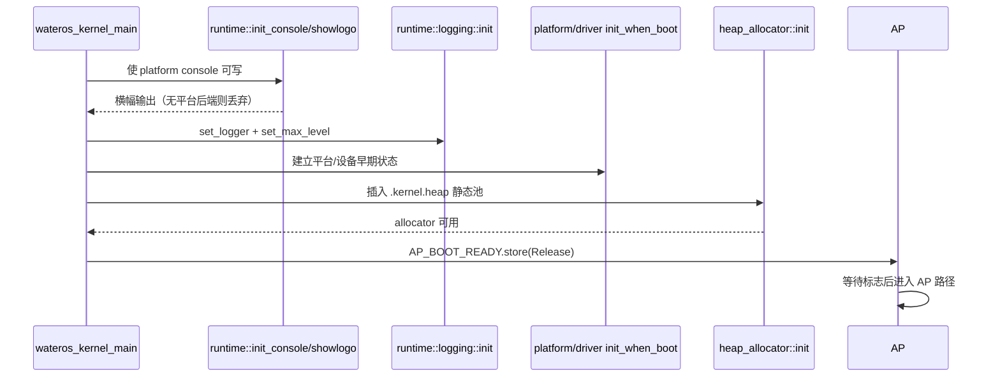

# wateros-runtime

[项目首页](../../../README.md) · [内核工程](../../README.md) · [系统架构](../../../README.md#系统架构)

## 简介

`wateros-runtime` 为 WaterOS 内核提供启动早期和运行期所需的基础支撑。它把控制台输出、全局
`log` logger、panic 终止路径、内核堆分配器以及可选的 QEMU virt UART 接口组合成统一入口，供根
crate 在平台初始化、设备探测、任务创建和用户态 bring-up 之间按顺序使用。控制台与日志输出通过
平台层完成跨 CPU 串行化，堆则从链接脚本保留的静态区域建立，并在分配期间屏蔽本 CPU 中断以防
递归进入。该组件只负责运行时机制和 facade，不负责调度、文件系统、设备发现或日志持久化；失败
时优先保留诊断信息，OOM 和 panic 最终交由平台 shutdown 或停机路径处理。

## 定位和边界

`wateros-runtime` 是 `wateros` 根 crate 使用的运行时聚合层：把控制台、`log` 全局 logger、panic
终止路径、全局堆和可选的 QEMU virt UART 统一再导出（`src/lib.rs`）。它不拥有调度器、VFS、设备
探测、平台寄存器或保留日志缓冲区；平台 console/reset 和 `wateros-klog` 分别拥有这些状态。

依赖方向是 `wateros` → runtime facade → 各 runtime 子 crate → platform/base/config。`console-api`
只定义 `Console` 约束，`impl-platform-console` 才把输出接到 `platform::console`；因此无平台 console
feature 的构建会静默丢弃 console 字节，而不会伪造设备输出。`serial-uart-virt` 是字符设备注册表
和 UART API 的可选再导出，不是 early console。

## 代码地图

| 语义职责 | 源码位置 | 状态所有者/边界 |
| --- | --- | --- |
| 聚合 facade、启动辅助 | `src/lib.rs` | 仅再导出；`init_console` 触发一次空 raw write，`showlogo` 调用 console 横幅 |
| console API 与平台后端 | `runtime-console/src/lib.rs`；`runtime-console/console-api/api-v0/src/lib.rs`；`runtime-console/console-impl/impl-platform-console/src/lib.rs` | API 无状态；平台 console 锁和硬件由 `wateros-platform` 持有 |
| 全局 logger | `runtime-logging/src/lib.rs`、`logger.rs` | 静态 `WaterOSLogger` 与 `log` 全局注册；输出下沉到 console |
| panic 终止 | `runtime-panic/src/lib.rs` | 只格式化、flush、请求 `platform::reset::shutdown`，不恢复任务 |
| 全局堆 | `runtime-heap-allocator/src/lib.rs`、`backend_tlsf.rs`、`backend_linked_list.rs`、`interrupt_guard.rs` | `.kernel.heap` 静态池与后端元数据；跨 CPU 后端锁、本 CPU 中断 guard |
| UART 字符设备 facade | `runtime-serial/src/lib.rs` | 再导出 `Ns16550Port`、注册表和 QEMU virt UART0 常量；设备生命周期由 driver 持有 |

## 核心状态与数据结构

| 状态/结构 | 关键字段与存储 | 同步、创建与销毁 | 不变量与限制 |
| --- | --- | --- | --- |
| `HEAP_SPACE` | `#[link_section = ".kernel.heap"]` 的 `[u8; KERNEL_HEAP_SIZE]`；`KERNEL_HEAP_SIZE = 1 << 29`（512 MiB，`base-config/src/mm.rs`） | `heap_allocator::init()` 只应在 BSP 单线程阶段调用一次；静态池随内核生命周期存在 | 后端不能同时启用 TLSF 与 linked-list；重复 init 会破坏元数据 |
| TLSF `InterruptSafeTlsfHeap` | `Mutex<KernelTlsf>`、`pool_len: AtomicUsize`、`used_estimate: AtomicUsize` | 分配/释放先经过 `with_allocator_interrupt_guard`，再锁 TLSF；`pool_len` Release 发布、读取 Acquire；全局 allocator 静态创建 | O(1) 分配；`used` 是按 layout 大小的饱和估算，不是回收决策依据；指针范围/对齐越界会被拒绝 |
| linked-list `InterruptSafeLockedHeap` | `LockedHeap` 内部空闲链表；容量仍为 `KERNEL_HEAP_SIZE` | 同样由 interrupt guard 包裹，后端锁保护链表；`init` 将静态池交给 `LockedHeap` | 统计 `used/free` 来自 allocator；与 TLSF feature 互斥 |
| `HEAP_GUARD_DEPTH` / 高水位标记 | `CpuLocal<AtomicUsize, MAX_CPUS>` 递归深度；全局 `AtomicBool` 告警标记 | 关本 CPU 全局中断后以 Acquire/Release 更新深度；高水位标记 Relaxed，整个引导周期最多告警一次 | guard 内不得调度、等待、进入 VFS 或触发日志格式化分配；嵌套 GlobalAlloc 直接 panic；使用量超过 90% 才告警 |
| `WaterOSLogger` / `log` 全局状态 | 无字段静态 logger；`log::set_logger` 与 `log::set_max_level` | `logging::init()` 在 console 可写后注册一次；重复注册失败且不替换既有 logger | `impl-trace`…`impl-error` 至多一个，编译期裁剪宏；`ext4_rs` 的 Info 及以上记录被过滤；logger 不分配、不递归调用 log |
| console 输出临界区 | runtime 不保存队列；整条 `fmt::Arguments` 或 byte slice 交给 `platform::console` | 平台层持有跨 CPU UART 锁；runtime 不再套 scheduler/VFS/allocator/driver 锁 | 一次 `write_fmt` 保持记录不交错；无 `impl-platform-console` 时输出显式丢弃 |

## 关键链路

### 启动与分配合法化

`wateros_kernel_main` 在 RISC-V 和 LoongArch 分支都先建立可写 console，再注册 logger，随后初始化
平台/驱动所需的早期状态并初始化堆；AP 在 `AP_BOOT_READY` Release 发布前等待。RISC-V 的具体顺序
见 `os/src/main.rs:315-340`，LoongArch 分支见 `os/src/main.rs:441-467`。



在 `heap_allocator::init()` 返回前不能依赖 `alloc`；返回后才允许 driver、VFS、task 和用户态
bring-up 使用可能分配的路径。AP 不得自行重复初始化。`#[alloc_error_handler]` 位于
`os/src/main.rs:45-48`，委托 `handle_alloc_error` 输出统计并 panic。

### 格式化日志到 console/UART

调用方使用 `runtime::logging::{info,warn,...}!`；logger 着色并追加 `[WaterOS][cpu=N]`，一次
`println!` 进入 console 的整段格式化写入，再由平台层串行化到 UART。该路径不是 `wateros-klog`
环形缓冲：后者的保留/读取能力由 `wateros-klog` 自己拥有。


`runtime-console` 的 raw 写入可服务非 UTF-8 syscall 路径；调用方应批量写入，不能逐字节扩大锁
竞争。logger 的 `flush()` 是空实现，runtime 没有独立持久化队列。

### panic、OOM 与终止

根 crate 的 `#[panic_handler]` 转发到 `runtime-panic::panic_handler`。它尽力打印源码位置和
消息，调用 `platform::console::console_flush()`，然后反复请求
`platform::reset::shutdown(SystemFailure)`；若 reset 返回错误或未终止，最终在无限循环中挂起。
堆 OOM 先读取 `heap_mem_stats()`、记录布局和容量，再 panic，因而会复用同一 panic 路径。

```mermaid
flowchart TD
    T[panic! 或 alloc 失败] --> O{入口}
    O -->|#[panic_handler]| PH[runtime-panic::panic_handler]
    O -->|#[alloc_error_handler]| OE[heap::handle_alloc_error]
    OE --> S[heap_mem_stats + log::warn]
    S --> PH
    PH --> OUT[console println + console_flush]
    OUT --> SH[platform::reset::shutdown(SystemFailure)]
    SH -->|Err| SH
    SH -->|返回但未终止| HALT[loop {} 挂起 CPU]
```

panic 路径不获取 scheduler/VFS/allocator 锁，也不假定 heap 已就绪；早期 console/reset 不可用时
输出和关机只能 best-effort。关机循环是当前实现的故障语义，不是可恢复重试协议。

## 机制与正确性

- **锁与递归**：后端锁负责跨 CPU allocator 元数据互斥；interrupt guard 负责本 CPU 中断重入
  和递归深度。guard 内禁止阻塞、调度、VFS 回调及会分配的日志格式化，否则可能死锁或 panic。
- **输出边界**：整条格式化参数在 platform console 锁内写出；runtime 不持有更高层锁再输出，
  防止锁反转。ANSI SGR 只在接收端支持时有颜色效果。
- **失败处理**：TLSF 无效 dealloc/realloc 指针默认只告警一次并忽略；启用 `tlsf-diagnostics`
  时改为 panic。分配失败返回 null，随后由 alloc error handler 终止内核；不伪造成功。
- **日志过滤**：`impl-*` 级别 feature 同时决定 `log/max_level_*` 和 logger 运行时上限；未选择
  级别时 `logging::init()` 不注册 logger，记录被 `log` 丢弃。logger 直接 console 输出，不进入
  `wateros-klog` 保留环。
- **平台边界**：console 后端依赖 platform facade；panic 的 reset 同样由 platform 实现。runtime
  本身不区分 UART 寄存器，RISC-V/LoongArch 差异由 platform/arch feature 提供。

## 初始化、配置与可观测性

### Feature

| Feature | 当前作用 |
| --- | --- |
| `impl-platform-console` | 将 console、logger、panic 连接到 platform console/reset |
| `impl-trace` / `impl-debug` / `impl-info` / `impl-warn` / `impl-error` | 互斥选择编译期日志最大级别 |
| `heap-tlsf` / `heap-linked-list` | 选择互斥堆后端；默认架构 feature 启用 TLSF |
| `impl-riscv64` / `impl-loongarch64` | 传递 allocator 所需的 arch 实现；顶层默认 RISC-V |
| `heap-stress` | init 后运行碎片压测并最终 `loop {}`，仅诊断用途 |
| `self_test` | 暴露 runtime 自检，执行 logger 标记和一次临时堆分配 |
| `tlsf-diagnostics` | TLSF 非法指针由告警改为 panic |
| `serial-uart-virt` | 可选再导出 QEMU virt UART0 字符设备 API |

堆统计通过 `heap_mem_stats()` 暴露 `used/free/capacity`；TLSF 的 `used` 是估算值。`heap-stress`
按 64..16384 字节 size class 做有限 live-slot churn，结束后故意挂起，不能作为正常启动配置。
验证入口包括 `runtime::self_test`（启用 `self_test`）、堆高水位/OOM 日志、logger 初始化日志及
panic 输出；直接 console 输出可在 QEMU 串口或平台 console 观察。

## 限制与后续边界

- runtime facade 不提供日志保留、检索或跨重启持久化；需要保留日志必须使用 `wateros-klog` 或
  外部采集链路。
- 无 `impl-platform-console` 时 console API 是显式 no-op；这适合最小构建/测试，但不代表存在
  可观察的终端输出。
- panic 的 shutdown 失败会无限重试，最终只能挂起；没有回退到任务级恢复或可配置重启策略。
- TLSF 统计的 `used` 不是精确 live allocation 集合；默认非法指针诊断不检测 double-free 起点，
  只检查池范围、长度和对齐。
- `runtime-serial` 只覆盖已注册字符设备和 QEMU virt UART0 API；它不替代 early console，也不
  提供通用跨平台串口发现。
