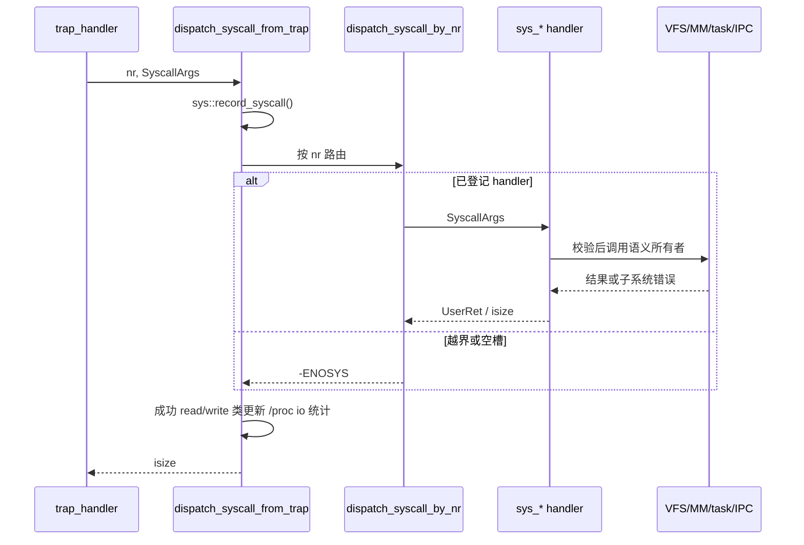
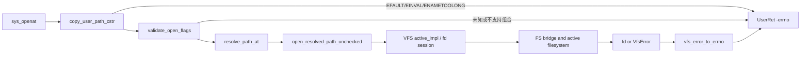
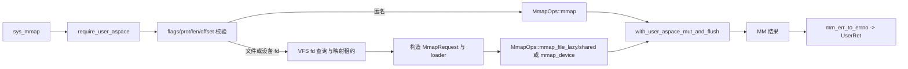
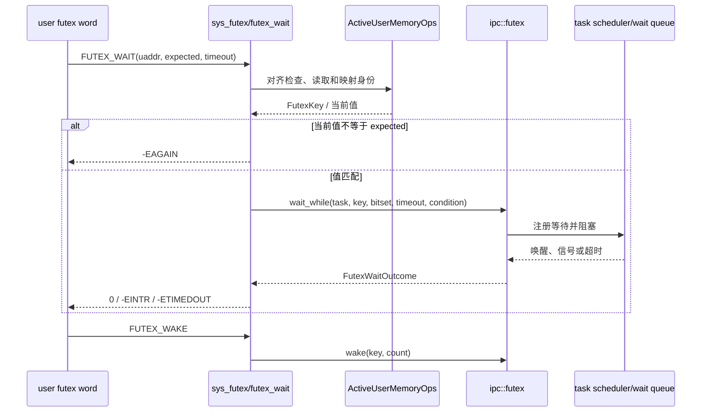

# wateros-syscall

[项目首页](../../../README.md) · [内核工程](../../README.md) · [系统架构](../../../README.md#系统架构)

`wateros-syscall` 是 WaterOS 的用户态 ABI 事务层：它把 trap 层已经提取的调用号和
寄存器参数路由至 `sys_*`，在进入子系统前验证 ABI 输入和用户内存，并把内部结果统一
编码为用户可见的返回值。它不拥有文件描述符、路径、进程、地址空间、futex 队列或网络
socket 的长期状态；这些分别属于 VFS、task、MM、IPC 与 network。trap frame 的读取和
写回也属于 platform arch，而非本组件。

从用户程序发起 `ecall` 到恢复用户执行，本组件负责把架构相关入口已经规范化的六个参数槽
转成一次可失败的内核事务：先按 generic64 调用号选择 handler，再验证标志、长度、对齐和
用户指针，随后调用 VFS、MM、task、IPC 或网络等真正持有状态的子系统。各层错误在边界处
收敛为 Linux 风格的 `-errno`，读写类调用则保留已完成的部分传输，避免跨页 fault 丢失可见
进度。它还为 epoll、poll 和 AF_UNIX 维护 ABI 所需的少量附属登记，并把信号中断、可重启调用
和退出清理接回 trap、调度与生命周期路径；这些适配不改变下游组件对资源、锁和唤醒的所有权。

## 定位和配置

顶层 `src/lib.rs` 是门面：`api-v0` 重导出调用号、参数与返回类型，`impl-kernel` 重导出
trap 返回路径所需的分发、信号、退出和统计入口。默认 feature 为 `impl-kernel`；它选择
`syscall-api/api-v0` 和 `syscall-impl/impl-kernel`。`user-copy-diagnostics` 只为用户拷贝
失败补充日志，`self_test` 运行内核态自检但不进行用户态切换。

`api-v0` 是不依赖 platform、task、MM 的 `no_std` 边界；`impl-kernel` 才依赖 task、MM、
VFS、IPC、cred、TTY、network、platform 和 klog。两种已支持架构共享绝大多数实现；仅
`riscv_hwprobe` 和 `riscv_flush_icache` 在 RISC-V 路由实际 handler，非 RISC-V 槽位返回
`ENOSYS`（`syscall_nr_dispatch.rs`）。

## 代码地图

| 语义 | 位置 | 责任与边界 |
| --- | --- | --- |
| 门面和 trap 入口 | `src/lib.rs`、`impl-kernel/src/lib.rs` | 导出 ABI，调用 `dispatch_syscall_from_trap`，转发信号、退出和诊断钩子。 |
| ABI 数据契约 | `syscall-api/api-v0/src/{args,errno,number,return_value}.rs` | 定义 generic64 号、六个参数槽、正 errno 与单次返回编码。 |
| 号表和重启判断 | `impl-kernel/src/syscall_nr_dispatch.rs` | 两张定长函数指针表、未实现槽位的 `ENOSYS`、可重启号白名单。 |
| 用户边界与临时缓冲 | `impl-kernel/src/{user_copy,fallible_buf}.rs` | 经 MM 访问用户页，记录部分写入；以可失败分配建立有上限的内核缓冲。 |
| 子系统适配 | `impl-kernel/src/sys/{fs,mem,task,ipc,net,poll,time,cred,misc}/` | 校验 ABI、调用语义所有者、转换错误；不是这些子系统的实现所在地。 |
| syscall 层附属对象 | `impl-kernel/src/{epoll_fd,poll_engine,unix_sock,socket_fd,socket_block}.rs` | 保存 epoll 附属状态、poll 编排和 AF_UNIX/socket 的 syscall 适配状态。 |

## 核心数据和状态

| 状态/结构 | 所有者和存储 | 并发、生命周期与不变量 |
| --- | --- | --- |
| `SyscallArgs` / `SyscallPacket` | `api-v0/src/args.rs` 的值类型；槽位数来自 `config::syscall::MAX_SYSCALL_ARGS`，当前为 6 | `from_regs` 与 `as_regs` 保持槽位顺序；调用号是否已实现不由 `SyscallNumber` 保证。 |
| `ErrNo`、`KernelResult<T>`、`UserRet` | `api-v0/src/{errno,return_value}.rs` 的边界类型 | errno 在内核中始终为正；仅以 `UserRet` 在最后一步编码为非负成功值或 `-errno`，避免重复取负。 |
| 号表 | `syscall_nr_dispatch.rs` 的编译期 `ARG_SYSCALL_TABLE` 与 `SPECIAL_SYSCALL_TABLE` | 表长是 `EPOLL_PWAIT2 + 1`；普通 handler 返回 `UserRet`，签名特殊者经第二表适配；越界和空槽恒为 `ENOSYS`。 |
| 用户写入进度 | `user_copy.rs` 的 `UserWriteProgress` 临时值 | 同时携带已复制字节和可选错误，供读取类 syscall 先提交已成功部分，避免把跨页 fault 伪装成全量成功。 |
| epoll 实例与登记表 | `epoll_fd.rs`：`Arc<Mutex<EpollInstance>>`，全局 `EPOLL_FD_REGISTRY: Mutex<_>` | `interests` 保存 fd 与 edge/oneshot 状态；匿名 handle 以 `handle_refs` 的 AcqRel 递减至零时清空兴趣项。登记表按 task id 映射，并有 fork copy、线程共享和 task drop 钩子。 |
| AF_UNIX 附属表 | `unix_sock.rs` 的全局绑定/FD 表和 `Arc<Mutex<...>>` socket 内部状态 | 仅保存 UNIX 域端点与 fd 的关联，关闭和重复 fd 时清理最后一个引用；inet socket 的 fd 生命周期刻意只由 VFS fd 表管理（`socket_fd.rs`）。 |
| poll 的短期上下文 | `poll_engine.rs` 的 `PollSet`、`PollDeadline` 与扫描上下文 | 只在一次 syscall 存活；从用户导入 pollfd、反复扫描并等待，不缓存 VFS 或 network 的就绪状态。 |

## 关键链路

### 1. 通用分发和返回

`dispatch_syscall_from_trap` 先记一次 syscall，再调用
`dispatch_syscall_by_nr`；成功的 read/write、向量 I/O 和文件内搬运才在不持有 VFS/设备锁的
前提下调用 VFS 的 task I/O 记账。分发器先检查边界，再查普通表和特殊表。信号使 syscall
以 `EINTR` 返回后，trap 层可用 `is_restartable_syscall` 的显式白名单决定是否重启；信号帧
投递和恢复由同一门面对外暴露的 `deliver_pending_signal`、`restore_signal_frame` 协调。

### 2. `openat` 到 VFS/FS

`sys/fs/openat.rs::sys_openat` 将 `dirfd`、路径指针、flags 和 mode 从六槽参数中取出；路径通过
`copy_user_path_cstr` 复制，最大 4096 字节。`openat_path` 先拒绝未知或明确不支持的 flags，
再用 `resolve_path_at` 处理目录 fd/路径，最后才进入 VFS。路径解析、fd 分配、挂载路由和实际
文件系统 I/O 均仍由 VFS/FS 所有；syscall 层只将 `VfsError` 映射到 Linux errno。

### 3. `mmap` 到 MM

`sys/mem/mmap.rs::sys_mmap` 首先捕获当前用户地址空间；它拒绝零长度、未知 flag、无效共享/私有
组合和未页对齐的文件 offset。文件映射先经 VFS 检查 fd 访问权限和特殊设备，随后把持有的
handle 转为需求分页 loader；可写共享映射选择稳定帧的 eager 路径，其余选择 lazy 路径。实际
地址选择、页表更新和 TLB flush 由 MM 的 `with_user_aspace_mut_and_flush` 与 `MmapOps` 完成，
本层仅保有映射期间需要的 device/memfd lease 并转换错误。

### 4. futex 等待、唤醒和中断

`sys/ipc/futex.rs` 要求非空且按 `u32` 对齐的用户地址。它从当前地址空间生成 private 或 shared
`FutexKey`，并在进入 IPC 等待前读取预期值；`wait_while` 的条件复查使用已捕获的地址空间，
避免在 scheduler 锁内重新查询 current task。超时区分 `FUTEX_WAIT` 的相对单调时长和
`FUTEX_WAIT_BITSET` 的绝对 deadline；中断、超时和值变化分别映射为 `EINTR`、`ETIMEDOUT` 和
`EAGAIN`。wake/requeue 继续委托 IPC；`FUTEX_WAKE_OP` 以用户页 CAS 修改第二地址，先完成地址
验证，避免在可能 fault 后留下部分副作用。

## 用户内存、阻塞与错误规则

`user_copy.rs` 以当前 task 的地址空间创建 `ActiveUserMemoryOps`；空读写成功返回零，非空空指针
返回 `EFAULT`。MM 的 `InvalidAddress` 也转为 `EFAULT`，其他 MM 错误由 `mm_err_to_errno` 转换。
NUL 路径按 64-byte 块复制；若块跨无效页则回退到逐字节读取，使 NUL 前缀仍遵守 fault 边界，
超过上限为 `ENAMETOOLONG`，非 UTF-8 为 `EINVAL`。`copy_to_user_progress` 保留已写字节；例如
`sys_read` 在取得 VFS read lease 后复制，再以 `VfsCopyProgress` 调用 `finish`，有部分成功时
返回字节数，完全失败才返回 `EFAULT` 或底层错误。

需要内核缓冲的 ABI 由 `fallible_buf.rs::try_kbuf` 使用 `try_reserve_exact`，因此超过调用点上限
为 `EINVAL`、分配失败为 `ENOMEM`，不会触发全局 OOM handler。当前通用 I/O 临时缓冲上限为
4 MiB，socket option 为 64 KiB，`getdents64` 为 256 KiB；较大的合法 I/O 可由 I/O 路径短传输
而非伪造 `EINVAL`。

poll/epoll 不在持有共享 fd 槽锁时睡眠：`poll_engine.rs` 对可能等待的 VFS handle 使用 detached
访问，并在每轮阻塞前重扫就绪状态、检查可投递信号和 deadline。VFS 报 `Interrupted` 或 task
sleep 被打断时统一成为 `EINTR`。epoll 扫描时短暂锁住 `EpollInstance` 复制 interest，锁外计算
fd 就绪并向用户回写，再短暂加锁更新 edge/oneshot 位，避免在 epoll 锁内进入 VFS/network。

## 初始化、可观测性和清理

本组件没有独立全局初始化入口；正确前提是 trap 已提取参数、当前 task/用户地址空间已建立，
且由 feature 选择的 VFS、MM、IPC 等实现已完成启动。`syscall_nr_dispatch.rs` 的表为编译期常量；
`NEXT_EPOLL_INODE` 仅以 Relaxed 分配匿名 inode 编号，epoll handle 引用计数用 Acquire/AcqRel
决定最后一个 handle 的清理。任务复制、共享和回收路径调用 `epoll_fd::{copy_from_parent,
share_from_parent,drop_task}`；退出时门面另提供 syscall 所有资源的 reaped-task 清理转发。

可观测性包括每次分发的 `sys::record_syscall()`、成功 I/O 的 `/proc/<pid>/io` 记账、futex 的
trace 日志，以及可选 `user-copy-diagnostics`。后者在 RISC-V 和 LoongArch 记录地址空间 token
及失败访问；RISC-V debug 构建还可探测虚拟地址。`self_test` 覆盖分发器的重启号断言和各
`sys` 子模块的内核态自检，不证明用户态 trap 或设备 I/O 正常。

## 当前边界和限制

- generic64 调用号常量并不意味着每个号都已实现；未登记或架构不适用调用稳定返回 `ENOSYS`。
- 可自动重启的 syscall 是 `is_restartable_syscall_nr` 的显式集合，不应由调用者推断所有
  `EINTR` 都会重启。
- epoll 的兴趣表与 AF_UNIX 附属登记是本层为 ABI/生命周期维护的状态；网络协议栈、VFS fd
  表、pipe/futex 等待队列及其唤醒正确性仍由各自组件负责。
- poll 的等待实现会按 tick 反复扫描，并非宣称具备 Linux 所有事件驱动或公平性语义；文档仅
  描述 `poll_engine.rs` 现有的重扫、信号和 deadline 处理。
- README 未把静态检查或自检等同于 RISC-V、LoongArch 实机/QEMU ABI 回归；运行时兼容性须由
  具体 workload 验证。
