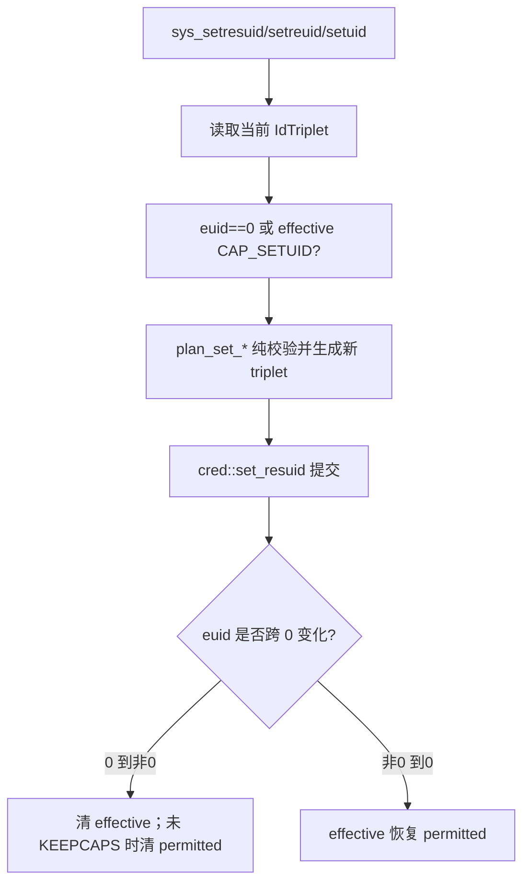

# 凭证系统调用开发手册

[返回 impl-kernel](../../../README.md) · [credential 组件](../../../../../../wateros-cred/README.md)

本目录将 uid/gid、附加组和 capability Linux ABI 映射到两个现有状态所有者：身份三元组和附加组在
`wateros-cred` 的每任务/进程 registry；capability、keep-caps 等进程属性当前在 `wateros-task`。

## 文件与状态

| 文件 | 职责 | 不能忽略的状态 |
| --- | --- | --- |
| `setid.rs` | 纯规则规划 | real/effective/saved ID 的合法转换，不直接写 registry |
| `groups.rs` | getgroups 查询/复制规划 | 查询模式与 buffer-too-small 的区别 |
| `cap.rs` | Linux v1/v2/v3 capability ABI | permitted/effective/inheritable 与版本/word 数 |
| `mod.rs` | 用户复制、权限判断、提交 | `CAP_SETUID/CAP_SETGID`、euid 变化后的 capability 转换 |

## set*id 调用链

先规划、后一次提交避免非法组合只修改一半。gid 路径使用 `CAP_SETGID`。`-1` 在 re/res 接口中表示
“不改变”，需在 ABI 解码处保留，不可先无符号范围校验后误拒绝。

## groups 和 capability 用户复制

- `getgroups(0,NULL)` 是数量查询；buffer 小于实际数量返回 `EINVAL`，不是部分复制。
- `setgroups` 先检查 `NGROUPS_MAX` 和权限，再以受限 probe/可失败缓冲读取用户数组。
- `capget` 可能先回写内核支持的 version；header/data 的坏地址要保持 Linux 规定的错误顺序。
- 输出多个 ID 时先取得同一 credential snapshot，避免三次读取跨越并发身份变化。

## 生命周期和权限消费者

fork 调 `cred::fork_cred`；线程 clone 共享进程 owner；exec 调 `cred::on_exec`；reap/回滚才最终
`drop_task_cred`。新增 credential 字段要同步这四条路径。VFS permission、signal 发送、mount/reboot、
调度跨进程修改等是主要消费者；应查询具体 capability，不要新增更多散落的 `euid == 0`。

## 扩展与回归

增加 capability 时同时更新位号、capget/capset ABI、prctl bounding/ambient 行为、exec 转换和权限检查
调用点。当前没有 user namespace、文件 capability 和完整 securebits；不能声明 namespace 隔离。

定向测试包括所有 real/effective/saved 组合、非 root 权限、KEEP_CAPS、附加组边界/坏指针、fork/exec
继承，以及 VFS/signal 等真实权限消费者，而不只检查 getuid 返回值。
