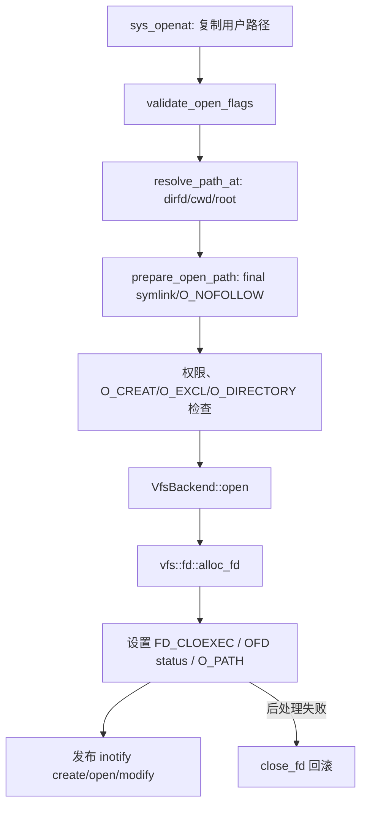
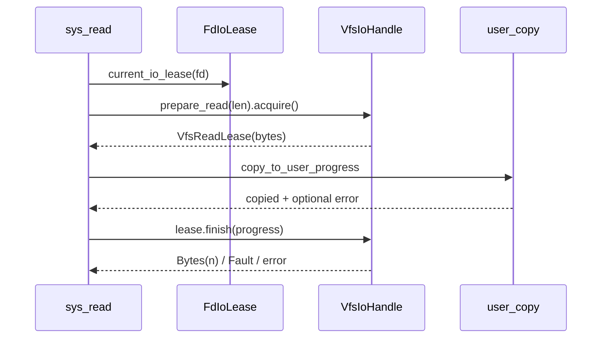

# 文件与 FD 系统调用开发手册

[返回 impl-kernel](../../../README.md) · [VFS](../../../../../../wateros-vfs/README.md) ·
[FS](../../../../../../wateros-fs/README.md)

本目录把 Linux generic64 文件 ABI 转换成 VFS 操作。长期 fd/cwd/页缓存状态属于 VFS，inode 和磁盘
状态属于 FS；这里只拥有 memfd、inotify 等 syscall 组合层对象以及 ABI 临时状态。

## 代码地图

| 文件 | 修改场景 | 关键入口/状态 |
| --- | --- | --- |
| `path_at.rs` | 所有 `*at` 路径 | dirfd、`AT_FDCWD`、cwd/root 合成和符号链接解析 |
| `openat.rs` / `openat2.rs` | open flag、创建权限、`open_how` | `openat_path`、`OpenHow`、fd 安装回滚 |
| `io.rs` | read/write/readv/pread 等 | `VfsReadLease`、iovec 导入、部分复制、socket 特例 |
| `close.rs` / `dup.rs` / `fcntl.rs` | descriptor flag 和 OFD flag | close-range、dup、CLOEXEC、NONBLOCK/APPEND |
| `dir.rs` / `getdents64.rs` | 目录和路径变更 | mkdir/unlink/link/symlink、目录游标 |
| `fstat.rs` / `statfs.rs` / `attr.rs` | 元数据、权限、时间 | Linux stat 编码、cred 检查 |
| `transfer.rs` / `sendfile.rs` | 内核内数据搬运 | splice/tee/vmsplice/copy_file_range、offset 提交 |
| `pipe2.rs` | pipe fd 创建 | pipe endpoint、NONBLOCK/CLOEXEC 回滚 |
| `memfd.rs` | 匿名内存文件 | `MemFdInner/State`、seals、共享 mmap lease |
| `inotify.rs` | 文件事件 | `InotifyState`、watch、事件队列、rename cookie |
| `xattr.rs` / `fallocate.rs` / `truncate.rs` | 后端能力扩展 | flag 校验和 VFS/FS error 映射 |

## 核心状态和不变量

| 状态 | 所有者 | 不变量 |
| --- | --- | --- |
| fd 槽位与 `FD_CLOEXEC` | `vfs::fd` 的每任务表 | descriptor flag 随槽位复制；dup 产生独立槽位 flag |
| 打开文件描述 | VFS `SharedIoHandle`/具体 handle | offset、`O_APPEND/O_NONBLOCK/O_SYNC` 由 dup/fork 共享 |
| `MemFdInner` | `Arc` 共享，内部锁保护数据和 seal | seal 检查与修改必须和对应写/truncate/mmap lease 原子协调 |
| `InotifyState` | fd handle 持有 `Arc`，全局仅保存 `Weak` | read 先预留事件，用户复制失败不丢事件；队列溢出发布 overflow |
| 路径临时值 | syscall 栈/可失败缓冲 | 用户路径最多 `USER_PATH_MAX`，解析结果不得越过进程 root |

## `openat` 调用链

新 open flag 要在 `validate_open_flags` 分类为“支持”“已知但不支持”或“未知”。`O_CLOEXEC` 属于 fd
槽位；`O_NONBLOCK/O_APPEND/O_SYNC` 写入 handle 的共享 open-description 状态。创建成功但 chown、
chmod 或 fd 后处理失败时必须关闭刚安装的 fd。

## `read` 的预留—复制—提交协议

`sys_read` 先取得 `FdIoLease`，再由 handle `prepare_read/acquire` 返回 `VfsReadLease`。数据复制到用户
空间后，以 `VfsCopyProgress` 调 `finish`：完整复制提交全部字节；部分复制按 ABI 返回短读；零字节且
发生 fault 返回 `EFAULT`。pipe/socket/eventfd/inotify 不能绕开该协议，否则坏用户指针会吞掉数据。

大 I/O 由 `MAX_IO/SYSCALL_IO_MAX/IO_CHUNK` 限制和分批，不能按用户 count 一次性分配。iovec 先验证
`IOV_MAX`、总长度溢出和非空项指针，再进入 I/O。

## 路径、权限与错误层次

- syscall：检查 flag、结构布局、用户指针、Linux errno。
- VFS：解析 cwd/root/mount/symlink，管理 fd 和 handle。
- FS：查询/修改 inode、目录项、xattr 和持久数据。
- cred：提供有效 uid/gid；目录 search、owner、mode 检查在调用 VFS 前后按操作完成。

不要把 `NotFound` 一律转换为 `EBADF`，也不要把后端 `Unsupported` 写成成功。统一转换优先使用
`crate::vfs_util::{vfs_error_to_errno,vfs_io_at_error_to_errno}`。

## 扩展实例：新增一个 fd ioctl

1. 在设备/handle 所属层增加真正的状态操作；通用 VFS trait 只加跨实现确实需要的能力。
2. 在 `ioctl` 分支验证 request、参数方向和结构大小。
3. 输入结构先复制到内核；输出结构最后一次性复制。
4. 不在 handle 锁内触发用户缺页。
5. 为错误 fd 类型返回 `ENOTTY`，坏 fd 返回 `EBADF`，坏指针返回 `EFAULT`。
6. 测试 dup/fork 后共享状态、close 后错误和非阻塞行为。

## 生命周期检查

- fork：fd 表复制或 `CLONE_FILES` 共享，打开描述保持共享。
- exec：只关闭 `FD_CLOEXEC` 槽位；普通 OFD 继续存活。
- exit/reap：`drop_task_fd_table` 移除表并释放句柄；TTY close 可能产生控制事件/信号。
- memfd：最后 handle/mapping lease 释放后回收；seal 不能因 dup/fork 丢失。
- inotify：最后实例释放后全局 `Weak` 可清除；移除 watch 发布 `IN_IGNORED`。

## 当前边界与回归

- `openat2 RESOLVE_IN_ROOT` 未安全实现；`RESOLVE_CACHED` 无纯 dcache 路径时返回 `EAGAIN`。
- inotify 依赖 syscall/VFS 变更入口发布事件；新增内核内部写路径时要补 mutation hook。
- FS 后端不支持的 fallocate/xattr/sync 能力应保留明确错误。

最小回归：open flag 矩阵、坏路径/坏指针、read 部分 fault、dup offset/CLOEXEC、fork 后 fd、
rename/unlink 打开句柄、fsync 错误，以及相关 LTP fs case。资源型测试至少重复两轮。
