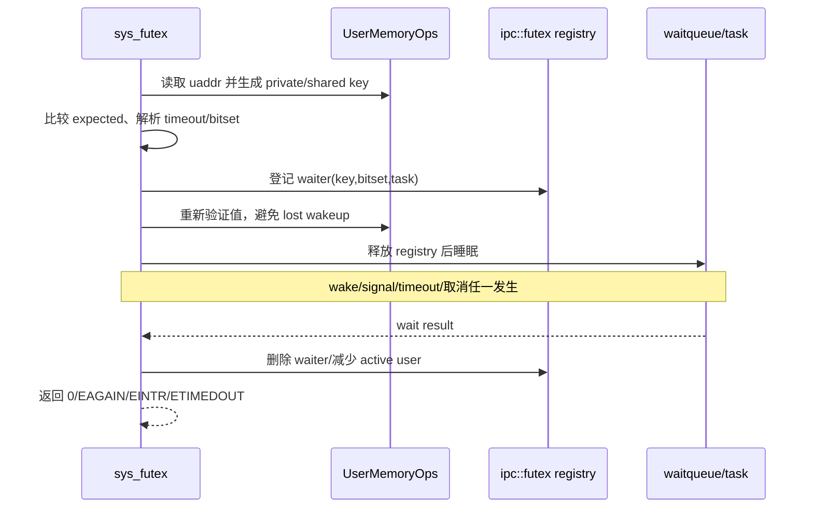

# IPC 与信号系统调用开发手册

[返回 impl-kernel](../../../README.md) · [IPC 组件](../../../../../../wateros-ipc/README.md) ·
[task syscall](../task/README.md)

本目录负责 Linux IPC ABI 和若干需要跨 task/MM/VFS 编排的状态。底层 futex、signal、SHM frame 与
waitqueue 机制来自 `wateros-ipc`；signalfd/eventfd、SysV message/semaphore 的 ABI 组合状态在本目录。

## 代码地图与真实状态

| 文件 | 核心状态 | 关键约束 |
| --- | --- | --- |
| `signal.rs` | signal frame ABI、进程/线程信号状态桥接 | 两架构 frame 布局有编译期 size/offset 断言 |
| `signalfd.rs` | mask、共享 OFD、pending read transaction | 用户复制失败必须回滚 pending 消费 |
| `futex.rs` | 私有/共享 key 转换和命令解码 | waiter 真状态在 `ipc::futex`，key 必须跨进程稳定 |
| `robust.rs` | 每 task robust-list head | exec/exit 遍历 owner-died 并 wake |
| `eventfd.rs` | 64 位 counter、semaphore 模式和 waiter | counter 上限、阻塞/非阻塞、poll 一致 |
| `shm.rs` | SysV SHM ABI 与每 task attachment | segment frame 由 IPC 所有，MM 只映射外部页 |
| `sysv_msg.rs` | `MESSAGE_REGISTRY`、queue、message reservation | 全局锁外复制/睡眠，reservation 防重复消费 |
| `sysv_sem.rs` | `SEMAPHORES`、set values/wait counts/SEM_UNDO | 整组 semop 先模拟后原子提交 |
| `kill_target.rs` | pid/tid/process-group 目标解析 | 权限由 credential + signal 规则决定 |

## futex wait/wake 链

当前命令包括 WAIT/WAKE、BITSET、REQUEUE/CMP_REQUEUE 和 WAKE_OP；PI futex 仍不支持。扩展时必须
同时维护 key、bitset、active-user、requeue 和退出取消，不能只移动 scheduler 队列。

## 信号产生、投递和返回

signal registry 维护 disposition、mask、pending、altstack 和 timer 状态；syscall 层编码 Linux
`siginfo/ucontext/mcontext`。trap 返回用户态前调用 `deliver_pending_signal`：选择未屏蔽信号，在用户栈
构造 frame，通过架构 `SignalFrameCodec` 改写寄存器。`rt_sigreturn` 在 trap 层恢复 frame；畸形 frame
触发 SIGSEGV，而不是普通 syscall 返回。

fork 复制 disposition 并建立新 pending 状态；线程 clone 建线程 mask；exec 重置规定 handler 并清理
其它线程；exit 移除 timer/pending/线程状态。新增 signal 侧状态必须接入 `on_fork/on_clone_thread/
on_exec/on_thread_exit/drop_thread_state`。

## SysV message queue

`MessageRegistry` 由短全局 mutex 保护，按 id/key 索引队列。每条 `Message` 有唯一 sequence、type、
payload 和 `reserved_by`：接收者在锁内选择并预留，锁外复制给用户，成功后按 sequence 删除；复制失败
撤销预留。因此两个 CPU 不会拿走同一消息，`EFAULT` 也不会丢消息。

队列满/空时实现按 tick 睡眠并重新检查，支持 `IPC_NOWAIT`、删除后的 `EIDRM`、类型选择及
`MSG_NOERROR/MSG_EXCEPT/MSG_COPY` 的当前子集。修改容量时同时检查 `MSGMAX`、`MSGMNB`、全局分配失败
和用户可控 payload 的可失败分配。

## SysV semaphore

`SemaphoreRegistry` 保存 set、值、最后操作 PID、等待计数和 `(task,set,num) -> adjustment` 的
`SEM_UNDO`。一次 `semop` 在同一把锁内复制 values 进行整组模拟，全部可行才提交，避免部分更新。
阻塞前增加对应 wait counter，释放锁后睡眠；醒来重新取锁验证。`IPC_RMID` 让等待者返回 `EIDRM`。

task 退出路径必须调用 `sysv_sem::task_exit` 回放 undo；这已由 task `wait.rs` 的统一资源清理调用。
新增退出路径不得绕开该函数。

## SHM 页面所有权

SHM segment 拥有物理 frame；`shmat` 在地址空间登记外部映射，普通 MM unmap/destroy 不得把 frame
交回通用分配器。`shm.rs` 维护每 task attachment，使 fork 可复制 attachment，shmdt/exit 可解除映射，
segment 在 `IPC_RMID` 且最后 attach 消失后回收。

## 阻塞和锁规则

- registry 锁只用于检查/修改内核状态；用户复制、task sleep 和未知后端调用都在锁外。
- 睡眠前登记 waiter 或 reservation，醒来重新检查条件。
- signal interrupt 返回 `EINTR`，timeout 返回 `ETIMEDOUT/EAGAIN` 取决于具体 ABI。
- 删除对象要唤醒或让等待者通过 generation/id 缺失观察到 `EIDRM`。
- 消费型 fd 使用 reserve/copy/commit，确保坏指针可重试。

## 扩展实例：增加 futex 命令

1. 在 `sys_futex` 解析 cmd 与允许的 flag/clock 组合。
2. 确定使用一个还是两个 futex key，private/shared 是否都合法。
3. 将用户原子读改写放在 MM `UserMemoryOps`，不要裸解引用。
4. 设计 registry 内原子状态转换和锁外 wake 列表。
5. 覆盖地址空间销毁、task exit、signal、timeout 和 requeue 竞争。
6. 测试同进程线程、不同进程共享映射、private key、坏地址和 ABA/值变化。

## 当前边界与回归

PI futex 和完整 realtime queued siginfo 尚未实现；普通信号按位合并。SysV msg/sem 已有 registry、阻塞
和删除语义，不能再按旧文档当成 stub，但仍不是 Linux 全部 namespace/accounting 能力。

最小回归应覆盖 futex pthread 压力、robust owner death、signal mask/frame/return、signalfd bad-pointer
回滚、eventfd counter 边界、SHM fork/detach/remove、msg queue 双接收者和 semaphore 原子组操作。
