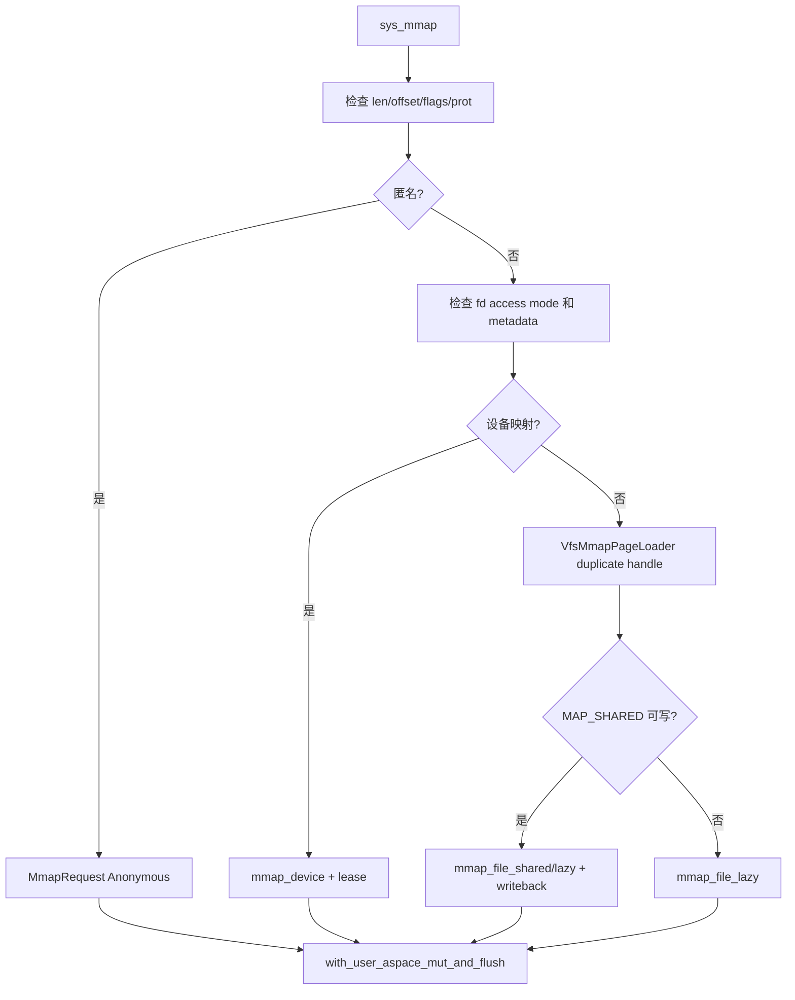

# 内存系统调用开发手册

[返回 impl-kernel](../../../README.md) · [MM 组件](../../../../../../wateros-mm/README.md) ·
[跨组件调用链](../../../../../../../../docs/offline-development/architecture-and-call-chains.md)

本目录只拥有 Linux 内存 ABI 的解析和 VFS 文件 loader 适配；VMA、PTE、物理帧、COW、ASID 和 TLB
由 `wateros-mm` 所有。通用 handler 同时服务 Sv39 与 LoongArch64，架构差异必须下沉到 MM。

## 文件与状态

| 文件/结构 | 作用 | 生命周期 |
| --- | --- | --- |
| `brk.rs` | 当前地址空间 heap break | 真用户任务走 `HeapBrk`；无地址空间 bringup 才走兼容 fake break |
| `mmap.rs::VfsMmapPageLoader` | 保持 mmap 后仍可读写的 VFS handle、文件大小和内容身份 | VMA 持有，fork 时 duplicate，munmap/destroy 时释放 |
| `mmap.rs` handlers | mmap/munmap/msync/mprotect/mremap/madvise/mlock | 每次通过 `require_user_aspace` 取得当前句柄 |
| `mincore.rs` | 把页级 resident 状态编码到用户 vec | 不保存长期状态 |
| `mempolicy.rs` | 单 NUMA 节点兼容 ABI | policy 状态由 MM/task API 决定 |

## mmap 建立链



关键 ABI 规则：长度不能为零；文件 offset 必须页对齐；`O_WRONLY` 不能用于读取映射；可写
`MAP_SHARED` 需要 `O_RDWR`；未知 flag 不可静默忽略。`PROT_WRITE` 在 MM 转换中包含合法的读权限
组合，避免产生 ISA 保留 PTE。

## fault、fork 和销毁

loader 的 `load_page` 只读取文件有效范围，页尾保持零填充。只读映射可通过内容身份复用物理页；可写
私有映射走 COW；共享映射在 fork 后共享引用计数帧。

munmap/exit 对共享文件 resident 页调用 `write_page`，随后 `writeback()` 提交 VFS 脏页。它不是
`fsync`，不能隐式要求块设备持久化 flush。最后按页面所有权释放引用：普通帧/共享帧归 MM 引用计数，
设备页只解除 PTE 并释放 mapping lease。

新增 VMA 类型必须同时实现或审计：

```text
mmap/register -> page fault -> user copy -> fork -> mprotect
              -> madvise/mremap -> msync -> munmap -> destroy -> /proc/maps
```

缺少任一销毁分支都可能在短进程压力下形成线性物理内存泄漏。

## TLB 与错误边界

handler 使用 MM 的 `with_user_aspace_mut_and_flush*` 包装，不直接发 fence。MM 根据地址空间记录的
CPU 集合完成本地和远端 shootdown。`MmError` 通过 `mm_util::mm_err_to_errno` 转换；坏用户地址一般是
`EFAULT`，映射参数非法是 `EINVAL`，无帧/无法扩展是 `ENOMEM`，权限不符是 `EACCES`。

## brk 与 mlock/madvise

- `brk` 成功返回新 break，失败按 Linux 约定返回旧 break，不是负 errno。
- `MADV_DONTNEED/FREE` 丢弃允许重建的私有页；共享/设备页不能照搬匿名页策略。
- `MADV_POPULATE_READ/WRITE` 真正触发 fault，部分失败要保持地址空间一致。
- `mlock` 当前通过验证和 prefault 保证驻留；系统无 swap/reclaim，不能据此宣称完整 Linux 锁页计费。
- `MCL_CURRENT` 缺少全 VMA 枚举接口时返回 `EOPNOTSUPP`；不要假成功。

## 扩展实例：增加一种 madvise 行为

1. 在 syscall 层验证 advice、对齐和零长度规则。
2. 判断行为是否只影响提示，还是会改变 fork/dump/resident 状态。
3. 若需长期 policy，在 MM VMA 结构增加字段，而不是 syscall 全局 map。
4. 同时更新 VMA split/merge、fork、mremap、munmap 和 snapshot。
5. 返回 `PteChange` 时让包装器决定 TLB flush。
6. 用匿名、私有文件、共享文件、设备映射分别测试合法和拒绝路径。

## 回归清单

- `mmap` flag/prot/fd mode/offset/零长度错误矩阵；
- 文件短页零填充、MAP_PRIVATE COW、MAP_SHARED 可见性和 msync；
- fork 后父子写入与引用计数；
- `mprotect` 后 read/write/exec fault；
- 部分 munmap、mremap 移动和地址空间退出；
- 连续两轮 mmap-file 压测后 `MemFree` 不按映射大小下降；
- rv/pre、rv/final、la/final 编译，至少一套架构 runtime 定向测试。

当前不支持 swap、huge page、userfaultfd、完整 NUMA policy 和 `MADV_DONTFORK/DOFORK`。这些行为应
返回明确错误，不能仅为通过探测而修改成功状态。
