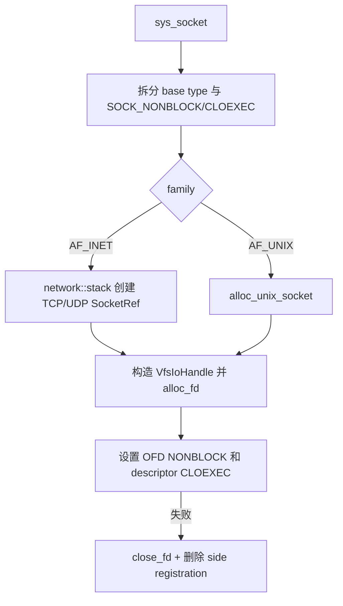

# 网络系统调用开发手册

[返回 impl-kernel](../../../README.md) · [network 组件](../../../../../../wateros-network/README.md) ·
[VFS](../../../../../../wateros-vfs/README.md)

本目录负责 Linux socket ABI。IPv4 TCP/UDP 的协议状态属于 `wateros-network`/smoltcp，fd 生命周期属于
VFS；AF_UNIX 目前由 impl-kernel 根目录的 `unix_sock.rs` 维护独立 registry 和 VFS handle。

## 文件地图

| 路径 | 职责 |
| --- | --- |
| `socket.rs` / `socketpair.rs` | family/type/protocol 校验、创建 handle、安装 NONBLOCK/CLOEXEC |
| `bind.rs` / `listen.rs` / `connect.rs` / `accept.rs` | TCP/UDP 状态转换和 AF_UNIX 分流 |
| `sendto.rs` / `recvfrom.rs` | 单缓冲发送接收、阻塞重试、地址编解码 |
| `sendmsg.rs` | iovec、mmsg、flags 和当前 ancillary 子集 |
| `sockname.rs` / `sockopt.rs` / `shutdown.rs` | 查询、option、半关闭 |
| `../../socket_fd.rs` | fd handle 到 `SocketRef`、共享 status flags |
| `../../socket_block.rs` | NONBLOCK/EINTR/tick sleep 的统一重试 |
| `../../unix_sock.rs` | AF_UNIX bound path、accept queue、datagram inbox、每任务 fd side table |

## socket 创建与回滚

family/type/protocol 的区别对应 `EAFNOSUPPORT/EPROTONOSUPPORT/ESOCKTNOSUPPORT` 等错误，不能统一
返回 `EINVAL` 或创建假 socket。

## 阻塞 I/O 与网络推进

smoltcp 需要 `stack::poll/poll_socket_events` 推进状态。connect/accept/send/recv/poll 在每次条件检查前后
按统一路径驱动网络栈；不可完成时，NONBLOCK 返回 `EAGAIN/EINPROGRESS`，阻塞模式按 tick 睡眠并检查
signal。任何 socket/stack 锁必须在睡眠和用户复制前释放。

接收是消费型操作：使用 handle read lease 或等价 reservation，复制失败不能丢 datagram/stream 数据。
发送大缓冲分段，避免用户长度直接形成同尺寸内核分配；返回部分发送时保留已经成功的字节数。

## AF_UNIX 特有生命周期

`unix_sock.rs` 的 `FD_TABLE` 以 `(task_id,fd)` 关联 `UnixSockRef`，`BOUND` 保存 pathname/abstract endpoint，
stream 有 accept queue，datagram 有有界 inbox。dup、fork、close、exec、exit 必须同步 side registration；
相关入口是 `duplicate_registration/copy_fds_from_parent/unregister/drop_task`。

新增 SCM_RIGHTS 等功能时，消息必须持有被传递 handle 的引用，并在接收成功时原子安装 fd；复制失败、
队列删除和接收进程退出都要释放引用，不能只传递整数 fd。

## 地址和 option

sockaddr 读取先验证最小长度和 family，再复制完整已知结构；输出遵循用户提供的 addrlen，回写实际长度。
socket option 的 level/optname/长度三者共同决定错误。status flag 属于共享 OFD，CLOEXEC 属于 fd 槽位。

## 当前边界与回归

当前重点是 QEMU IPv4 与本地 AF_UNIX；IPv6、raw/netlink/packet socket、完整 ancillary data、零拷贝和
复杂 TCP option 未实现。回归至少覆盖 TCP/UDP loopback、非阻塞 connect、accept4 flag、半关闭、poll/
epoll readiness、datagram 边界、AF_UNIX pathname unlink/close、socketpair fork 和坏用户地址回滚。
