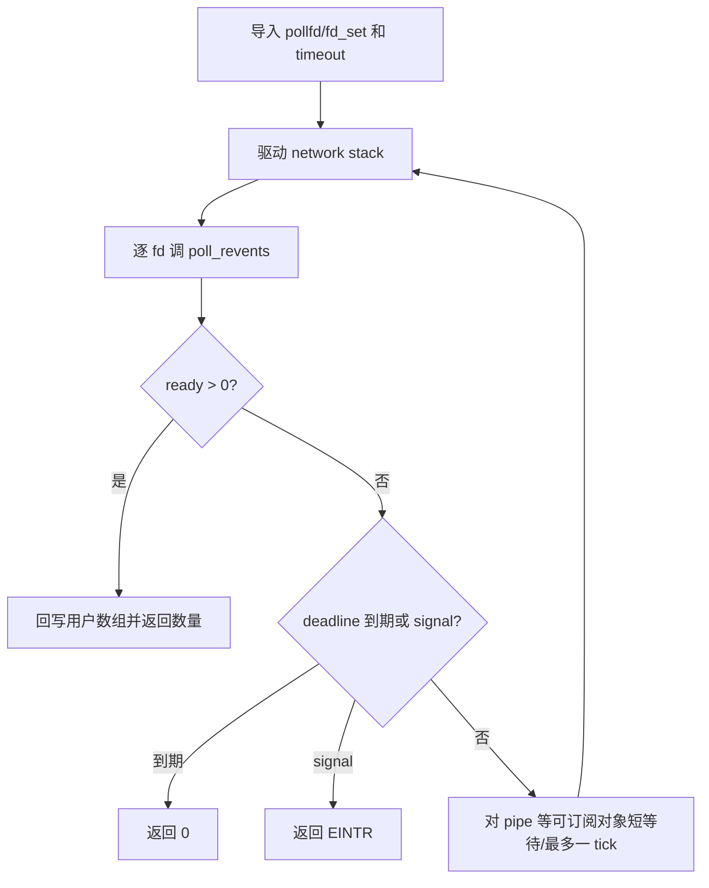

# poll/select/epoll 开发手册

[返回 impl-kernel](../../../README.md)

`poll_engine.rs` 是 poll/ppoll/select/pselect6 的共同扫描和阻塞引擎；本目录的 `epoll.rs` 处理 ABI，
长期 epoll interest 状态在 impl-kernel 根目录 `epoll_fd.rs`。所有对象最终通过 `VfsIoHandle::poll_revents`
或 socket snapshot 给出 readiness。

## 核心结构

| 结构 | 位置 | 不变量 |
| --- | --- | --- |
| `PollSet/PollFd` | `poll_engine.rs` | 最多 1024 项；负 fd 忽略，坏正 fd 报 `POLLNVAL` |
| `PollDeadline` | `poll_engine.rs` | 绝对 monotonic deadline；纳秒向上取整到 scheduler tick |
| `PollSigmaskGuard` | `poll_engine.rs` | ppoll/pselect 临时替换 mask，任何返回路径都恢复 |
| `EpollInstance` | `epoll_fd.rs` | interest map、LT/ET/ONESHOT delivered 状态和用户 data |
| `EpollFdRegistry` | `epoll_fd.rs` | 每任务 fd 到 instance；fork copy/share、close/exit 清理 |

## poll 阻塞链

当前跨多种对象采用重扫保证正确性，没有统一的多对象 subscription token。新增 fd 类型至少实现稳定的
`poll_revents`，并确保状态变化最终唤醒等待者或在下一 tick 可见。

## epoll 语义

`epoll_ctl` 在 instance 锁内增删改 interest，但不能持锁调用可能睡眠的对象操作。wait 扫描目标 fd 后
按 LT/ET/ONESHOT 更新 delivered 状态：ET 只在 readiness 边沿重新报告；ONESHOT 报告一次后禁用，直到
MOD 重新武装。目标 fd 关闭、task fork/exec/exit 时 registry 必须避免悬空整数 fd 关联。

## 用户复制与 signal mask

输入数组先完整导入并限制数量；输出先在内核形成结果，再复制。pselect6 的第六参数是指向
`{sigmask,sigsetsize}` 的结构而非直接 mask。临时 mask 必须覆盖“检查 pending → 睡眠”的竞态窗口，
RAII guard 保证 `EFAULT/EINTR/timeout` 都恢复原 mask。

## 回归

覆盖零 timeout、无限 timeout、坏 fd、关闭 pipe 两端、TTY/eventfd/timerfd/signalfd/inotify/pidfd、TCP
connect/listen、signal EINTR、临时 mask 恢复、epoll LT/ET/ONESHOT、重复 ADD/MOD/DEL、fork 后 epoll 和
目标 fd close。高并发性能优化不能以丢失 wakeup 为代价。
