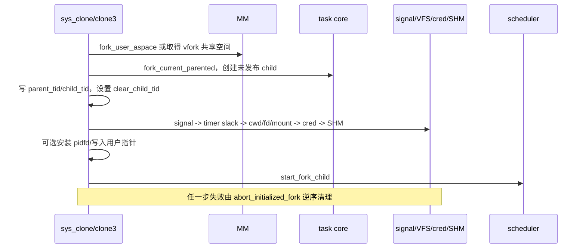

# task syscall

[返回 impl-kernel](../../../README.md) · [任务系统](../../../../../../wateros-task/README.md)

本目录负责把 Linux 进程/线程 ABI 映射到 `wateros-task` 的 PCB、TCB、scheduler
和各资源侧表。创建流程采用“先创建未发布 task，初始化全部资源，再入队”，防止
SMP 下子任务提前运行。

## 文件与职责

| 文件 | 作用 |
| --- | --- |
| `clone.rs` / `vfork.rs` | fork、clone、clone3、vfork 创建和失败回滚。 |
| `execve.rs` | ELF 替换、线程组收敛、CLOEXEC 和地址空间切换。 |
| `task.rs` / `wait.rs` | exit、wait4/waitid、资源回收与 SIGCHLD。 |
| `process.rs` | PID/TID、进程组、会话和 set_tid_address。 |
| `sched.rs` / `priority.rs` / `ioprio.rs` | policy、affinity、nice、I/O priority。 |
| `rlimit.rs` | rlimit/umask 读写及目标进程权限。 |
| `pidfd.rs` | pidfd open/signal/getfd、poll 以及 waitid(P_PIDFD)。 |
| `personality.rs` / `unshare.rs` / `rseq.rs` | 执行域、命名空间探测和运行时兼容。 |

## 当前能力

- fork/clone/clone3、线程 TLS/TID/clear-child-tid、vfork 父等待、execve 和多线程 exec。
- exit/exit_group、wait4/waitid，支持 exited/stopped/continued、WNOWAIT 和 P_PIDFD。
- PID/TID、PGID/SID、job-control 相关查询和修改。
- 五类调度策略、参数/属性、affinity、getcpu、RR interval、nice 与 I/O priority。
- rlimit、umask、personality、prctl 常用项及 parent-death signal。
- pidfd_open、pidfd_send_signal(NULL siginfo)、pidfd_getfd、退出 poll。

## 生命周期与锁

```text
clone/fork
  -> 创建未入队 TCB/PCB
  -> 初始化 signal、cred、fd、cwd、mount namespace、SHM 等侧表
  -> start_* 发布 Ready，必要时定向 IPI

exit
  -> 记录 PCB/TCB 退出状态并唤醒 wait/pidfd 观察者
  -> 锁外释放 fd、signal、futex、SHM、MM 等资源
  -> 父进程 wait 后 reap PCB 与调度实体
```

scheduler lock、process registry lock 与任何 VFS/MM/IPC 锁不能嵌套到调度或用户
复制。失败路径必须撤销已建立的每个侧表，不能留下“存在但永远不入队”的子任务。

### fork 创建事务的实际顺序

`clone.rs::do_fork` 的关键设计是：子 task 在所有外围资源准备完成前不进入 scheduler Ready 队列。



`CLONE_FILES` 共享 fd 表，否则复制 descriptor 表但继续共享打开文件描述；`CLONE_FS` 决定 cwd/root
共享；`CLONE_NEWNS` 与 `CLONE_FS` 互斥。新增 side table 必须同时加入成功继承和
`abort_initialized_fork` 回滚。

### exit 与 reap 的资源边界

task core 先发布线程/进程退出状态，使 wait 和 pidfd 能观察 zombie；syscall 组合层随后在锁外调用
`drop_task_runtime_resources_with_aspace`，依次清 timer slack、SEM_UNDO、futex wait、SHM attachment、
cwd/mount namespace、fd、epoll 和 UNIX socket。robust futex、signal thread state 与 credential 在
reap/回滚路径完成幂等清理。

凭证刻意保留到 reap，因为当前线程退出后续的信号/vfork/记账仍可能查询它。新增资源时先决定它应在
exit 立即释放，还是作为 zombie 可观察状态保留到 reap，不能在两处无条件重复释放。

## 增加 task syscall 的落点

- 纯查询（getpid/getcpu）：读取 task/platform snapshot，最后复制输出。
- 调度属性：先做目标任务权限检查，再调用 scheduler API；不直接修改 TCB 私有字段。
- clone flag：更新 flag 白名单、组合约束、继承、失败回滚、exec 和退出五处。
- prctl/rlimit side table：明确 fork 复制规则、线程共享规则、exec 重置规则和 drop 函数。
- wait 选项：同时维护 stopped/continued/exited 选择、`WNOWAIT`、status/siginfo 用户复制和 reap 时机。

## 定向回归

1. fork 后父子返回值、COW、共享 offset 与独立 fd flag；
2. clone 线程 TLS、parent/child TID、clear-child-tid futex wake；
3. 任一用户输出指针 `EFAULT` 时无不可见 child 和 side-table 泄漏；
4. 多线程 exec 后只剩调用线程，CLOEXEC 生效，旧地址空间释放；
5. exit/wait/pidfd 的 stopped/continued/exited 与 `WNOWAIT`；
6. forkheavy 重复运行，任务、fd、pipe、地址空间和内存回到稳定基线。

## 已知边界

- `CLONE_PIDFD` 尚未接入 clone 创建事务；独立 pidfd syscall 已完整可用。
- pidfd_send_signal 的非空 siginfo 尚无 queued payload 语义，返回 `EOPNOTSUPP`。
- rseq 保持 `ENOSYS`：完整实现必须在每次迁移/抢占时更新用户 rseq area 并处理 abort IP。
- setns 和完整 namespace 尚无 namespace fd/引用生命周期。
- 部分 rlimit（AS、MEMLOCK、NPROC）仍需在每一条资源分配路径统一计费。

## 扩展方向

优先把 `CLONE_PIDFD` 纳入 fork 的可回滚 fd 安装事务；随后实现 rseq 上下文切换
hook、namespace fd/setns、精确 rusage 和 capability 驱动的跨进程权限。所有新增
功能都应同时覆盖 fork/clone/exec/exit/reap 五个生命周期节点。
