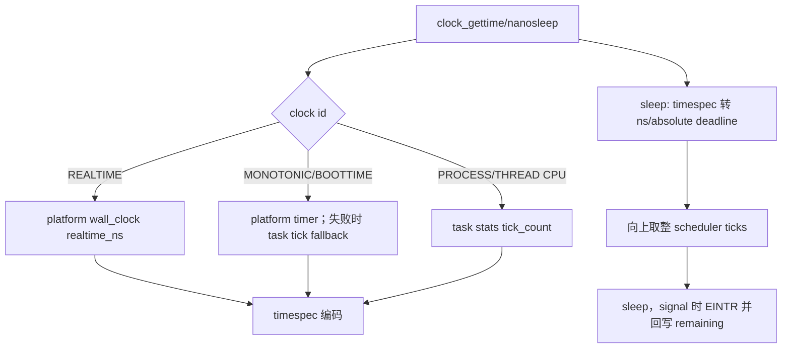

# 时间与计时器 syscall 开发手册

[返回 impl-kernel](../../../README.md) · [platform](../../../../../../wateros-platform/README.md) ·
[signal/IPC](../ipc/README.md)

本目录把 Linux clock/timer ABI 组合到 platform 时钟、task tick/CPU 统计和 signal timer registry。
必须区分 monotonic、realtime、CPU clock 和调度 tick；它们不能互相替代。

## 文件与状态

| 文件 | 状态/来源 | 关键规则 |
| --- | --- | --- |
| `clock.rs` | platform monotonic/realtime、`TIMEX_STATE` | timespec 校验、绝对/相对 sleep、settime 权限 |
| `timer.rs` | task CPU/children 统计、itimer signal 状态 | times/getrusage/getitimer/setitimer |
| `posix_timer.rs` | IPC signal registry 的 per-process timer | timer id、sigevent、overrun、exec/exit 清理 |
| `timerfd.rs` | `TimerFdInner/State`、read reservation | expiration 累计、poll、dup/fork 共享 OFD |
| `rtc.rs` | platform wall clock | RTC 结构与 calendar 转换、set 权限 |

## clock 与 sleep

realtime 可被 settime 调整，monotonic 不可回退。CPU clock 当前粒度来自调度 tick，不应宣称纳秒精度。
`clock_getres` 报告值必须与实际实现粒度相符；绝对 sleep 使用选择的 clock 计算 deadline。

## timerfd 消费协议

timerfd handle 共享 deadline、interval、累计 expiration 和 status flags。read 返回 8 字节计数：先生成
`TimerReadReservation`，复制成功才从累计值扣除；坏指针不丢 expiration。poll 的 `POLLIN` 条件必须和
read 使用同一更新函数，否则会出现“poll 可读但 read 阻塞”。

`TFD_CLOEXEC` 是 fd flag，`TFD_NONBLOCK` 是共享打开状态。fork/dup 共享 timerfd OFD；最后 handle 释放
状态。`TFD_TIMER_CANCEL_ON_SET` 当前不支持，不能忽略后成功。

## 全局 timekeeper 和 SMP

BSP 是全局 timeout/timer timekeeper；AP timer 只维护本 CPU 时间片，避免 SMP 每个 CPU 同时推进一次
全局 timer。新增 periodic source 时必须确认只有一个发布者，callback 不在持 signal/timer registry 锁
时执行用户复制或调度睡眠。

## 扩展与回归

新增 clock id 要同时定义 gettime/getres/settime/sleep 能力矩阵；新增 timer 状态要接 fork（POSIX timer
通常不继承）、exec、exit 和 signal delivery。回归覆盖 timespec 边界、零/负时间、绝对 deadline、
signal EINTR/rem、realtime 调整、周期 overrun、timerfd poll/read bad-pointer、dup/fork，以及 SMP 下
timeout 不随 CPU 数加速。

当前没有 time namespace、高精度亚 tick timer 和完整 CPU clock accounting；相关测试失败应记录实际
粒度或返回明确不支持，而不是伪造精度。
