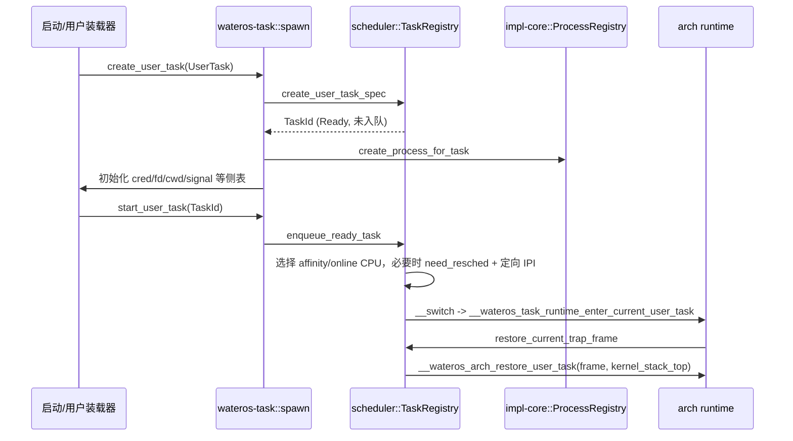
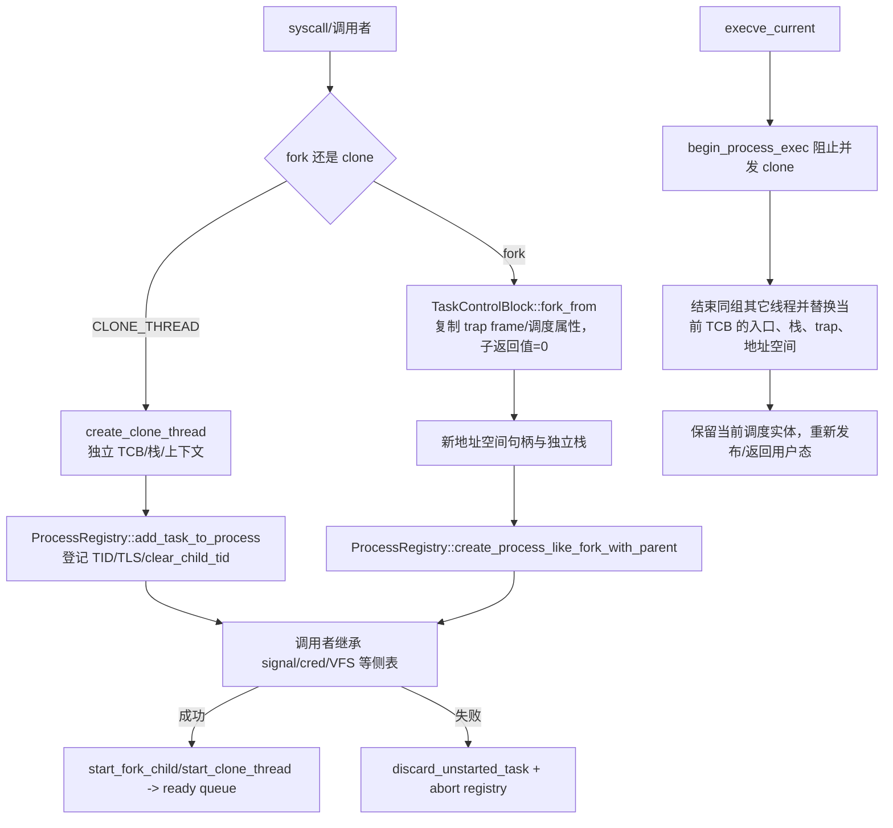
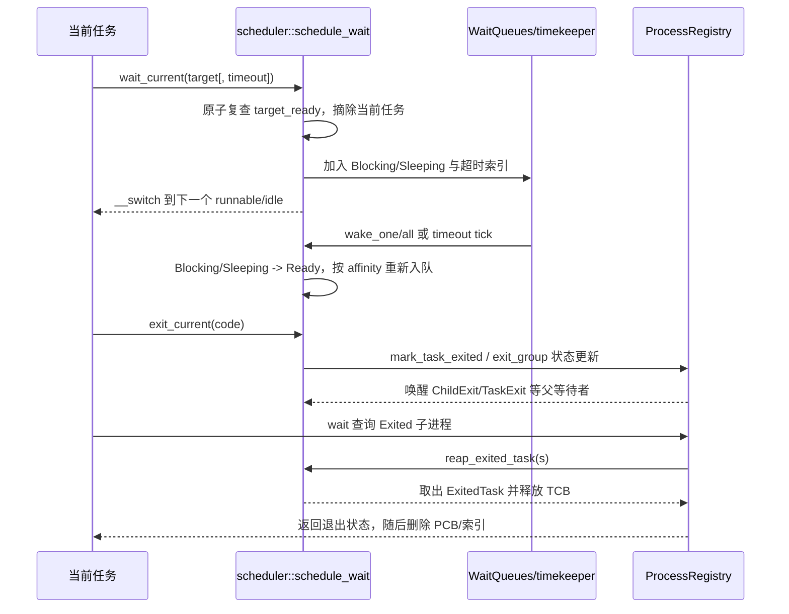

# wateros-task

`wateros-task` 是 WaterOS 内核中连接“可执行任务”和“进程语义”的核心组件。它为每条执行流维护
TCB、内核栈、上下文、用户 trap 现场及调度属性，同时通过进程注册表维护 PID/TID、线程组、父子
关系、停止/退出状态和 zombie 等 wait 语义。任务创建采用先分配、登记和初始化侧表，最后发布到
就绪队列的两阶段流程；fork、clone、exec、exit 与 reap 则分别协调 MM、VFS、IPC、signal 和 cred
的资源生命周期。多级调度器在每个 CPU 上管理实时、公平和 idle 队列，结合 affinity、在线状态、
时间片、vruntime、等待队列和定向 IPI 完成阻塞、唤醒、迁移与上下文切换。本文以当前源码为准，
说明这些状态、锁和跨组件边界，不将尚未实现的 Linux 进程语义描述为已支持能力。

## 定位和边界

`wateros-task` 是任务生命周期、进程/线程关系和 CPU 调度的聚合层。它把
`task-api/api-v0` 的稳定类型、`task-impl/impl-core` 的 TCB/PCB 实现和
`task-scheduler` 的多类调度器接到 syscall、trap、MM、VFS、IPC 与 cred 的调用点。
任务系统拥有 TaskId 到 TCB、PID/TID 到 PCB/线程记录、每 CPU 运行队列及等待队列；
地址空间内容与 ELF 映像由 MM/装载器拥有，文件描述符、cwd、mount namespace、信号、
凭证和 futex 侧表由对应组件拥有，任务层只在 fork/clone/exec/exit 钩子处协调它们。

顶层 `Cargo.toml` 将 API、核心实现、调度器 API 和 `impl-multi-class` 组成一个 workspace；
`wateros-task` facade 通过 `default-features = false` 选择平台 arch 与实现。任务 API 对
RISC-V 和 LoongArch 只暴露架构无关的 `TaskTrapSnapshot`、`AddressSpaceHandle` 等语义，
真正的上下文布局和 `__switch`/用户态恢复由 `wateros-platform-arch` 提供。

## 代码地图

| 语义 | 代码位置 | 说明 |
| --- | --- | --- |
| 聚合入口与生命周期 | `src/lib.rs`, `src/spawn.rs`, `src/lifecycle.rs`, `src/process.rs` | 初始化两个全局状态，编排创建、fork/clone/exec、等待、退出和回收。 |
| 任务公共契约 | `task-api/api-v0/src/{task,process,snapshot,wait}.rs` | `TaskState`、进程状态、快照、等待目标和结果等跨实现类型。 |
| TCB 与进程 registry | `task-impl/impl-core/src/{tcb,process}.rs` | 任务专属栈/上下文/用户现场，以及 PCB、线程表和 PID/TID 反向索引。 |
| 调度 facade | `task-scheduler/src/lib.rs` | 发布调度器状态、锁、当前任务原子快照及对聚合层的操作入口。 |
| 多类策略与队列 | `task-scheduler/scheduler-impl/impl-multi-class/src/scheduler/{cpu,policy,runqueue,tasks,wait}.rs` | CPUState、FIFO/RR/CFS/Batch/Idle 队列、状态迁移和等待唤醒。 |
| 运行时/上下文边界 | `src/runtime.rs`, `src/trap.rs` | 首次切入内核/idle/用户任务，保存和恢复 trap frame，调用 arch 恢复例程。 |

## 核心状态与数据结构

| 结构/所有者 | 关键字段与存储 | 生命周期、并发与不变量 |
| --- | --- | --- |
| `TaskControlBlock`（`impl-core/tcb.rs`） | `id/parent_id`；`TaskState`；policy、priority、nice、`vruntime`、统计；`task_cx`；`TaskInner::{Idle,Kernel,User}` 中的内核栈、用户栈、用户映像、地址空间 token 和 trap frame；`ready_cpu_id/running_cpu_id/last_cpu_id/affinity`。 | 由 scheduler registry 持有；新建为 `Ready` 但 `ready_cpu_id=None`，资源初始化完成后才发布。一个任务至多在一个 ready queue，`Running` 时不在 ready queue；`Exited` 不得再次入队。fork 建立独立 TCB/栈/现场，clone 建立独立执行流但可共享进程地址空间，exec 替换当前用户资源。 |
| `ProcessControlBlock` / `ProcessTask`（`impl-core/process.rs`） | PID、父 PID、leader、`state`、地址空间引用、PGID/SID、rlimit/umask/caps、`exec_in_progress`；线程表记录 TID、`ProcessTaskState`、TLS、`clear_child_tid`、comm。 | `ProcessRegistry` 的 `BTreeMap<ProcessId, ...>` 加 `pid_for_task`、`task_for_thread` 三张索引表；访问经关中断后的 `MultiprocessorSafeCell`。leader/member 分别记录；所有线程退出后 PCB 变为 `Exited` 并保留为 zombie，父 wait/reap 后才删除索引，地址空间在锁外释放。 |
| `MultiClassScheduler` / `CPUState` | 每 CPU current/idle、online、affinity 可选任务、五类 ready queue、timer/context-switch 统计、`need_resched`；全局 `TaskRegistry`、`WaitQueues`、timekeeper CPU 和迁移/IPI 状态。 | 调度器由 `SCHEDULER_READY: AtomicBool` Release 发布、Acquire 检查；主体由 `MultiprocessorSafeCell` 保护，通常在关中断临界区访问。`CURRENT_TASK_IDS`、`CURRENT_ASPACE_PTRS`、`CURRENT_TICK` 用 Release 写/Relaxed 或 Acquire 读供条件回调和诊断读取，不能替代主体锁。 |
| ready 队列 | FIFO/RR 按 priority 1..99 分桶；Other/Batch 按 `BTreeMap<VRunTime, VecDeque<TaskId>>`；Idle fair queue；每 CPU 另有物理 idle task。 | `pick_next_runnable` 先实时类，再 Other/Batch 最小 vruntime，最后 Idle/物理 idle。FIFO 不因普通时间片轮转；RR 到期重调度；fair 类 tick 按 nice 增加 vruntime。任务迁移须符合 affinity 且目标 CPU online。 |
| `WaitQueues` 与等待目标 | `TaskWaitTarget::{WaitQueue,TaskExit,ChildExit,Manual}`，可选 `wake_tick`，`TaskWaitResult::{Woken,TimedOut,Interrupted}`。 | `schedule_wait` 在同一调度临界区复查 `wait_target_ready`、摘除当前任务、入阻塞/超时队列再切换，避免检查与入队之间丢唤醒。timekeeper CPU 推进全局 tick 和超时，其它 CPU 只推进本地统计/时间片；唤醒后重新选择合法 CPU。 |

## 关键链路

### 用户任务创建、ELF 交接与首次返回用户态

`TaskControlBlock::new_user_task` 分配独立内核栈并准备用户入口上下文；`spawn.rs` 先完成
TCB 和 PCB 登记，调用方随后建立其它侧表，最后才调用 `start_user_task` 发布。首次进入
`runtime.rs` 时先发布延迟迁移任务，再从 TCB 恢复 trap frame 和地址空间 token；返回用户态
的寄存器布局由 arch 实现决定，任务层不直接解释 RISC-V/LoongArch 寄存器。

### fork、clone 与 exec

fork 的 TCB 拥有独立地址空间和 trap frame，子 syscall 返回 0；clone 线程共享进程级语义
（包括地址空间边界），但有自己的内核栈、上下文和可选 TLS。两者都采用“创建但不入队”
的回滚点：侧表继承失败时 `discard_unstarted_task` 和对应 registry abort 不会留下可运行
半初始化任务。`execve_current` 通过 `exec_in_progress` 形成线程组屏障，替换当前用户映像
并清理其它线程；实现不把 exec 的 ELF 装载本身移入任务组件。

### 阻塞、唤醒、退出、wait/reap

`ScheduleReason::Block/Sleep/Exit` 决定当前任务进入阻塞、睡眠或退出容器；`schedule` 在
状态转换后才 pick next，避免退出任务仍被选中。`wake_task`、wait queue wake-one/all 和
timekeeper 超时只把可唤醒任务重新放入 ready queue；`TaskWaitResult::Interrupted` 表示
信号或异步事件打断，具体信号投递由 IPC/signal 组件完成。进程层先把非 leader 线程放入
`exited_member_task_ids`，全组退出后保留 zombie 供 `wait*`，`reap_exited_task` 完成 TCB
释放后，PCB registry 才能安全删除记录。

## 机制与正确性

- **两套状态机。** scheduler 的 `Ready -> Running -> Blocking/Sleeping -> Ready` 或
  `Exited` 描述是否可被 CPU 执行；registry 的 `Running -> Stopped/Exiting -> Exited`
  描述进程组和 wait 可见性。`ProcessTaskState::Runnable/Exited` 是进程视角，不能替代
  TCB 的阻塞原因。
- **锁与中断。** `impl-core::with_process_registry` 和 scheduler 的 `with_scheduler` 都
  先保存并关闭全局中断，再取得 `MultiprocessorSafeCell` 独占访问；锁内只做状态/队列变更，
  IPI、上下文切换、地址空间释放以及侧表回调在锁外完成。跨 registry/scheduler 的创建与
  回滚使用“未发布对象”降低锁交叉和半初始化风险。
- **上下文边界。** `__switch` 只交换 arch `TaskContext`；用户 trap frame 由 TCB 保存，
  `runtime.rs` 将其交给 `__wateros_arch_restore_user_task`。内核任务/idle 通过同一运行时入口，
  idle 只开中断并 `wait_for_interrupt`。
- **SMP 与迁移。** 每 CPU 维护 current/idle 和本地队列；新任务选择 online 且满足 affinity
  的较空 CPU，唤醒优先 `last_cpu_id`。远端入队只设置目标 CPU 的 `need_resched` 并发送定向
  IPI；IPI 触发重调度检查，不推进全局时间。timekeeper CPU 独占 wait timeout 的推进。
- **失败和清理。** registry 操作返回 `ProcessResult`/`Option` 区分不存在、参数错误和正常
  缺省；fork/clone 在发布前失败可撤销。退出时写入退出码、统计和可选 `clear_child_tid`，
  父等待者由任务层唤醒，但用户地址写回、信号、凭证、文件和地址空间具体清理由相应组件
  的生命周期 hook 负责。

## 初始化、配置与可观测性

`wateros_task::init` 先调用 `scheduler::init` 建立 `TaskRegistry`、CPUState 和每 CPU idle
任务，再调用 `init_process_registry`；任何 registry 查询在对应 `*_READY` 的 Acquire 检查
前都不可使用。`run_first_task` 进入第一批 runnable 任务。容量和 CPU 数来自
`wateros-base/base-config` 的 `MAX_CPUS` 等编译期配置，逻辑 tick 是 `u64`；真实 CPU online
状态和 affinity 是运行时状态。平台差异隐藏在 `wateros-platform-arch` 的上下文/陷阱实现和
地址空间 token 中，任务 API 不假定某一 ISA。

调度器公开 `task_snapshot`、`cpu_snapshot`、`online_cpu_mask`、`current_task_snapshot`，
可供 dashboard/GDB 与 `stall-debug` 观察当前任务、队列长度、tick、context switch、
`need_resched`、policy/vruntime 和等待目标。启用 `self_test` 时，`wateros-task::self_test`
只确认调度器和 boot CPU 已建立，不创建或切换用户任务（`src/lib.rs`）。

## 限制与后续边界

- 这是内核内部任务/进程实现，不是完整 Linux process ABI；API 注释明确为 generic64 兼容的
  语义子集，未实现的 clone、signal、ptrace、资源限制和 exec 细节不能由本 README 推断为已支持。
- `ProcessRegistry` 当前是单一全局 registry，虽以多处理器安全 cell 保护，进程语义并未按 NUMA
  或每 CPU 分片；调度器的 ready queue 则是每 CPU 的。
- timekeeper 设计要求一个 CPU 推进全局 wait tick；代码没有显示的多 timekeeper 共识机制。
- 调度器和任务层没有拥有 MM/VFS/IPC/cred 的资源本体；若调用方未在 `start_fork_child` 或
  `start_clone_thread` 前完成侧表继承，任务层只能通过未发布回滚避免任务运行，不能修复外部
  侧表不一致。
- 任务 API 的 `TaskTrapSnapshot` 只保留架构无关语义字段；完整寄存器现场、页表刷新和 TLB
  细节仍属于架构/MM 实现，不能通过任务快照进行调试或迁移。

## 验证入口

从 `os/` 目录执行 `cargo check -p wateros-task` 检查聚合 crate 及其 path 依赖；使用目标
架构配置时按仓库约定执行 `make rv_check` 或 `make la_check`，运行时再用对应的 QEMU
workload 验证真实 trap、SMP 和 wait/reap 链路。
