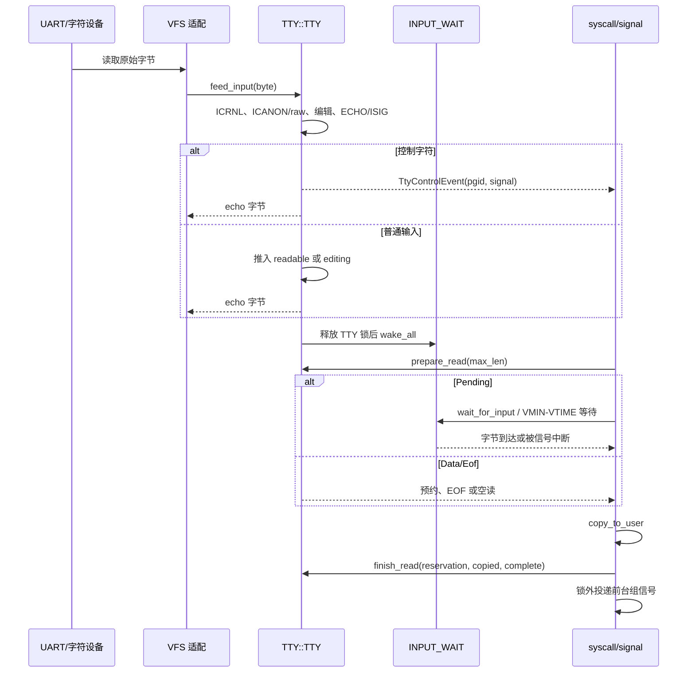
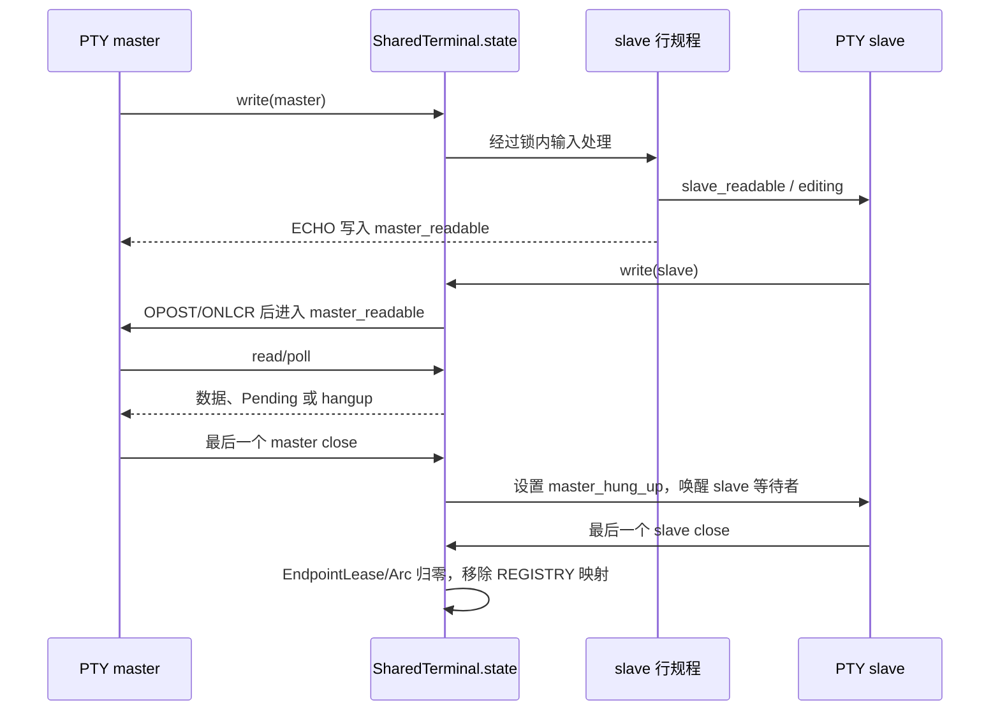

# wateros-tty

[项目首页](../../../README.md) · [内核工程](../../README.md) · [系统架构](../../../README.md#系统架构)

`wateros-tty` 是 WaterOS 内核的终端状态与行规程组件，统一承载系统控制台和 UNIX98 伪终端的
输入编辑、回显、输出转换、阻塞读取及控制字符信号事件。UART 或字符设备输入经 VFS 适配后进入
行规程，在 canonical 模式下按行编辑，在 raw 模式下依据 `VMIN/VTIME` 交付字节；读取采用预约与
提交机制，用户复制失败时可回滚，等待通过 waitqueue 避免丢失唤醒。PTY 以共享 terminal 状态连接
master/slave 两端，使用有界队列、独立等待队列和引用租约管理关闭与 hangup。该组件只拥有终端机制，
不负责 VFS 路径、fd 生命周期、syscall ABI 转换或实际信号投递。

## 定位和边界

`wateros-tty` 是终端行规程和 UNIX98 PTY 的状态所有者：它处理输入编辑、回显、控制字符、
输出后处理、读取等待以及 master/slave 数据流。它不拥有 VFS 路径或文件描述符表，也不解析
Linux syscall 号、用户指针或用户态 `termios` 布局；这些分别由 `wateros-vfs` 和
`wateros-syscall` 适配。字符设备层把 UART 字节交给 `feed_input`，调用方在锁外执行回显和
信号投递。

顶层 `wateros-tty` 通过 feature 选择 API 与 `impl-console`。API 是架构无关契约；当前实现
使用 `spin::Mutex` 和 `ipc-waitqueue`，RISC-V 与 LoongArch 没有独立的 TTY 语义分支。

## 代码地图

| 语义 | 源码 | 所有权/职责 |
| --- | --- | --- |
| 聚合门面 | `src/lib.rs` | 按 `api-v0`、`impl-console` feature 再导出能力。 |
| 稳定契约 | `tty-api/api-v0/src/lib.rs` | `TtyTermios`、`TtyWinSize`、`TerminalId`、控制事件、模式位和错误类型。 |
| 控制台行规程 | `tty-impl/impl-console/src/lib.rs` | `TTY`、`INPUT_WAIT`、canonical/raw 输入、预约式读取和输出转换。 |
| PTY | `tty-impl/impl-console/src/pty.rs` | `PtyRegistry`、`SharedTerminal`、master/slave 端点和有界队列。 |
| 启动选择 | `os/src/user_operator.rs` | `pre`/`final_online`/operator feature 映射到 `ConsoleTtyMode`。 |

## 核心状态与数据结构

| 状态 | 关键字段与存储 | 并发、生命周期和不变量 |
| --- | --- | --- |
| `TTY: Mutex<TtyState>` (`lib.rs`) | `termios`、`winsize`、`foreground_pgid`、`controlling_sid`；`readable: VecDeque<u8>` 是已处理输入，`editing: Vec<u8>` 是未提交行；`eof_pending`、`active_read`/`next_read_id` 管 EOF 与读取预约。 | 所有字段由同一自旋锁保护。`configure` 重置配置、会话和缓冲；`prepare_read` 一次只允许一个预约，`finish_read` 只消费已复制字节，其余按原序放回队首。 |
| `INPUT_WAIT: Mutex<Option<WaitQueue>>` | 懒创建的 `console-tty-input` 等待队列。 | 不能在 `TTY` 锁内唤醒或阻塞；`feed_input`/`configure` 释放 TTY 锁后唤醒，`wait_for_input` 用 `wait_current_while` 原子衔接条件检查和入队。 |
| `PtyRegistry` (`pty.rs`) | `pairs: BTreeMap<u32, Weak<SharedTerminal>>`；`sessions: BTreeMap<usize, TerminalId>`；PTY 编号上限 `MAX_PTYS=64`，终端 ID 从 2 起。 | 全局 `Mutex` 只管理索引。最后一个 `Arc<SharedTerminal>` 释放时移除 pair 和会话映射，并释放四个等待队列。 |
| `PtyState` | `locked`、独立 `termios`/窗口/前台组/会话；`slave_readable`/`slave_editing`/`slave_eof_pending`；`master_readable`；两个活动读取 ID；master/slave 打开描述计数；hangup 标志和 `events`。 | 由 `SharedTerminal.state` 短锁保护。master 写入只进入 slave 行规程，slave 输出/回显进入 master 队列；两侧各有独立读/空间等待队列。每侧队列容量 `QUEUE_CAPACITY=64*1024`。 |
| `PtyEndpointHandle` / `EndpointLease` | `Arc<SharedTerminal>`、端点类型、`Arc<AtomicBool>` 非阻塞标志、访问模式；租约引用端点。 | clone 增加描述引用；最后一个 master/slave 描述关闭时更新 hangup/唤醒对端，`SharedTerminal` 的 `Drop` 才回收注册表对象。 |
| API 数据 | `TtyTermios` 为 `#[repr(C)]`、`NCCS=19`；`TtyWinSize` 默认 25x80；`TtyControlEvent { process_group, signal }`。 | API 不含 syscall 号或指针。事件只描述待投递信号，实际投递必须在 TTY/PTY 锁外完成。 |

## 关键链路

### UART 输入到阻塞读取和信号

`feed_input` 在 `TTY` 锁内完成转换和状态改变，随后才唤醒等待者；`prepare_read` 把字节暂时
移出队列，用户复制失败时 `finish_read` 回滚未复制部分。canonical 模式以整行就绪为条件；
raw 模式按 `VMIN`，并由 `wait_for_input_change*` 实现字节间 `VTIME`。`Closed` 或空行 `VEOF`
返回 EOF。

### PTY master/slave 传输与关闭

`/dev/ptmx` 分配 pair 后初始为 locked；解锁后 `/dev/pts/N` 才能作为 slave 使用。master 和
slave 各自只有一个活动读预约，写入受 64 KiB 队列和空间等待队列约束；端点的非阻塞位按打开
文件描述保存。关闭产生 hangup 语义，资源回收由租约引用计数而非路径名决定。

## 机制与正确性

- `ICRNL` 先把 `\r` 转成 `\n`。canonical 模式实现 `VERASE`、`VKILL`、`VEOF` 和换行提交；
  raw 模式直接入 `readable`。ECHO 产生最多 8 字节短回显，不能在锁内写 UART。
- `ISIG` 匹配 `VINTR`/`VQUIT`/`VSUSP`，清空当前编辑行并产生 `SIGINT`/`SIGQUIT`/`SIGTSTP`。
  事件只携带前台进程组；syscall/signal 层在释放锁后投递，避免锁顺序反转。
- `OPOST|ONLCR` 将输出换行转换为 `\r\n`；未启用时原样复制。TTY 不负责实际设备写入。
- `wait_current_while` 避免“检查后、入队前”丢失 UART 唤醒；读、写空间等待分别由 PTY 的四个
  waitqueue 管理。锁内不做用户复制、调度、等待、设备 I/O 或信号回调。
- `PtyError` 提供 `NotFound`、`Locked`、`NoSpace`、`HungUp`、`WouldBlock` 等可由 VFS 映射的
  分类；API 不承诺所有 Linux PTY ioctl 或 job-control 语义。

## 初始化、配置与可观测性

`TTY` 静态初始化为 `Closed`、`TtyTermios::DEFAULT`、25x80 窗口和空缓冲；`INPUT_WAIT` 与
PTY 等待队列按需创建。`os/src/user_operator.rs::build_plan` 在编译期 feature 下选择：
`pre` 默认 `Fixture`（预置 `password\n`），`final_online` 默认 `Closed`，
`operator-shell`/`operator-run` 选择 `Interactive`。operator feature 互斥，启动时
`operator_main` 调用 TTY 配置后再启动用户 workload。

`impl-console` 的 `self_test` 覆盖默认状态、canonical 编辑/EOF、raw 读取、VMIN/VTIME、
缓冲区上限和前台控制字符。可观察入口是 `[tty]`/调用方日志、`poll_readable` 与读取预约状态；
本组件没有独立的运行时统计计数器。

## 限制与后续边界

- 当前控制台只有一个固定 `TerminalId::CONSOLE=1`；PTY 上限为 64，单向队列为 64 KiB，容量耗尽
  依赖阻塞/非阻塞调用方处理。
- `Fixture` 是固定 `password\n`，不是通用输入脚本；`Closed` 直接 EOF，不能模拟 UART。
- Linux ABI 的结构体布局、ioctl 编号、用户复制和 errno 转换不在本组件；TTY 也不实现完整的
  权限、会话继承或全部 job-control 规则。源码未显示的语义不能视为已支持。
- 没有架构专用 TTY 实现；设备探测、UART 驱动、VFS fd 生命周期和 signal 实际投递仍由相邻组件
  负责。
