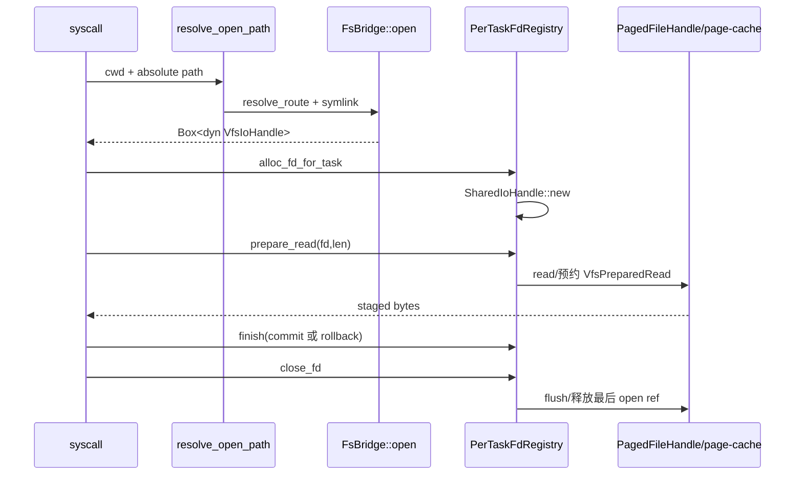
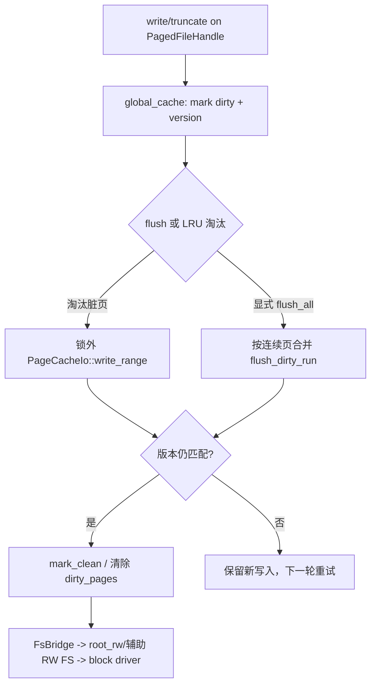

# wateros-vfs

[项目首页](../../../README.md) · [内核工程](../../README.md) · [架构说明](../../../README.md#系统架构)

`wateros-vfs` 为内核提供统一的文件访问中间层：上承 syscall、任务和内存管理，下接根文件系统、伪文件系统及设备句柄。它将绝对路径解析、当前工作目录、符号链接、挂载命名空间、每任务文件描述符表和打开文件生命周期组合起来，并以稳定的 `VfsIoHandle` 契约隔离具体后端。普通文件可经页缓存完成共享读取、脏页跟踪、预取和批量写回；管道、控制台、字符设备及可选图形设备则由 fd-session 提供相应句柄。VFS 负责路由、资源持有和错误分类，不直接实现 ext4 磁盘格式、块设备传输或 Linux syscall ABI。

## 定位和边界

`wateros-vfs` 是 syscall、MM 和 `wateros-fs` 之间的 VFS 聚合层。它把路径、打开态句柄、每任务
fd/cwd、挂载命名空间和文件页缓存组合为稳定的 VFS 面；`vfs-api/api-v0` 只定义契约，实际行为由
`impl-fd-session`、`impl-fs-bridge` 和 `impl-page-cache` 提供（见各自 `Cargo.toml`）。

它拥有路径规范化/符号链接解析、fd 槽位和句柄生命周期、挂载路由、读预约提交以及缓存一致性；不拥有
ext4/inode 的磁盘实现（由 `wateros-fs`）、块设备传输（由 `wateros-driver`）或 syscall 参数和 errno
转换（由 `wateros-syscall`）。组件本身不按 ISA 分叉；RISC-V/LoongArch 的差异由下游平台和驱动隐藏。

## 代码地图

| 语义层 | 主要路径 | 当前职责 |
| --- | --- | --- |
| 聚合 facade | `src/lib.rs` | feature 选择 `active_impl::backend()`，导出路径解析、fd/cwd/mount_ns 和图形设备入口 |
| 公共契约 | `vfs-api/api-v0/src/{backend,handle,fd,mount,resolve}.rs` | `VfsBackend`、`VfsIoHandle`、`VfsFdSession`、挂载/路径/错误契约；不依赖 FS |
| fd 会话 | `vfs-impl/impl-fd-session/src/{registry,cwd,handles}.rs` | `PerTaskFdRegistry`、共享打开文件描述、cwd/root、pipe/console/字符设备和 flock |
| FS 桥接 | `vfs-impl/impl-fs-bridge/src/{lib,path_ops,mount_table,paged_handle,file_handle}.rs` | 根卷与伪 FS 路由、目录/普通文件/tmpfile/procfs/sysfs 句柄、稳定节点 |
| 页缓存 | `vfs-impl/impl-page-cache/src/{lib,file_cache,cache_state}.rs` | 按挂载代次和文件身份索引的共享 LRU、脏页、预取和批量写回 |

`bridge-fs-api`、`impl-fd-session` 是默认 feature；`user-graphics` 追加 `/dev/fb0`/evdev，
`cache-layer-diagnostics` 打开缓存诊断，`self_test` 仅在显式启用时导出。关闭桥接时 facade 使用
`UnsupportedBackend`，能力列表为空，挂载返回 `VfsError::Unsupported`（`src/lib.rs`）。

## 核心状态与数据结构

| 状态 | 关键字段/存储 | 并发与生命周期不变量 |
| --- | --- | --- |
| `PerTaskFdRegistry` | `TaskId -> Vec<Option<SharedIoHandle>>`，另有 close-on-exec/path-only 标志表 | registry 内锁/可变借用保护槽位；`SharedIoHandle` 以 `Arc<Mutex<OpenFileDescription>>` 共享，`close_once` 保证幂等；任务创建时建立，close/exec 时释放对应槽位 |
| `PerTaskCwdRegistry` | 任务到 cwd、进程 root、`CLONE_FS` 共享关系的表（`cwd.rs`） | fork 复制或按 `CLONE_FS` 共享；解析不得越过虚拟 root，任务退出时清理 |
| `MountNamespace`/`MountEntry` | 根挂载及辅助挂载的前缀、`mount_id`、`fstype`、传播属性；全局 registry 由 `MultiprocessorSafeCell` 发布 | `resolve_route` 按最长前缀选择 Root/AuxRw/AuxRo/Pseudo 路由；挂载 ID 单调分配，命名空间按任务引用，卸载后不再接受新路由 |
| `StableNodeLease`/detached 状态 | `(mount_id,node_id)` 到稳定 inode 的弱引用表；unlink 后句柄可持有 detached 数据 | 打开句柄持有 lease；最后一个引用释放时回收未发布 tmpfile/缓存元数据，内容版本原子递增 |
| `GlobalFilePageCache` | `GLOBAL_CACHE: Mutex<Option<Arc<_>>>`；`FileCacheKey{mount_gen,stable,path}`、帧池、LRU、每文件脏页版本 | `files -> FileEntryInner -> state -> FS` 锁顺序；I/O 在 `state` 锁外执行；脏页版本匹配才标记 clean；挂载代次切换原地清空并复用帧池 |

## 关键链路

### 打开、读取与关闭

`resolve_symlink_absolute` 在最终组件是否跟随由 `FinalSymlink` 决定，并把超过 40 次展开转成
`TooManySymlinks`；桥接层把 FS 错误映射为 `VfsError`。读预约在用户复制失败时回滚，避免字节被
错误消费；`PagedFileHandle::Drop` 配合缓存的 `release_open_ref_key` 回收路径元数据。

### 写入、淘汰与持久化

页缓存缺页时 `install_page` 先释放 cache 锁再读盘，第二次加锁检查避免重复装页；没有可用帧时
等待 LRU 状态变化。`flush_all` 是 `reset_global_cache` 前的持久化边界，不能在未写回时直接丢弃旧代次。

## 机制与正确性

- 路由顺序是 namespace 的最长前缀匹配；Root、AuxRw、AuxRo、proc/sys/security 伪挂载分别决定
  可写性，写入只允许 Root/AuxRw，否则返回 `ReadOnlyFs`。
- fd 槽位区分普通 fd、`FD_CLOEXEC` 和 `FD_PATH_ONLY`；共享打开描述在并发 close/dup 时以
  `closed` 和 `Busy` 防止重复释放或取得可变句柄失败。pipe/stream 的端点引用由句柄对象持有。
- 页缓存的 `mount_gen` 使用 `AtomicU64` Release/Acquire 发布；旧代次请求被忽略，新代次清空索引但
  复用帧池。写回只在 key、页号和版本仍一致时清脏，避免写回覆盖并发新数据。
- FS/块设备调用不得在 page-cache `state` 锁内进行；读盘、写回和预取均在锁外完成。VFS 错误在
  bridge 边界统一为 `VfsError`，syscall 再负责 Linux errno。
- `user-graphics` 的 `initialize_user_graphics_devices` 必须在平台驱动探测后调用；输入 worker
  是低优先级任务。该组件没有在 VFS 内实现权限模型、块设备调度或完整 Linux mount 语义。

## 初始化、配置与可观测性

构建默认启用 `api-v0 + bridge-fs-api + impl-fd-session`；根卷和 devfs/procfs 的实际初始化属于
`wateros-fs`，VFS 只在其可用后通过 `FsBridge` 建立句柄和路由。页缓存容量和页大小来自
`wateros-base/base-config`（`FILE_PAGE_SIZE`、缓存帧容量及 `FLUSH_RUN_MAX_PAGES`），不是运行时由
VFS 自动扩容。`cache-layer-diagnostics` 提供 lookup/install/eviction 计数，`self_test` 提供
页缓存和桥接自检；运行时日志使用 `[page-cache]` 等组件前缀。

建议验证入口：`cargo check --manifest-path os/components/wateros-vfs/Cargo.toml`、
`cargo test --manifest-path os/components/wateros-vfs/vfs-impl/impl-page-cache/Cargo.toml`
（含页缓存并发/写回单测），以及目标架构的 `make rv_check`/`make la_check`。

## 限制与后续边界

- API 中部分默认实现仍返回 `Unsupported`；关闭 `bridge-fs-api` 时不会提供可用根卷。
- 页缓存源码没有覆盖所有生产路径的测试（CodeGraph 未发现 `GlobalFilePageCache` 的完整调用覆盖）；
  当前自检主要验证 LRU、写回竞争和失败重试。
- 图形设备入口是 feature-gated 的内核句柄与输入 worker，不等于用户态图形协议或完整显示栈。
- mount propagation、权限检查和 Linux ABI 的最终 errno/重启语义分别由桥接、cred/task 和 syscall
  层负责，不能从本 README 的 VFS 契约推断为已完全兼容。
