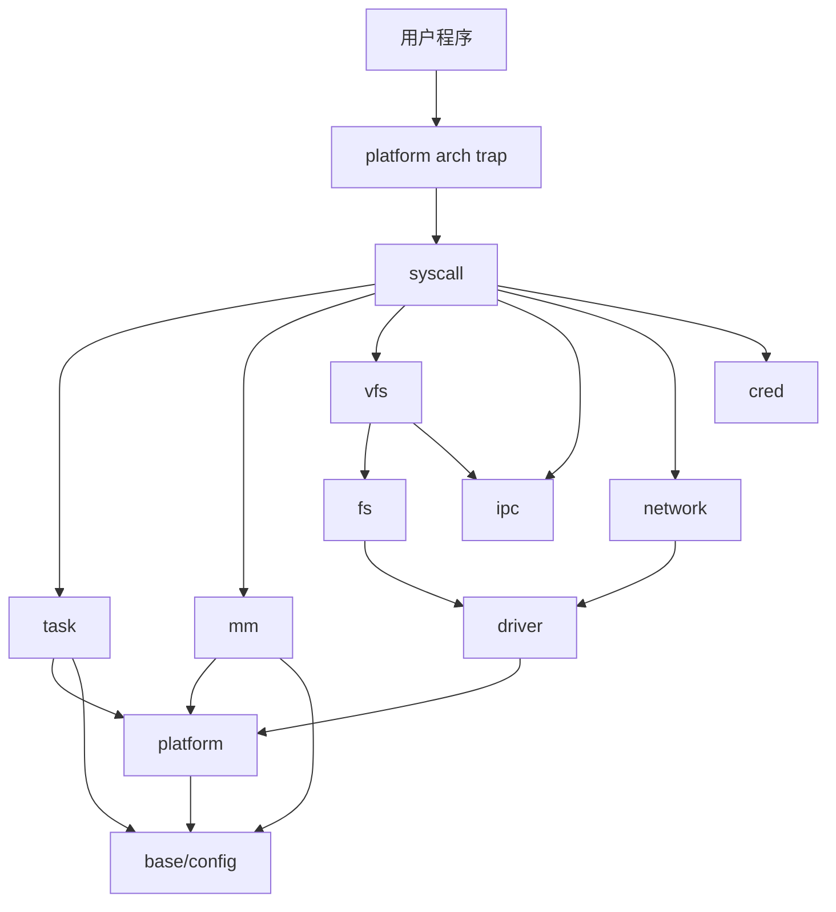
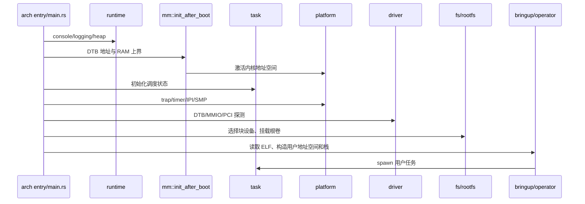
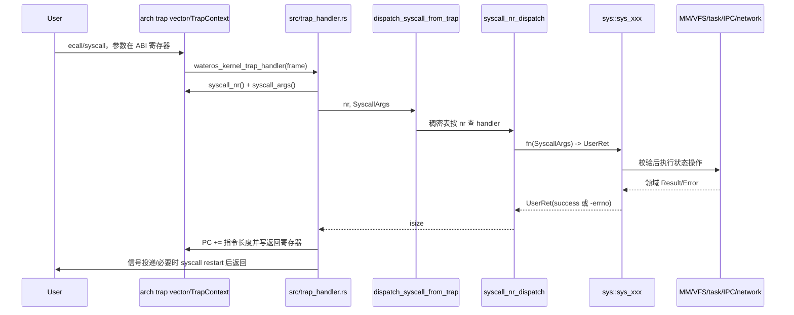
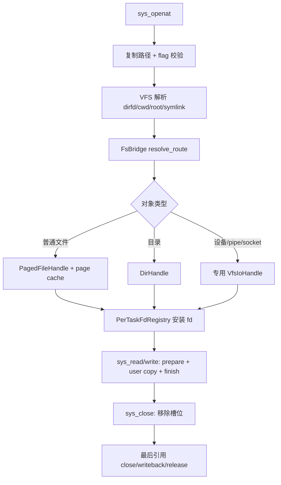
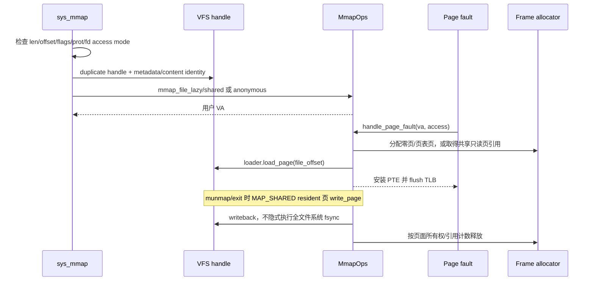

# WaterOS 架构与关键调用链

本文从运行时调用链解释组件如何组合。阅读它时同时打开对应源码；函数名比目录印象更可靠。

## 顶层依赖方向



箭头表示运行时调用方向，不代表 Cargo 中每条依赖。`api-v0` 用来打破具体实现耦合；例如 task
只通过 MM API 的地址空间生命周期钩子释放地址空间，而不是依赖 Sv39 结构。

## 启动链

顶层入口在 [`src/main.rs`](../../src/main.rs)。理解初始化顺序时关注“首次可用”的边界：

1. 架构和串口足以输出早期日志；
2. runtime heap 建立后才允许普通 `alloc`；
3. `mm::init_after_boot` 建立物理帧池和内核页表；
4. task/scheduler、trap、定时器和 IPI 具备运行条件；
5. driver 探测产生块设备等注册对象；
6. FS 选择根设备和后端，VFS 才能打开根卷文件；
7. bringup/operator 装载 ELF 并创建首个用户任务。



修改初始化顺序时，不要只检查函数能否调用；还要检查其中是否分配堆、申请物理页、睡眠、访问
当前 task、读取根文件系统或依赖 AP 已上线。

## 系统调用：从用户寄存器到返回

跨架构 trap 契约位于
[`platform-arch/arch-api/api-v0/src/trap.rs`](../../components/wateros-platform/platform-arch/arch-api/api-v0/src/trap.rs)。
RISC-V 和 LoongArch 各自实现 `TrapFrameRead/TrapFrameWrite`，将不同寄存器布局转换成共同的
`SyscallArgs`、调用号和 `UserRet`。



重要例外：

- `execve` 成功后已替换 trap frame，顶层不能再推进旧 PC 或覆盖返回寄存器。
- `rt_sigreturn` 由 trap 层恢复整个信号帧，不走普通返回流程。
- 可重启 syscall 返回 `EINTR` 后，trap 层保存 `(nr,args)`，信号返回路径决定是否重入。
- 未登记调用号由 `sys_enosys` 返回 `ENOSYS`；handler 文件存在不等于已接入。

相关源码：[`src/trap_handler.rs`](../../src/trap_handler.rs)、
[`syscall_nr_dispatch.rs`](../../components/wateros-syscall/syscall-impl/impl-kernel/src/syscall_nr_dispatch.rs)、
[`args.rs`](../../components/wateros-syscall/syscall-api/api-v0/src/args.rs)。

## 用户内存访问链

syscall handler 不能直接解引用用户地址。所有用户指针都必须经过
[`user_copy.rs`](../../components/wateros-syscall/syscall-impl/impl-kernel/src/user_copy.rs)，最终由
MM 的 `UserMemoryOps` 跨页校验、处理合法缺页/COW 并复制。

```text
sys_xxx
  -> copy_from_user / copy_to_user / copy_c_string_from_user
     -> current_user_memory()
        -> task::current_task_user_aspace_ptr()
        -> mm::kernel_mm::with_user_memory(...)
           -> 每页权限检查 / fault / translate
           -> 复制已验证的物理映射区间
```

正确性规则：

- 长度先做上限和乘法/加法溢出检查，再分配临时缓冲。
- 零长度按具体 Linux ABI 决定是否允许空指针，不能统一提前报 `EFAULT`。
- 输出结构必须先在内核栈/堆完整构造，最后一次性复制到用户空间。
- 消费型输入（pipe/socket/eventfd/signal）必须先 reserve，复制成功再 commit；否则坏指针会吞数据。
- 不在自旋锁、页缓存全局锁或设备队列锁内做可能 fault 的用户复制。

## `openat/read/write/close` 链



`fd` 是进程表中的小整数；真正的打开文件描述包含共享 offset/status flags/句柄状态。
`dup` 和 fork 应共享打开描述，但 `FD_CLOEXEC` 是 descriptor flag，必须按槽位独立。路径路由属于
VFS，inode/磁盘写入属于 FS，Linux open flag 和 errno 属于 syscall。

## `mmap`、缺页、共享写回与销毁

[`sys/mem/mmap.rs`](../../components/wateros-syscall/syscall-impl/impl-kernel/src/sys/mem/mmap.rs)
负责 Linux 参数和 VFS 文件句柄；MM 负责 VMA/PTE/帧。



设备映射页面不属于普通帧分配器；匿名、私有文件页和共享文件页的 fork/destroy 引用规则不同。
任何新增 VMA 类型都必须同时审计：fault、fork、mprotect、munmap、mremap、地址空间 destroy、
用户访问与 `/proc/maps` 快照。

## fork、clone、exec、exit、reap 生命周期

这条链是最常见的资源泄漏来源。主要编排在
[`sys/task/clone.rs`](../../components/wateros-syscall/syscall-impl/impl-kernel/src/sys/task/clone.rs)、
[`execve.rs`](../../components/wateros-syscall/syscall-impl/impl-kernel/src/sys/task/execve.rs) 和
[`wait.rs`](../../components/wateros-syscall/syscall-impl/impl-kernel/src/sys/task/wait.rs)。

| 资源 | fork 进程 | `CLONE_THREAD` | exec 成功 | exit/reap |
| --- | --- | --- | --- | --- |
| 地址空间 | `fork_user_aspace`，私有可写页 COW | 共享同一地址空间 | 建新空间后原子替换，释放旧空间 | 最后所有者/回收路径销毁 |
| fd 表 | 表 COW，打开描述共享 | 依 clone flag 决定共享 | 关闭 `FD_CLOEXEC` | 关闭槽位/释放引用 |
| cwd/root | 复制或 `CLONE_FS` 共享 | 通常进程内共享 | 保留 | registry 清理 |
| credential | `cred::fork_cred` 复制进程身份 | 线程共享 owner | `cred::on_exec` | 最后 owner 清理 |
| signal | `on_fork` 复制 disposition、清 pending | `on_clone_thread` 建线程状态 | `on_exec` 重置规定状态 | robust/timer/pending 清理 |
| futex robust/clear_tid | 子线程独立登记 | 按 clone 参数设置 | exec 清旧线程状态 | 写 clear_tid、wake、robust cleanup |
| task/进程记录 | 新 child/线程 | 加入线程组 | 杀死其它线程并替换 image | 先 publish exited，再由 wait/reap 释放外围资源 |

失败回滚必须按创建的逆序执行。clone 中任何后半段失败，都要撤销已创建的 task、地址空间、fd、
signal、credential 等状态；只释放 TCB 会留下 side table。

## SMP 和锁的通用规则

- 修改 PTE/VMA 后使用 MM 提供的 `with_user_aspace_mut_and_flush*`，不要手写本地 fence 代替远端 shootdown。
- 中断上下文不能等待普通任务事件；会睡眠的操作必须确认当前在 task 上下文。
- 阻塞协议通常是“持状态锁检查条件 → 登记 waiter → 释放锁 → 睡眠 → 唤醒后重新检查”。
- 不要在全局 registry 锁内调用未知后端、用户复制、块 I/O 或调度睡眠。
- 每个组件 README 中记录的锁序优先于凭直觉调整；新增跨组件锁嵌套时必须写入文档。

## 架构相关修改清单

以下改动通常必须同时检查 `impl-sv39` 和 `impl-loongarch64`：

- 页表遍历、PTE flag、VMA resident 页面回收；
- ASID 分配和 TLB shootdown；
- trap frame 新字段、用户寄存器 ABI、信号上下文；
- 用户地址空间 token 的激活/切换；
- ELF 架构辅助信息和平台入口。

普通 Linux generic64 syscall handler、VFS、FS、task 机制原则上不按 ISA 分叉。若通用 handler 出现
`cfg(target_arch)`，先确认差异是否应该下沉到 platform/MM API。

