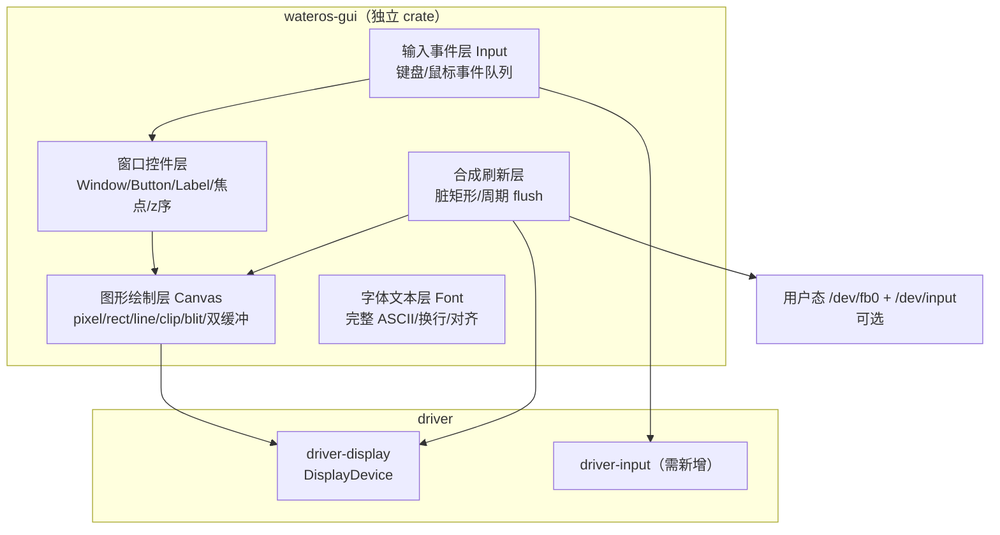

Optimized tool selection

Read 

Ran terminal command:  cd /home/kasss/WaterOS && git branch --show-current && git log --oneline -10

Searched for regex `driver-display|display/|display::|FramebufferInfo|first_display_device|mod gui|gui::` (`**/os/**`), 146 results

Searched for regex `gui|display` (`**/os/src/main.rs`), 7 results

Read 

Read 

Read , lines 1 to 100

Read 

Read 

Searched for regex `display-demo|display|impl-virtio-gpu|gui` (`**/os/Cargo.toml`), 1 result

No matches found. Your search pattern might be excluded completely by either the search.exclude settings or .*ignore files.
If you believe that it should have results, you can check into the .*ignore files and the exclude setting (here are some excluded patterns for reference:[**/node_modules,**/bower_components,**/*.code-search]).
Then if you want to include those files you can call the tool again by setting "includeIgnoredFiles" to true.

Read 

Read , lines 48 to 115

我把 gui.rs、`driver-display` 组件、main.rs 的接线和 Cargo.toml 的 feature 都看了一遍。先给结论，再展开清单。

## 现状定位

gui.rs 目前只是"一次性内核绘制 demo"，不是完整 GUI：

- **已有**：`driver-display` 组件（`DisplayDevice` trait：`info()` / `framebuffer()` / `flush()`、`FramebufferInfo`、`PixelFormat::Bgra8888`、全局注册表 `first_display_device()`），RV/LA 的 virtio-gpu 驱动也已实现。
- gui.rs 只做了：`Color` + `Canvas`（`clear`/`fill_rect`/`put_pixel`/`draw_text`/`draw_glyph`）+ `glyph()` 5×7 字模 + `draw_boot_screen()` 画一张欢迎页 + 一次 `flush()`。
- 接线：main.rs 里 `#[cfg(feature = "display-demo")] mod gui`，`Cargo.toml` 里 `display-demo = ["driver/display"]`。

所以"扩展成单独模块"本质上是从"画一张静态图"升级成"一个完整的 GUI 子系统 crate"（例如 `wateros-gui`）。下面是需要实现的功能清单。

## 要实现的 8 块功能

### 1. 图形绘制层（当前 Canvas 的补强）

- **裁剪（clipping）**：现在只靠 `put_pixel` 逐个判界，应引入 `clip_rect` 上下文，所有绘制先求交集，这是窗口系统的地基。
- **画线/圆/多边形**：`draw_line`（Bresenham）、`draw_circle`、`fill_circle`。
- **blit 区域拷贝**：整块 framebuffer ↔ shadow buffer 之间搬移，是双缓冲和窗口拖动的前提。
- **双缓冲**：画到 shadow buffer，整块拷入 framebuffer 再 `flush()`，避免闪烁。
- **格式抽象**：目前 `PixelFormat` 只有 `Bgra8888`、颜色转换硬编码；应把"Color → 具体格式"收敛成统一的 `encode_pixel`。

### 2. 字体/文本层（当前最大短板）

- `glyph()` 只收录了大写 `A B D E F G I K L M N O P R S T U V W Y` + 空格，**小写、数字、全部符号都显示为空白**。要做 GUI 必须换成完整 ASCII 字模（8×16 或 5×7 全表）。
- 嵌入方式：`static` 数组或 `include_bytes!` 内嵌 `.psf` 字体；no_std 下没问题。
- `draw_text` 目前不换行、不对齐；需要 `measure`/换行/左中右对齐。
- 可选：点阵字体的整数倍缩放（现 `scale` 已支持），够用即可，抗锯齿可不做。

### 3. 输入事件层（目前完全没有）

- 键盘/鼠标**驱动**：需在 driver 侧新增 `driver-input`（virtio-keyboard、virtio-tablet），RV 走 mmio、LA 走 PCI，模式仿照 `driver-display`。
- GUI 侧需要：事件类型（`KeyEvent`/`MouseMove`/`ButtonDown/Up`/`Scroll`）、**全局事件队列**（`Mutex<VecDeque>` 或无锁环形队列）、事件到窗口的**命中测试与路由**。
- 事件来源：轮询或中断都行，简单 GUI 轮询即可。

### 4. 窗口/控件模型（"图形化界面"的核心）

- **窗口**：`Rect` + z 序 + 可见性 + 焦点；绘制时按 z 序从底到顶。
- **控件原语**：`Label`、`Button`（可点击、有按下态）、`ProgressBar`、简单 `TextInput`（结合键盘事件）。
- **事件分发**：鼠标点击 → 命中窗口 → 命中控件 → 回调；键盘 → 焦点控件。

### 5. 合成与刷新

- **常驻刷新任务**：现在是画一次就结束；要"界面"就得有个内核任务（仿照 main.rs 里 `network_poller_task` 的写法），`task::sleep_for_ticks(1)` 周期重绘 + flush。
- **脏矩形（dirty region）**：只重画变化区域。注意 `DisplayDevice::flush()` 目前是全屏 flush，若要脏矩形得扩展 trait（加区域刷新接口）。

### 6. 生命周期/API 设计

- 明确谁持有 framebuffer：当前 `Canvas` 借用 `device.lock()` 的 guard，生命周期受限；常驻 GUI 需要把"设备锁"生命周期拉长或采用"短借用 + 全屏快照"策略。
- 多显示器：注册表已支持 `display_device_at`，可考虑多屏（当前 demo 只取第一个）。

### 7. 用户态接口（可选，看你要不要做应用层）

- `/dev/fb0`：走 `CharacterDevice`，提供 `write/read/seek`（慢但零 mmap 改动），或给 `sys_mmap` 加 `MmapKind::Framebuffer` 做零拷贝。
- `/dev/input` 事件流。
- 更重一点的路线是用户态 `libgui` 库，但这超出"内核 GUI 模块"范畴。

### 8. 模块化打包（按项目约定落成独立组件）

- 新建 `os/components/wateros-gui/`，结构仿 `wateros-driver`：
  - `gui-api/api-v0`（Canvas/事件/窗口 API 契约）
  - `gui-impl/impl-*`（绘制/字体/窗口实现）
  - 聚合 `wateros-gui/src/lib.rs`
- Cargo.toml：加依赖 + feature，例如 `gui = ["driver/display", "driver/input", "dep:gui"]`，默认比赛构建不启用（保持 `display-demo` 现状）。
- 文档三件套：`docs/exports/features/wateros-gui.md`、`docs/exports/impl-guide/wateros-gui.md`、`components/.../README.md`。
- 所有 crate 保持 `#![no_std]` + `alloc`，代码风格对齐现有组件（缩进风格、`#[allow(dead_code)]` 约定见 repo memory）。

## 建议的推进顺序

1. **补字模 + 换行/对齐**（成本最低，立刻让画面像样）
2. **Canvas 裁剪 + 双缓冲 + blit**（为窗口系统打地基）
3. **常驻刷新任务 + 动画**（验证周期性 flush 不闪屏）
4. **driver-input + 事件队列**（键盘鼠标能驱动界面）
5. **窗口/控件 + 事件路由**（真正的"图形化界面"）
6. **模块化拆分 + 文档**（边做边拆，不必一步到位）

需要的话，我可以直接帮你把第 1 步（完整 ASCII 字模 + 文本层）或第 2 步（Canvas 裁剪/双缓冲）落地成代码。
