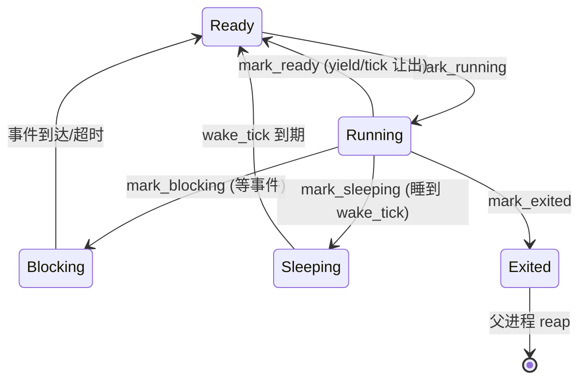

# WaterOS 答辩回顾

> 基于进程模型、capability、fork/clone/exec、CFS 调度与时间片配置的问答整理。
> 每个条目都标注了对应源码位置，方便答辩时按图索骥。

---

## 1. 进程资源限制：`rlimits`

**位置**：`os/components/wateros-task/task-impl/impl-core/src/process.rs`

- 字段：`rlimits : BTreeMap<usize, ResourceLimit>`
- `usize` 键 = Linux `RLIMIT_*` 资源编号（`RLIMIT_NOFILE`、`RLIMIT_STACK`、`RLIMIT_CPU`、`RLIMIT_AS` 等）
- `ResourceLimit` 值 = 软限制 `cur` + 硬限制 `max`，且 `cur <= max`
- 用 `BTreeMap` 而非定长数组：
  - 初始为空表（`BTreeMap::new()`），进程调用 `setrlimit` 时才插入，避免预分配 16 个默认值
  - 有序、可范围查询、迭代确定
- **fork 继承**：`create_process_like_fork_with_parent` 中 `parent.rlimits.clone()`

---

## 2. 进程能力：`caps : ProcessCaps`

**位置**：`process.rs` + `os/components/wateros-task/task-api/api-v0/src/process.rs`

- POSIX capability 模型：把 root 的大权拆成细粒度权限位
- `ProcessCaps` 是**四集合**，每个都是 u32 位图：
  | 集合 | 作用 |
  |------|------|
  | `effective` | 内核做权限检查时实际生效的能力 |
  | `permitted` | 允许提升到 effective 的能力 |
  | `inheritable` | fork/exec 可传递给子进程的能力 |
  | `bounding` | 能力天花板：capset/exec 都不能超出 |
- 默认值 `ProcessCaps::ROOT`（init 拥有全部已实现权限），`fork` 时继承
- 由 `capset` 通过 `set_process_caps` 维护

### 已实现的能力位（只支持低 32 位，`CAP_LAST_CAP = 31`）

| 常量 | 位值 | 含义 | 使用点 |
|------|------|------|--------|
| `CAP_CHOWN` | 1<<0 | 修改文件所有者 | — |
| `CAP_SETGID` | 1<<6 | 任意设置 GID | `cred/mod.rs` |
| `CAP_SETUID` | 1<<7 | 任意设置 UID | `cred/mod.rs` |
| `CAP_SETPCAP` | 1<<8 | 修改自身 capability | `cred/cap.rs` |
| `CAP_SYS_TIME` | 1<<25 | 设置系统时钟 | `sys/time/clock.rs` |

> 答辩要点：WaterOS 是"最小能力模型"——只实现了这 5 个真正用到的位，其余位占位但无检查逻辑。

---

## 3. fork / clone / exec

**位置**：`os/components/wateros-task/task-impl/impl-core/src/tcb.rs`

| 操作 | 方法 | 新建任务？ | 地址空间 | 进程身份 |
|------|------|-----------|---------|---------|
| **fork** | `fork_from` | ✅ | 独立（新 satp） | 新 pid |
| **clone** | `clone_thread_from` | ✅ | **共享** | 同 pid 的线程 |
| **exec** | `execve_from` | ❌ 复用 | 替换（换新） | pid 不变 |

- **fork**：独立地址空间/trap frame/内核栈，但共享父任务用户映像；子进程 `syscall_ret = 0` + `add_user_pc(4)` 跳过 syscall 指令
- **clone**：与 fork 最大区别是共享地址空间（`user : parent_user.user`），可选设 `child_stack`/`tls`（`CLONE_SETTLS`）
- **exec**：不建新任务，换皮：新 entry/sp/satp/映像，重设 argc/argv/envp；进程模型里配合 `begin_process_exec`/`retain_only_task_in_process` 清掉旧线程组

> 典型组合：shell 执行命令 = fork 子进程 → 子进程 execve；pthread_create = clone 线程。

---

## 4. Linux clone 的"种类" = flag 矩阵

**位置**：`api-v0/src/process.rs` 的 `CloneFlags`

- clone 是**一个 syscall + 一堆 flag 位**，不是 N 种固定类型

| flag | 位值 | 含义 |
|------|------|------|
| `CLONE_VM` | 0x100 | 共享地址空间 |
| `CLONE_FS` | 0x200 | 共享 umask/cwd/root |
| `CLONE_FILES` | 0x400 | 共享 fd 表 |
| `CLONE_SIGHAND` | 0x800 | 共享信号处理器表 |
| `CLONE_PARENT` | 0x8000 | 子进程与调用者成为兄弟 |
| `CLONE_THREAD` | 0x10000 | 同一线程组（同 TGID） |
| `CLONE_SETTLS` | 0x80000 | 设置 TLS |
| `CLONE_CHILD_CLEARTID` | 0x200000 | 线程退出清零地址并唤醒 futex（pthread_join） |
| `CLONE_NEWNS` | 0x20000 | 新建挂载命名空间 |

- 常见组合：`fork = clone(SIGCHLD)`；`pthread_create = CLONE_VM|FS|FILES|SIGHAND|THREAD|SETTLS|...`；容器 = 命名空间 flag
- **WaterOS 已实现**：上述 flag 的子集，**无命名空间系列**
- 调度处理：`CLONE_THREAD` → `add_task_to_process`（同 pid，对应 `clone_thread_from`）；不带 → `create_process_like_fork`（新 pid，对应 `fork_from`）；`exec_in_progress` 屏障阻止 exec 期间并发 clone

---

## 5. CFS 的 vruntime 更新策略

**位置**：`os/components/wateros-task/task-scheduler/scheduler-api/api-v0/src/cpu.rs` + `cfs_queue.rs`

### 更新时机
- 只在 scheduler tick（`CPUState::tick`）推进，且仅 fair 策略（Other/Batch/Idle）
- **物理 idle 任务运行时不推进基线**，否则新唤醒任务被无端惩罚

### 每 tick 增长公式（固定点 + nice 权重）
```rust
const VRUNTIME_SCALE : u64 = 1 << 20;          // 固定点，避免高权重任务除出 0
let weight = NICE_TO_WEIGHT[(nice + 20) as usize];
let delta  = (NICE_0_WEIGHT * VRUNTIME_SCALE / weight).max(1);
vruntime += delta;
```
- nice 越低 → 权重越大 → delta 越小 → 长期获得更多 CPU

### 基线（min_vruntime）与归一化
- `min_vruntime` **只升不降**，取当前运行实体与两个 fair ready tree 左端的较小者
- 新任务/唤醒/迁移任务入队前 `normalize_vruntime`: `vruntime.max(min_vruntime)`，防止 vruntime=0 插队
- `Idle` 策略用**独立** `idle_min_vruntime` 基线

### yield 特殊处理
- yield 不消耗 tick；把 vruntime 抬到 `ready_min + 1`，防止"立即再选中自己"死循环

### 抢占判断
- `current_vruntime() > min_ready_fair_vruntime()` → 让出（实时任务永远优先）
- 热路径 cache（`current_snapshot`）就地更新，切出时批量回写 TCB，避免每 tick 碰全局锁

### 队列结构
- `CfsQueue = BTreeMap<VRunTime, VecDeque<TaskId>>`：最小 vruntime 优先，同 vruntime FIFO

### 深入：为什么用 BTreeMap 而不是红黑树（答辩必被追问）

**CFS 对有序集合的操作需求**（无论红黑树还是 B 树都满足）：

| 操作 | 场景 |
|------|------|
| 插入 | 新任务/唤醒/迁移入队 |
| 删除 | 被选中出队、阻塞、退出、迁移走 |
| **取最小** | **每次调度都要取最小 vruntime（最"吃亏"者）——最高频** |
| 改 key（vruntime 变化） | tick 推进后删+重插调整位置 |
| 平衡维护 | 保证 O(log n) 不退化 |

**Linux 红黑树实现：**
- 每个节点一个 `sched_entity`；`__enqueue_entity`/`__dequeue_entity` 旋转+变色维持平衡
- **`rb_leftmost` 缓存 → 取最小 O(1)**（对每 tick pick 极关键）
- 同 vruntime 需附加字段保证严格弱序（key 必须唯一）
- 删除 O(log n)；节点指针多，内存局部性一般

**WaterOS BTreeMap 实现：**
```rust
tree : BTreeMap<VRunTime, VecDeque<TaskId>>   // key=vruntime, value=FIFO 桶
```
- 插入 O(log n)（B 树分裂，规则简单）；取最小 `first_entry()` 沿最左路径 O(log n) 但深度浅
- **删除 `retain` 全树扫描 = O(n)**（非 O(log n)）
- **同 vruntime 用 `VecDeque` 天然 FIFO**，无需额外比较字段

**对比表：**

| 维度 | 红黑树（Linux） | BTreeMap（WaterOS） |
|------|----------------|---------------------|
| 结构 | 二叉平衡树，1 任务=1 节点 | 多路搜索树，1 key=1 个 VecDeque |
| 取最小 | **O(1)**（leftmost 缓存） | O(log n)，但 fanout 高、深度浅 |
| 插入 | O(log n) 旋转+变色 | O(log n) 节点分裂 |
| 删除 | **O(log n)** | **O(n)** 全树 `retain` |
| 同 vruntime | 需附加字段保证严格弱序 | `VecDeque` 天然 FIFO |
| 内存局部性 | 指针多，缓存不友好 | 大节点多 key，cache 友好 |
| 平衡维护 | 旋转/变色易错 | 分裂/合并规律性强 |

**取舍结论（答辩话术）：**
- Linux 红黑树为**超大任务集 + 最坏情况**优化：O(1) 取最小、O(log n) 删除
- WaterOS 选 BTreeMap 为**当前规模 + 可读性**优化：fanout 高、深度浅、cache 友好，且 `BTreeMap<VRunTime, VecDeque<TaskId>>` 用语言内置结构直接表达"同 vruntime FIFO"
- 代价：取最小 O(log n) 而非 O(1)、删除 O(n) 全扫——对当前任务规模完全够用，且免去手写红黑树的复杂度
- 一句话：**红黑树优化最坏情况和热路径常数，BTree 优化实现简洁与 cache 局部性，两者都是 O(log n) 级别**

---

## 6. `deferred_ready_after_switch` 为什么存在

**位置**：`cpu.rs`（字段）+ `scheduler-impl/.../runqueue.rs` + `src/runtime.rs`

- 作用：SMP 强制迁移的**延迟发布暂存区**
- 问题：当当前任务 affinity 不允许留在本核时，yield/tick 重入队路径要迁走它，但此时 **`__switch` 还没执行**，任务"还在本核运行"。直接发布到别的核会被空闲核偷走 → **双核同跑同一任务** panic：
  ```
  [PANIC] publishing running task 44 to CPU 2 while it runs on CPU 6
  ```
- 修复流程：
  1. `cpu.dequeue(task_id)` 摘出本核队列（防止再被 pick 选中 → 迁移永久悬挂）
  2. `set_deferred_ready(task_id)` 记入暂存区，**不发布**
  3. `__switch` 保存完旧上下文后，`enqueue_deferred_task()` 调 `take_deferred_ready()` 取出，用 `LeastLoaded` 安全发布
- 两个发布时机：`switch_and_unlock` + 首次任务入口（`__wateros_task_runtime_entry` 等，因首次任务不经 `switch_and_unlock`）
- 同一核同时只允许一个待迁任务（`set_deferred_ready` 有 assert）

### 深入：`InterruptGuard`（关中断守卫）与锁的分工（答辩必被追问）

**`InterruptGuard` 是 RAII 中断守卫**（`lib.rs`）：构造时读当前中断状态并**关本 CPU 全局中断**，`Drop`/`release` 时恢复原状态。注释原话："包裹所有可能触碰就绪队列与 TCB 的调度路径"。

WaterOS 的调度保护是**两层互补**：

| 层 | 保护什么 | 粒度 |
|----|---------|------|
| `with_scheduler`（全局自旋锁，`MultiprocessorSafeCell`） | 防止**另一个 CPU** 同时改就绪队列/TCB | 跨核互斥 |
| `InterruptGuard`（关中断） | 防止**本 CPU 中断**（Timer/IPI/SSIP）在调度中途插入 | 本核串行化 |

**为什么只有锁不够（本核自旋死锁）：**
- 若本 CPU 正持锁改就绪队列时，**时钟中断**到来 → 中断 handler 里又去 `schedule_tick()` → 尝试拿**同一把调度器锁** → **自旋死锁**（自己等自己）
- 关中断后，本核临界区内不会再有中断插入，从根上消除"持锁中被本核中断打断 → 重入拿锁"路径
- 所以几乎每个公开入口都是"关中断 + 拿锁"成对出现：

```rust
let _guard = InterruptGuard::new();   // 关本核中断
with_scheduler(|scheduler| { ... });  // 拿全局锁
// 闭包结束锁释放；_guard drop 时恢复中断
```

**补充作用（跨 `__switch`）：** `switch_and_unlock` 里保持关中断直到 `__switch` 完成，防止 SSIP/Timer 在切换前打断旧任务，造成"返回用户态但 current 是非用户任务"的状态错配。

> 答辩话术：锁挡住"他核并发"，关中断挡住"本核重入"——两者互补；只有锁的话，本核持锁时被自己的时钟中断打断会自旋死锁。

### 深入：锁粒度与"锁释放 → __switch"空档（答辩必被追问）

**前提一：调度器锁只保护"调度决策"，不保护"任务运行"。**

公开入口结构（`lib.rs` 的 `schedule_tick` / `sys_yield` 等）：

```rust
let guard = InterruptGuard::new();                 // ① 只关本 CPU 中断
let (switch_pair, targets) = with_scheduler(|s| { // ② 加全局调度器锁
    ... scheduler.schedule(...) ...                //    锁内：决策/入队/选 next
    (switch_pair, targets)
});                                                // ③ 闭包结束 → 锁已释放！
dispatch_reschedules(targets, cpu_id);
if let Some(switch_pair) = switch_pair {
    switch_and_unlock(guard, switch_pair);         // ④ __switch 在锁外执行
}
```

- `with_scheduler` 的闭包一结束，调度器锁就释放了；`switch_and_unlock` 里的 `guard` 只是 `InterruptGuard`（关中断），**不含调度器锁**
- 原因：`__switch` 只保存/恢复寄存器，**不碰调度器数据结构**，无需持锁；在锁内做长切换会让其他 CPU 长时间自旋

### 深入：为什么必须"释放锁再 __switch"（答辩必被追问）

**① 锁保护的是共享数据结构，`__switch` 操作的全是任务私有的东西。**
- 锁保护：就绪/wait 队列、`CPUState`（`current_snapshot`、vruntime 基线）、registry 中的 TCB
- `__switch`：把当前任务寄存器存进**它自己**的 `task_cx`、恢复 next 的 `task_cx`、换**它自己**的内核栈——没有共享状态需要锁

**② 关键不是 `__switch` 那一下，而是 switch 之后新任务要"长期运行"。**
- `__switch` 本身耗时可控（微秒级，几十个寄存器）
- 真正致命的是：如果锁跨过切换边界、被"切进来的新任务"带走，新任务在用户态可能跑几十毫秒甚至无限长 → 其他核空转**时间不可控**
- 更糟：新任务一旦再进调度路径（`yield`/`tick`/`block`/`exit`），要拿的正是背上那把锁 → **自己等自己 = 死锁**

**③ 锁的粒度 = "调度决策"，不是"上下文切换"。**
- 锁内（`schedule()`）：当前任务去哪个桶、pick next、更新 `current_snapshot`、累计 pending IPI——**决策已锁定**
- 锁外：`__switch` 执行 + 发 IPI——**忠实执行已确定的决定**
- 经典模式：decision under lock, execution lock-free
- 与 Linux 一致：Linux `__schedule` 也是先释放 `rq->lock` 再 `__switch`

**④ WaterOS 实现里，跨过 `__switch` 的只有 `InterruptGuard`（关中断）。**
- 锁在 `with_scheduler` 闭包结束就释放，**新任务运行时不持锁**
- `InterruptGuard` 在 `__switch` 完成后 `guard.release()` 恢复，也不会被带进用户态

> 答辩话术：锁只保护"决策"，切换边界必须把锁卸干净——否则新任务带着锁跑，其他核空转时间不可控，且新任务再进调度会自锁死锁。

**前提二：另一个 CPU"运行任务"不需要拿锁。**

- 锁只保护"从队列里摘任务"这一步：拿锁 → pick → **释放锁** → 才在锁外真正恢复上下文执行任务
- 所以"拿不到锁就不会执行"只对"调度决策"成立，对"任务运行"不成立

**危险窗口（没有 deferred 时）：**

```
with_scheduler { ... } 返回
   │   ←─ 调度器锁已释放 ─→  44 仍"活"在 CPU6 寄存器/栈上（task_cx 还是旧值）
   │
dispatch_reschedules(...)
   │
switch_and_unlock → __switch   ←─ 44 上下文在此才真正保存
```

若旧 bug 在锁内就把 44 enqueue 到 CPU2 队列，CPU2 恰好在该空档拿到锁 → pick 44 → 释放锁 → 跑 44 的旧上下文 → **44 同时在两个核上运行**。

**三个"可能"限定（为何是间歇性 bug）：**
1. 44 已被发布到别核队列
2. 远端 CPU **恰好在空档里**抢到锁
3. 远端 CPU pick 后立刻运行 44

**deferred 如何关死窗口：** 锁内不发布 44，只记 `deferred_ready_after_switch`；等 CPU6 的 `__switch` 完成（44 安全下线、`task_cx` 已更新）后，在 `switch_and_unlock` 里**重新拿锁**调用 `enqueue_deferred_task` 发布。把"44 可被别核运行"的公告时刻硬推到"源核已确认换下"之后，窗口从"存在"变"不存在"。

> 答辩话术：deferred = 把"正在运行的任务迁移"从调度决策里拆出来，延迟到上下文真正保存完毕之后发布，消除"锁释放 → __switch"竞态窗口。

> 出处：`docs/todo/kasss's_todo_list/2026-08-09-scheduler-placement-bug.md`（已修复）

---

## 7. 当前时间片大小

**位置**：`os/components/wateros-base/base-config/src/task.rs`

```rust
pub const SCHED_TIMER_PERIOD_MS : u64 = 10;   // 每 tick = 10ms
pub const MAX_TICKS_PER_TASK   : u64 = 50;    // RR 最多连续 50 tick
```

- **每 tick = 10ms**（监督态定时器重武装间隔，`trap_handler.rs` 的 `TIMER_REARM_MS` 同值）
- **`SCHED_RR` 时间片 = 50 × 10ms = 500ms**（`cpu.rs`: `current_ticks >= MAX_TICKS_PER_TASK` 强制让出；`sched_rr_get_interval` 返回同值）
- **CFS 类（OTHER/BATCH/IDLE）没有固定时间片**：靠 vruntime 每 tick 比较抢占
- `SCHED_FIFO`：无时间片概念，运行到阻塞/退出/被更高优先级抢占

> 历史：`MAX_TICKS_PER_TASK` 由 10 → 50，为修复 lmbench `lat_ctx` 测量窗口内被非自愿抢占导致 score=0。

---

## 8. tick(10ms) 与 RR 时间片(500ms) 的利弊

### tick = 10ms
| 优势 | 不足 |
|------|------|
| 中断频率低（100Hz），调度器开销小 | 调度/抢占粒度粗，公平是 10ms 级 |
| 换算简单（sleep/poll 以 tick 为单位） | sleep/poll/超时精度被钳制在 10ms |
| 测量窗口内非自愿抢占少，结果稳定 | 交互式/低延迟任务响应差 |

### RR 时间片 = 500ms（仅影响 SCHED_RR）
| 优势 | 不足 |
|------|------|
| 上下文切换次数骤减，吞吐高 | 同优先级 RR 最坏等 500ms，实时性名不副实 |
| cache 局部性好（长期独占 CPU） | 交互式任务明显卡顿 |
| 微基准稳定（设计初衷，lat_ctx） | CPU 密集任务霸占半秒，饥饿风险 |
| 接近 FCFS，行为确定 | 对比 Linux 默认 100ms，大 5 倍 |

### 综合画像
- 对 CFS：10ms 决定公平粒度 + 抢占延迟；500ms 无关
- 对 RR：10ms 决定检查时机；500ms 决定最大占用
- 对 sleep/poll/futex：10ms 决定精度，timekeeper 按单调时钟补 tick 防 SMP 超时漂移
- 整体是"**吞吐优先、牺牲响应**"的取舍，为"跑 LTP/lmbench + 嵌入式批处理"量身调

---

## 9. 五种调度策略全貌（PPT 第 13 / 20 / 21 页）

**位置**：`sched.rs`（`SchedPolicy`）+ `cpu.rs`（队列与选择）

| 策略 | Linux 值 | 调度类 | 队列 | 抢占规则 |
|------|---------|--------|------|---------|
| `SCHED_OTHER` | 0 | fair | `cfs_queue`（vruntime） | vruntime 超过就绪最小 → 让出 |
| `SCHED_FIFO` | 1 | 实时 | `fifo_queue`（优先级） | 运行到阻塞/退出/更高优先级 |
| `SCHED_RR` | 2 | 实时 | `rr_queue`（优先级） | 50 tick(500ms) 后强制让出 |
| `SCHED_BATCH` | 3 | fair | `batch_queue`（vruntime） | 同 OTHER（轻微劣后） |
| `SCHED_IDLE` | 5 | fair | `idle_queue`（vruntime） | 独立 `idle_min_vruntime` 基线 |

- 优先级校验：`validate_policy_param` —— FIFO/RR 必须 `1..=99`，CFS 类必须 `priority == 0`
- **选择顺序**（`pick_next_runnable`）：
  1. FIFO → RR，按优先级 99→1 穿插扫描（实时永远优先）
  2. fair：跨 `cfs_queue`/`batch_queue` 取最小 vruntime，**相同 vruntime 优先 Other**（Batch 轻微劣后但不会饿死）
  3. `idle_queue`（SCHED_IDLE）
  4. 兜底本 CPU idle 任务
- 抢占统一入口 `cpu_should_reschedule`：`Forced` 无条件；实时任务存在 → fair 无条件让出；`RR` 检查 `current_ticks >= MAX_TICKS_PER_TASK`

> 答辩点：五种策略 = 2 种实时（FIFO/RR，按优先级）+ 3 种 fair（OTHER/BATCH/IDLE，按 vruntime），实时绝对优先于 fair。

---

## 10. 任务状态机（PPT 第 14 页）

**位置**：`task-api/api-v0/src/task.rs`（`TaskState`）+ `tcb.rs`（`mark_*` 方法）

```rust
pub enum TaskState {
    Ready,                          // 挂在就绪队列等调度
    Running,                        // 正占用 CPU
    Blocking(TaskWaitTarget),       // 等某事件到达 → 回 Ready
    Sleeping { wake_tick : TaskTick }, // 主动睡眠到指定 tick
    Exited(TaskExitCode),           // 已终止，等父进程回收
}
```

生命周期迁移（`tcb.rs` 的 `mark_*` 方法）：



- `mark_exited` 时**用户任务丢弃地址空间句柄**（`without_user_aspace`），页表由进程 registry 在 `reap` 时统一释放——避免 CLONE_VM 共享 aspace 被提前 destroy
- 配套统计：`TaskRuntimeStats`（`schedule_count` 切入次数 / `tick_count` 累计 tick）

> 答辩点：状态与等待队列/睡眠队列一一对应；阻塞唤醒统一走 wait-queue（IPC 复用同一机制）。

### 深入：等待队列 `wait_queues` 的数据结构与注意事项（答辩必被追问）

**位置**：`scheduler-api/api-v0/src/wait_queues.rs`

**① 为什么有的用 Vec / VecDeque，有的用 BTreeMap / BTreeSet —— 按访问模式选型：**

| 字段 | 结构 | 为什么 |
|------|------|--------|
| `wait_queues` | `Vec<VecDeque<TaskId>>` | `WaitQueueId` 是**连续整数 id**（allocate 用 `len()` 当新 id）→ Vec O(1) 下标 |
| `free_wait_queues` | `BTreeSet<WaitQueueId>` | 需要**取最小空闲 id**（`pop_first()`）复用 + 有序 |
| `exit_wait_queues` | `BTreeMap<TaskId, VecDeque<TaskId>>` | key 是**稀疏 task_id**（等 task 10 退出），无法用 Vec 开槽 → BTreeMap 索引 |
| `child_exit_wait_queues` | `BTreeMap<TaskId, VecDeque<TaskId>>` | 同上，key = 父 task_id |
| `wait_timeouts` / `sleep_queue` | `VecDeque` + 按 wake_tick 有序 | 队首=最早到期 → O(1) 判断是否到期 |
| `blocked_queue` / `exited_queue` | `VecDeque<TaskId>` | 纯 FIFO |

> 规律：**连续整数 id → Vec；稀疏 task_id → BTreeMap；FIFO → VecDeque；需最小元素+有序 → BTreeSet；有序序列只看队首 → 有序 VecDeque**。不能用 Vec 存 exit_wait 是因为 task_id 大而稀疏（10/203/4096…），按 id 开槽会浪费大量空间。

**② 注意事项（易错点/正确性约束）：**

- **超时与显式 wake 的"摘除一致性"（无丢/无重唤醒协议）**：`timeout_tasks()` 必须先 `remove_task_from_wait_target` 把任务从实际等待队列摘掉，否则队列残留已 Ready/Running 的 id，后续 wake/requeue 会**再次激活同一任务**、破坏调度状态
- **有序队列"只看队首"**：`has_woken_or_timeout_tasks()` 只查 `front()`——队首没到期后面更不可能。代价是**插入 O(n) 线性扫描**（代码有 TODO：可优化二分）
- **SMP 超时漂移 → timekeeper 补 tick**：timekeeper 拿锁可能跨多个周期，按**单调时钟**计算实际 ticks 一次补齐（`advance_ticks`），否则 futex/poll/sleep 超时随核数系统性变慢
- **退出前清残留**：`enqueue_exited_task`/`kill_task` 先 `detach_task_from_run_queues` 清干净再进 `exited_queue`，避免僵尸残留被再次唤醒
- **futex requeue 同步改超时目标**：`update_wait_timeout_target` 把任务从 from 迁到 to 队列时，`wait_timeouts` 里的 `wait_target` 也要同步改（有测试覆盖）
- **释放/复用边界**：`try_release_wait_queue` 仅空队列才释放；复用前 `clear()`；`wait_queue_mut` 用 `expect` 兜底（id 必须先 allocate）
- **两个清理函数的职责分工**：显式 wake 走 `remove_wait_timeout`（调用方已单独清超时），超时路径走 `remove_task_from_wait_target`（不重复扫超时表）

> 答辩话术：等待队列按访问模式选型——连续 id 用 Vec、稀疏 task_id 用 BTreeMap、FIFO 用 VecDeque、按到期时间排序的队列只看队首 O(1) 判断；最关键的正确性约束是"超时与显式 wake 都先从实际队列摘除任务"，防止队列残留导致同一任务被重复唤醒。

---

## 11. 调度触发闭环（PPT 第 15 页）

**位置**：`scheduler.rs`（`schedule`）+ `lib.rs`（`schedule_tick` / `switch_and_unlock`）

PPT 原话："触发 → 处理 → 取出入队 → 选下一个 → 切换 → 通知"，所有路径最终汇到 `__switch`，再向远端 CPU 发 IPI。

**三种触发源**（`ScheduleReason`）：
| 触发源 | 对应 |
|--------|------|
| 任务状态变化 | Yield / Block / Sleep / Exit |
| TICK 时钟中断 | `schedule_tick()` → `ScheduleReason::Tick` |
| IPI 重调度请求 | `ScheduleReason::Reschedule` |

**闭环流程**（`schedule()`）：
1. Phase 1 前置：`Tick` → `tick()`（推进全局 tick + 本地 vruntime/时间片 + 抢占判断）；`Yield` → `prepare_yield` 抬 vruntime
2. `pick_queue` 决定当前任务去哪个桶（Ready / Blocked / Sleeping / Exited）
3. `enqueue_task`：入队 + 状态迁移（Exit 会唤醒 waiters/父进程）
4. `pick_next_runnable` 选下一任务
5. `switch_and_unlock` → `__switch` 保存旧上下文、恢复新任务
6. 切走后：发布 `deferred` 迁移任务 + `dispatch_reschedules` 发定向 IPI

**`switch_and_unlock` 关键点**：**保持关中断直到 `__switch` 完成**（否则 SSIP/Timer 会在真正切换前打断旧任务，造成"返回用户态但 current 是非用户任务"的状态错配）。

> 答辩点：调度不是单一入口，而是"tick + IPI + 系统调用"统一收敛到 `schedule()` 一个闭环，全路径经 `__switch`。

---

## 12. 负载均衡与放置策略（PPT 第 21 页）

**位置**：`runqueue.rs`（`pick_ready_cpu` / `cpu_is_overloaded`）+ `scheduler.rs`（`ReadyPlacement`）

三种放置偏好 `ReadyPlacement`：
| 场景 | 策略 | 原因 |
|------|------|------|
| Yield/Tick 重入队 | `Prefer(当前核)` | 任务**还在运行**，不能迁移（否则双核同跑） |
| Wakeup | `LastCpu` | 已切出；last_cpu 过载时放宽到更空核 |
| New / Deferred | `LeastLoaded` | 选最空闲核 |

**选核流程**（`pick_ready_cpu`）：
1. 按放置偏好取首选 CPU，须满足 `online + affinity`
2. 不满足则从 `next_placement_cpu` 开始**环形扫描**选最小负载核，并轮转起点，避免相同负载长期偏向 CPU 0

**过载判定**（`cpu_is_overloaded`）：
- `load == 0` 不算过载
- 只要有核空闲 → 任何非零负载核都算过载（避免"一核忙、他核空转"积压）
- 否则：`load > 平均负载 + 1` 视为过载

**弱唤醒策略**（`cpu_should_reschedule`）：唤醒 `SCHED_BATCH`/`SCHED_IDLE` 时只唤醒物理 idle CPU，繁忙 CPU 下一 tick 再比较 vruntime。

> 答辩点：WaterOS 的负载均衡是"**入队时选核**"——通过放置偏好 + 过载检测 + 环形最小负载扫描，配合 IPI 唤醒空闲核；当前是入队侧均衡，PPT 未来计划提"忙核主动均衡"即从运行侧主动搬移。

---

## 13. IPI 重调度机制（PPT 第 15 页）

**位置**：`runqueue.rs`（`request_reschedule` / `mark_need_resched`）+ `lib.rs`（`switch_and_unlock` / `dispatch_reschedules`）

```
入队/唤醒 → request_reschedule(cpu, cause)
        → cpu_should_reschedule 判断
        → mark_need_resched：置 need_resched + 记入 pending_reschedule_cpus（锁内累计）
        → 锁外 dispatch_reschedules：发送定向 IPI
        → 远端 IPI handler：take_need_resched 消费请求 → schedule(Reschedule)
```

- **锁内累计、锁外发 IPI**：避免 IPI handler 反向等待同一把 scheduler 锁（死锁风险）
- IPI 只触发重调度判断，**不推进 scheduler tick**（推进 tick 是 timekeeper CPU 的职责）

> 答辩点：跨核协作 = 定向 IPI 请求重调度 + timekeeper 单核推进全局 tick，避免 SMP 数量影响超时速度。

---

## 14. 每 CPU 独立队列 + 当前任务热路径 Cache

**位置**：`cpu.rs`（`CPUState`）

每个 CPU 维护：
- 五个就绪队列：`cfs_queue` / `batch_queue` / `idle_queue`（vruntime）+ `fifo_queue` / `rr_queue`（优先级）
- `current_snapshot`：当前运行任务的完整快照缓存
- `current_ticks`（RR 时间片计数）、`current_runtime_ticks`（批量回写计数）
- `min_vruntime` / `idle_min_vruntime` 基线

**Cache 设计原则**：`current_snapshot` 是运行期**唯一热路径真相**——tick 就地推进 vruntime/统计（免锁），但**切出前必须批量回写 registry**（`sync_current_to_registry`），不能成为第二份永久真相。

> 答辩点：用"每 CPU cache + 切出回写"换取 tick 热路径免全局锁，代价是切出时必须同步（`sync_current_to_registry`），保持单份真相。

---

## 15. 进程回收（从创建到回收，PPT 第 14 页"一生"）

**位置**：`process.rs`（`RetiredProcess` / `detach_exited_process` / `mark_task_exited`）

- 进程"一生"：`create_process_for_task`（内核启动/fork）→ 运行 → `mark_process_exited`（exit_group 进入 `Exiting`，子进程托孤 subreaper/init）→ 所有线程 `Exited` → `Exited` → 父进程 `wait` reap
- `Exiting` 状态：运行中的同组线程在**下一次 trap 边界**观察到 `Exiting` 再各自标记退出，避免远端 CPU 上仍在执行的线程地址空间被提前销毁
- `RetiredProcess::cleanup`：取快照 + 释放地址空间（`drop_user_aspace_on_task_exit`），在**释放 registry 锁之后**执行，避免锁内丢弃共享资源
- 僵尸回收：`find_exited_child_process` → `detach_exited_process` → `RetiredProcess`

> 答辩点：进程退出 = 两阶段（`Exiting` → `Exited`），保证多核下"线程还在跑、地址空间已被回收"不会发生；托孤（reparent）保证孤儿进程的 parent_pid 始终有效。

---

## 16. PPT 未来规划相关（第 24 页，答辩"下一步"必被问）

| PPT 规划 | 当前状态（对应实现） | 差距 |
|----------|---------------------|------|
| 忙核主动均衡 | 入队侧均衡（`pick_ready_cpu`） | 无运行中主动搬移 |
| 自适应调度 | 五类静态策略 | 无自适应动态切换 |
| 用户栈向下增长 | `initial_user_sp` 固定 | 无栈增长/guard page 动态扩展 |
| cgroup 资源限制 | 无（仅 rlimit） | 无层级资源控制 |
| 完整 capability 安全机制 | 已实现 `ProcessCaps` 四集合 + 5 位 | 位集不全，未接入文件/网络权限检查 |
| 进程记账 (accounting) | 有 `ProcessIoCounters`（/proc/pid/io） | 无完整 CPU/内存记账 |
| 内核堆分配锁竞争 | 每核堆？ | SMP 下需进一步优化 |

> 答辩话术：未来规划 = 把"入队侧均衡"推进到"运行中主动均衡"、补全 capability 落地到子系统权限检查、引入 cgroup 与记账，提升资源隔离与可观测性。

---

## 源码速查表

| 主题 | 文件 |
|------|------|
| 进程 registry / rlimits / caps / 回收 | `task-impl/impl-core/src/process.rs` |
| capability 定义（`ProcessCaps`） | `task-api/api-v0/src/process.rs` |
| 调度策略定义（`SchedPolicy`/nice） | `task-api/api-v0/src/sched.rs` |
| 任务状态（`TaskState`/统计） | `task-api/api-v0/src/task.rs` |
| TCB / fork / clone / exec / 状态迁移 | `task-impl/impl-core/src/tcb.rs` |
| CFS 队列（`CfsQueue`） | `scheduler-api/api-v0/src/cfs_queue.rs` |
| CPUState：五队列 / vruntime / 时间片 / 热路径 cache / pick 顺序 | `scheduler-api/api-v0/src/cpu.rs` |
| 调度主流程 / tick 前置 / `ReadyPlacement` | `scheduler-impl/impl-multi-class/src/scheduler.rs` |
| 入队 / 选核 / 过载判定 / IPI 请求 / deferred 发布 | `scheduler-impl/impl-multi-class/src/scheduler/runqueue.rs` |
| 调度入口 / `switch_and_unlock` / IPI 派发 | `scheduler-impl/impl-multi-class/src/lib.rs` |
| 延迟发布调用点（runtime 入口） | `os/components/wateros-task/src/runtime.rs` |
| tick / 时间片配置 | `os/components/wateros-base/base-config/src/task.rs` |
| 调度 bug 记录（deferred 迁移） | `docs/todo/kasss's_todo_list/2026-08-09-scheduler-placement-bug.md` |
